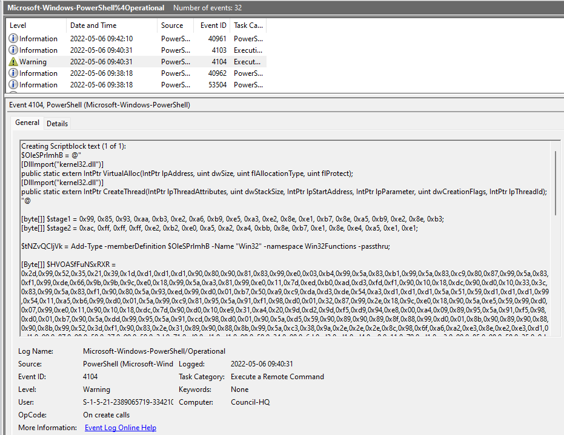

# [Cyber Apocalypse](index.md) - Forensics - Puppeteer

In this challenge we are given a zip file full of Windows event logs.

I found that opening the logs in Windows Event View was slow and annoying, so I looked for an alternative program to do this, and found [EVTX](https://github.com/omerbenamram/evtx), which can dump an `evtx` file into a text file that can be more easily searched.

Predictably, I didn't find much in the typical Application, Setup, System, and Security logs. None of this was especially useful though. 

We find that:
 - The computer is named `COUNCIL-HQ`
 - There is a user named `Council Leader` 
 - That user ran a powershell script named `C:\sysmgr\special_orders.ps1`
 - Python was installed by `Council Leader` at one point

I was able to extract some logs that didn't appear in Event Viewer, but the events I looked at did not appear to be useful.

I was very interested in that powershell script, so my next step is to see if there is a powershell log. The `Windows Powershell` log is not especially useful, but we do have the Powershell Operational log file `Microsoft-Windows-PowerShell%4Operational.evtx` as well. Good thing they had powershell logging enabled.

There aren't many logs here, so we can quickly see something suspicious - a big blob of what appears to be shellcode in a script. There aren't many legitimate reasons to write a script like this, so it looks like this is what we're looking for.



We can see at the bottom of this event log entry that this is indeed the powershell file we're looking for.

```
ScriptBlock ID: 3f384b05-3a00-4a65-bbf7-e31b331ac923
Path: C:\sysmgr\special_orders.ps1
```

Copying and pasting the contents into a text/code editor we can see the full script more easily. I did not include the full text of the script here, because my antivirus really did not like it.

There appear to be two distinct sections of this script - one that unpacks and runs the giant blob of shellcode, and one that unpacks "Special Orders!". 

If we cut out the shellcode related stuff, and focus only on the "Special Orders" related bits, we get:
```powershell
[byte[]] $stage1 = 0x99, 0x85, 0x93, 0xaa, 0xb3, 0xe2, 0xa6, 0xb9, 0xe5, 0xa3, 0xe2, 0x8e, 0xe1, 0xb7, 0x8e, 0xa5, 0xb9, 0xe2, 0x8e, 0xb3;
[byte[]] $stage2 = 0xac, 0xff, 0xff, 0xff, 0xe2, 0xb2, 0xe0, 0xa5, 0xa2, 0xa4, 0xbb, 0x8e, 0xb7, 0xe1, 0x8e, 0xe4, 0xa5, 0xe1, 0xe1;

[array]::Reverse($stage2);

$stage3 = $stage1 + $stage2;

#Unpack Special Orders!
for($i=0;$i -lt $stage3.count;$i++){
    $stage3[$i] = $stage3[$i] -bxor 0xd1;
}
```
This appears to reverse the `$stage2` array, concatenate it onto the end of `$stage1`, and then do some `bxor` operation to it. The only thing that it *doesn't* do is print it anywhere, so if we simply add that cability to the bottom, we'll hopefully get the flag.

```powershell
[byte[]] $stage1 = 0x99, 0x85, 0x93, 0xaa, 0xb3, 0xe2, 0xa6, 0xb9, 0xe5, 0xa3, 0xe2, 0x8e, 0xe1, 0xb7, 0x8e, 0xa5, 0xb9, 0xe2, 0x8e, 0xb3;
[byte[]] $stage2 = 0xac, 0xff, 0xff, 0xff, 0xe2, 0xb2, 0xe0, 0xa5, 0xa2, 0xa4, 0xbb, 0x8e, 0xb7, 0xe1, 0x8e, 0xe4, 0xa5, 0xe1, 0xe1;

[array]::Reverse($stage2);

$stage3 = $stage1 + $stage2;

#Unpack Special Orders!
for($i=0;$i -lt $stage3.count;$i++){
    $stage3[$i] = $stage3[$i] -bxor 0xd1;
}

# Convert stage3 byte array into a string
$flag = [System.Text.Encoding]::ASCII.GetString($stage3);
write-host $flag
```
```
> .\puppeteer_flag_code.ps1
HTB{b3wh4r3_0f_th3_b00t5_0f_just1c3...}
```
