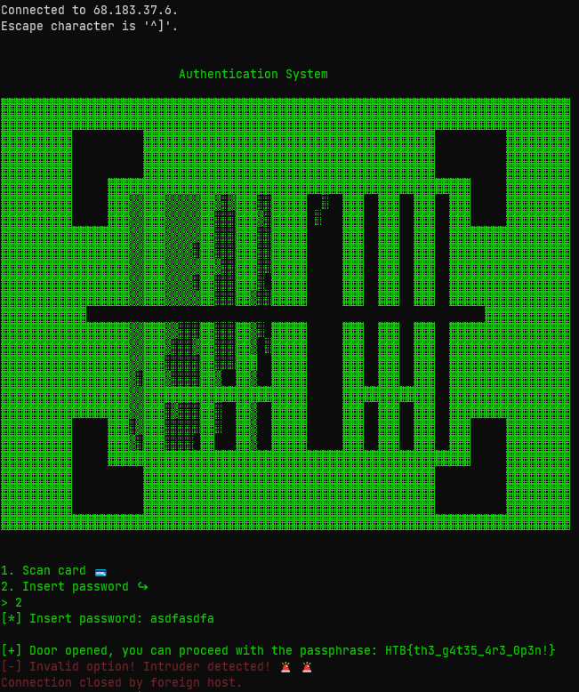

# [Cyber Apocalypse](index.md) - Pwn - Space Pirate: Entrypoint

> D12 is one of Golden Fang's missile launcher spaceships. Our mission as space pirates is to highjack D12, get inside the control panel room, and access the missile launcher system. To achieve our goal, we split the mission into three parts. In this part, all we need to do is bypass the scanning system and open the gates so that we proceed further. 

This challenge is done via a remote connection to a server over telnet (or Netcat probably would have worked as well).
We were provided the binary for this challenge, which could be decompiled using a program like Ghidra.

Before I did that, I connected to the challenge server to see what the program was *supposed* to do. Selecting option 2 asks for a password, and basically anything you type in will give you the flag right away. 




This seemed like a mistake... so I decompiled the code, and found this - the code that runs when you select option 2:

```c++
void check_pass(void)

{
  int iVar1;
  long in_FS_OFFSET;
  undefined8 local_28;
  undefined8 local_20;
  long local_10;
  
  local_10 = *(long *)(in_FS_OFFSET + 0x28);
  local_28 = 0;
  local_20 = 0;
  printf("[*] Insert password: ");
  read(0,&local_28,0xf);
  iVar1 = strncmp("0nlyTh30r1g1n4lCr3wM3mb3r5C4nP455",(char *)&local_28,0xf);
  if (iVar1 == 0) {
    printf(&DAT_001025a8,&DAT_0010259a);
                    /* WARNING: Subroutine does not return */
    exit(0x1b39);
  }
  open_door();
  if (local_10 != *(long *)(in_FS_OFFSET + 0x28)) {
                    /* WARNING: Subroutine does not return */
    __stack_chk_fail();
  }
  return;
}
```
So... it does try to compare your input to a password (`0nlyTh30r1g1n4lCr3wM3mb3r5C4nP455`), but regardless of the results of that it runs the `open_door` function anyway.

```c++
void open_door(void)
{
  long lVar1;
  long in_FS_OFFSET;
  
  lVar1 = *(long *)(in_FS_OFFSET + 0x28);
  printf("\n%s[+] Door opened, you can proceed with the passphrase: ","\x1b[1;32m");
  system("cat flag*");
  if (lVar1 != *(long *)(in_FS_OFFSET + 0x28)) {
                    /* WARNING: Subroutine does not return */
    __stack_chk_fail();
  }
  return;
}
```

And this prints the flag to the screen.

```
HTB{th3_g4t35_4r3_0p3n!}
```
