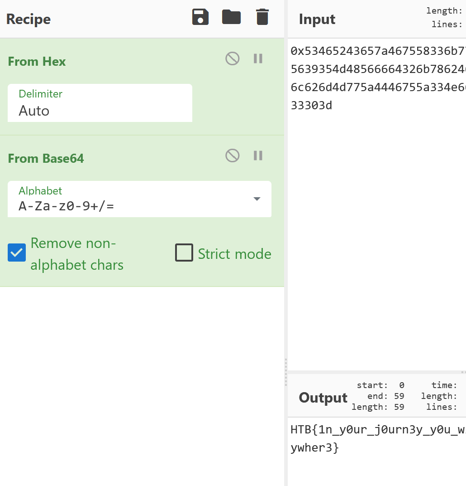

# [Cyber Apocalypse 2023](index.md) - Crypto - Ancient Encodings

> Your initialization sequence requires loading various programs to gain the necessary knowledge and skills for your journey. Your first task is to learn the ancient encodings used by the aliens in their communication.

In this challenge we are given a ZIP file containing a python script, and some output in a text file.

Python Script:
```python
from Crypto.Util.number import bytes_to_long
from base64 import b64encode

FLAG = b"HTB{??????????}"


def encode(message):
    return hex(bytes_to_long(b64encode(message)))


def main():
    encoded_flag = encode(FLAG)
    with open("output.txt", "w") as f:
        f.write(encoded_flag)


if __name__ == "__main__":
    main()

```

Output:
```
0x53465243657a467558336b7764584a66616a4231636d347a655639354d48566664326b786246397a5a544e66644767784e56396c626d4d775a4446755a334e665a58597a636e6c33614756794d33303d
```
The output file looks like it's hex - it starts with `0x`, only contains characters that you'd see in hexadecimal, and the python script runs it through the `hex` function.

The python script also runs `b64encode` on the input, so the flag is likely both in hexadecimal and base64 encoded.

Copying and pasting the text into CyberChef and having it decode from hex, and then decode from base64 gives us the flag.



```
HTB{1n_y0ur_j0urn3y_y0u_wi1l_se3_th15_enc0d1ngs_ev3rywher3}
```