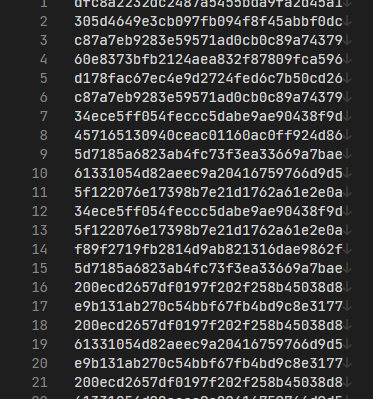

# [Cyber Apocalypse 2023](index.md) - Crypto - Perfect Synchronization

> The final stage of your initialization sequence is mastering cutting-edge technology tools that can be life-changing. One of these tools is quipqiup, an automated tool for frequency analysis and breaking substitution ciphers. This is the ultimate challenge, simulating the use of AES encryption to protect a message. Can you break it?

We're provided with a Pyhon script that was used to encrypt the file in the first place, and the full ciphertext (which is much too long to include in this writeup).



```python
from os import urandom
from Crypto.Cipher import AES
from secret import MESSAGE

assert all([x.isupper() or x in '{_} ' for x in MESSAGE])


class Cipher:

    def __init__(self):
        self.salt = urandom(15)
        key = urandom(16)
        self.cipher = AES.new(key, AES.MODE_ECB)

    def encrypt(self, message):
        return [self.cipher.encrypt(c.encode() + self.salt) for c in message]


def main():
    cipher = Cipher()
    encrypted = cipher.encrypt(MESSAGE)
    encrypted = "\n".join([c.hex() for c in encrypted])

    with open("output.txt", 'w+') as f:
        f.write(encrypted)


if __name__ == "__main__":
    main()

```

The python code looks simple enough. They are using `AES.MODE_ECB`, which is short for Electronic Code Book. Normally AES would be in `CBC` mode - or Cipher Block Chaining mode.

In CBC mode, AES encrypts a block, and then uses that encrypted block as part of the encryption process on the next block, "chaining" them together. This means that if two blocks have the same plaintext in them, they _won't_ be the same ciphertext, because the ciphertext depends on the blocks encrypted before it.

In ECB mode, it works more like a Caesar Cipher - blocks are independently encrypted, so if two blocks happened to contain the same text, their ciphertext would be the same too.

AES uses 128-bit block sizes, which translates to 16 bytes, or 16 characters. The above Python code appends a 15 character "salt" to each character of the plaintext. That salt is determined when the program starts (to generalize a bit), so it's the same for each character, and we have no way to know it in advance. This means that for all intents and purposes, each block of our ciphertext sill be one single english character (which the output has handily put on individual lines of the output for us).

We can see the line-duplication issue if we modify the given python code a bit.

```py
from os import urandom
from Crypto.Cipher import AES

MESSAGE = "AAA"

class Cipher:

    def __init__(self):
        self.salt = urandom(15)
        key = urandom(16)
        self.cipher = AES.new(key, AES.MODE_ECB)

    def encrypt(self, message):
        return [self.cipher.encrypt(c.encode() + self.salt) for c in message]


def main():
    cipher = Cipher()
    encrypted = cipher.encrypt(MESSAGE)
    encrypted = "\n".join([c.hex() for c in encrypted])

    with open("output.txt", 'w+') as f:
        f.write(encrypted)


if __name__ == "__main__":
    main()

```
By setting a `MESSAGE` variable ourselves, we can control the output. Running the above code creates a new output.txt file that looks like this:

```
597241119f258860f7e8bebccc942ced
597241119f258860f7e8bebccc942ced
597241119f258860f7e8bebccc942ced
```
It encrypted three `A`s, each onto their own line, and they are all the same.

The challenge description suggests we use quipquip (https://quipqiup.com), a cryptogram solver that guesses at subtitution ciphers and gives you what it thinks the plaintext might be - or something close to it. Since our ciphertext is basically a substitution cipher, quipquip can help us, but our ciphertext is too large for the quipquip website to handle, so we're going to need to shrink it.

```py
assert all([x.isupper() or x in '{_} ' for x in MESSAGE])
```
Based on this line from the provided python script, we know that the entire plaintext was all in upper-case, or was `{`, `_`, or `}`, or space, which makes our job a lot easier.

Since each line of the output is a single character, and each character's ciphertext will be the same, we can just assign each unique line of ciphertext to a character, and then let quipquip unscramble it from there.

I tried to do this with Python, but I don't know it well enough, so here is C# code that:
 * Reads in the ciphertext file
 * Assigns a character to each unique line, in order of how often they occur in the file
 * It assigns the characters in the order of occurrence in the english language based on a website I found
 * It outputs the new condensed version of "output.txt" to the console window

```cs
using System.Text;

List<string> lines = File.ReadLines("output.txt").ToList();

//string potential_plaintext_chars = "ABCDEFGHIJKLMNOPQRSTUVWXYZ{}_ ";
// If we put the plaintext characters in order of most frequently used in english
// and also sort the ciphertext by most frequently used characters, we can
// get _some_ of the way closer to decyphering it so the quipquip algorithm
// has a much easier time of it.
//
// Space is the first character, because we also have to take it into account
// and it's going to be the most common character in a paragraph of text.
//
// Frequency of letters based on here:
//   https://www3.nd.edu/~busiforc/handouts/cryptography/letterfrequencies.html
string potential_plaintext_chars = " EARIOTNSLCUDPMHGBFYWKVXZJQ{}_";

Dictionary<string, int> file_lines_with_occurance = new Dictionary<string, int>();

foreach(string line in lines) {
    string sanitized_line = line.Trim();
    if (!file_lines_with_occurance.ContainsKey(sanitized_line)) {
        file_lines_with_occurance.Add(sanitized_line, 0);
    }
    file_lines_with_occurance[sanitized_line]++;
}

// Assign each occurance a letter from the list
// Do this in order of how "popular" a line was, mostly to ensure that spaces are already
// figured out, but also to make quipquip's job a bit easier. Every little bit helps.
int potential_letter_counter = 0;
Dictionary<string, char> line_to_letter_mappings = new Dictionary<string, char>();
foreach(KeyValuePair<string, int>kvp in file_lines_with_occurance.OrderByDescending(x => x.Value)) {
    if (!line_to_letter_mappings.ContainsKey(kvp.Key)) {
        line_to_letter_mappings.Add(kvp.Key, potential_plaintext_chars[potential_letter_counter]);
        potential_letter_counter++;
    }
}

// Now loop through the actual lines and assemble a new output file
StringBuilder new_condensed_output_file = new StringBuilder();
foreach(string line in lines) {
    string sanitized_line = line.Trim();
    new_condensed_output_file.Append(line_to_letter_mappings[line]);
}

// Send the result to the console where I can copy and paste it into the quipquip website.
Console.WriteLine(new_condensed_output_file);

```
The output of the above code, when run against the given `output.txt` file, is:

```
HOEZDENCM RNRLMATA TA FRAEP SN IUE HRCI IURI TN RNM BTVEN AIOEICU SH WOTIIEN LRNBDRBE CEOIRTN LEIIEOA RNP CSYFTNRITSNA SH LEIIEOA SCCDO WTIU VROMTNB HOEZDENCTEA YSOESVEO IUEOE TA R CURORCIEOTAITC PTAIOTFDITSN SH LEIIEOA IURI TA OSDBULM IUE ARYE HSO RLYSAI RLL ARYGLEA SH IURI LRNBDRBE TN COMGIRNRLMATA HOEZDENCM RNRLMATA RLAS KNSWN RA CSDNITNB LEIIEOA TA IUE AIDPM SH IUE HOEZDENCM SH LEIIEOA SO BOSDGA SH LEIIEOA TN R CTGUEOIEJI IUE YEIUSP TA DAEP RA RN RTP IS FOERKTNB CLRAATCRL CTGUEOA HOEZDENCM RNRLMATA OEZDTOEA SNLM R FRATC DNPEOAIRNPTNB SH IUE AIRITAITCA SH IUE GLRTNIEJI LRNBDRBE RNP ASYE GOSFLEY ASLVTNB AKTLLA RNP TH GEOHSOYEP FM URNP ISLEORNCE HSO EJIENATVE LEIIEO FSSKKEEGTNB PDOTNB WSOLP WRO TT FSIU IUE FOTITAU RNP IUE RYEOTCRNA OECODTIEP CSPEFOERKEOA FM GLRCTNB COSAAWSOP GDXXLEA TN YR{SO NEWAGRGEOA RNP ODNNTNB CSNIEAIA HSO WUS CSDLP ASLVE IUEY IUE HRAIEAI AEVEORL SH IUE CTGUEOA DAEP FM IUE RJTA GSWEOA WEOE FOERKRFLE DATNB HOEZDENCM RNRLMATA HSO EJRYGLE ASYE SH IUE CSNADLRO CTGUEOA DAEP FM IUE {RGRNEAE YECURNTCRL YEIUSPA SH LEIIEO CSDNITNB RNP AIRITAITCRL RNRLMATA BENEORLLM UIF}RQATYGLEQADFAITIDITSNQTAQWERK_ CROP IMGE YRCUTNEOM WEOE HTOAI DAEP TN WSOLP WRO TT GSAATFLM FM IUE DA ROYMA ATA ISPRM IUE UROP WSOK SH LEIIEO CSDNITNB RNP RNRLMATA URA FEEN OEGLRCEP FM CSYGDIEO ASHIWROE WUTCU CRN CROOM SDI ADCU RNRLMATA TN AECSNPA WTIU YSPEON CSYGDITNB GSWEO CLRAATCRL CTGUEOA ROE DNLTKELM IS GOSVTPE RNM OERL GOSIECITSN HSO CSNHTPENITRL PRIR GDXXLE GDXXLE GDXXLE
```
This looks much more manageable, and much more like a simple substituion cipher. It's still encrypted, but this should be enough to let the quipquip website take it from here. We can even see where the key likely is - `UIF}RQATYGLEQADFAITIDITSNQTAQWERK_`.


The top result was:

```
S A CHARACTERISTIC DISTRIBUTION OF LETTERS THAT IS ROUGHLY THE SAME FOR ALMOST ALL SAMPLES OF THAT LANGUAGE IN CRYPTANALYSIS FREQUENCY ANALYSIS ALSO KNOWN AS COUNTING LETTERS IS THE STUDY OF THE FREQUENCY OF LETTERS OR GROUPS OF LETTERS IN A CIPHERTEXT THE METHOD IS USED AS AN AID TO BREAKING CLASSICAL CIPHERS FREQUENCY ANALYSIS REQUIRES ONLY A BASIC UNDERSTANDING OF THE STATISTICS OF THE PLAINTEXT LANGUAGE AND SOME PROBLEM SOLVING SKILLS AND IF PERFORMED BY HAND TOLERANCE FOR EXTENSIVE LETTER BOOKKEEPING DURING WORLD WAR II BOTH THE BRITISH AND THE AMERICANS RECRUITED CODEBREAKERS BY PLACING CROSSWORD PUZZLES IN MA{OR NEWSPAPERS AND RUNNING CONTESTS FOR WHO COULD SOLVE THEM THE FASTEST SEVERAL OF THE CIPHERS USED BY THE AXIS POWERS WERE BREAKABLE USING FREQUENCY ANALYSIS FOR EXAMPLE SOME OF THE CONSULAR CIPHERS USED BY THE {APANESE MECHANICAL METHODS OF LETTER COUNTING AND STATISTICAL ANALYSIS GENERALLY HTB}AJSIMPLEJSUBSTITUTIONJISJWEAK_ CARD TYPE MACHINERY WERE FIRST USED IN WORLD WAR II POSSIBLY BY THE US ARMYS SIS TODAY THE HARD WORK OF LETTER COUNTING AND ANALYSIS HAS BEEN REPLACED BY COMPUTER SOFTWARE WHICH CAN CARRY OUT SUCH ANALYSIS IN SECONDS WITH MODERN COMPUTING POWER CLASSICAL CIPHERS ARE UNLIKELY TO PROVIDE ANY REAL PROTECTION FOR CONFIDENTIAL DATA PUZZLE PUZZLE PUZZLE
```

Which looks really close to what the original plaintext would have been. We can see that we have... most of the a key:

```
HTB}AJSIMPLEJSUBSTITUTIONJISJWEAK_
```
It's got some of the characters wrong, but I don't think it knows about special characters - it's easy enough to see what it's supposed to say and manually fix it.

```
HTB{A_SIMPLE_SUBSTITUTION_IS_WEAK}
```

I found this challenge _much_ more challenging than the other crypto challenges.