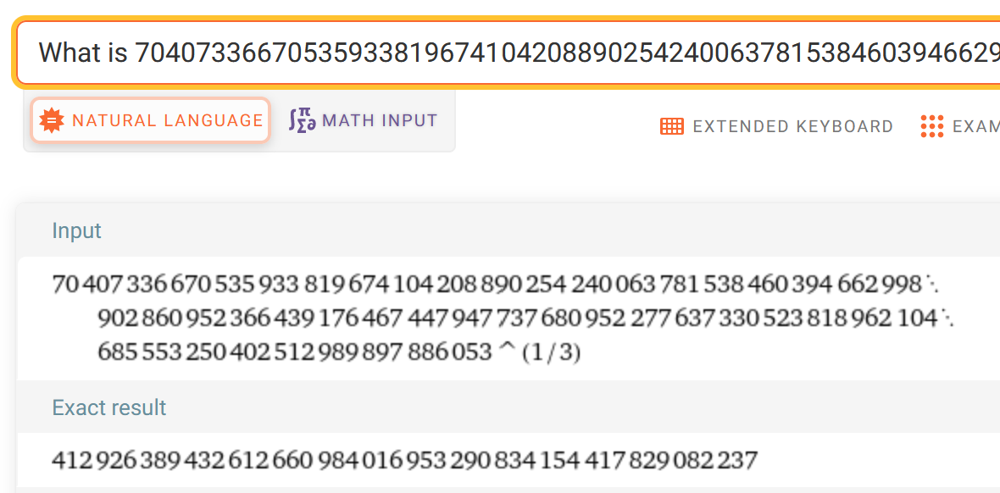

# [Cyber Apocalypse 2023](index.md) - Crypto - Small StEps

> As you continue your journey, you must learn about the encryption method the aliens used to secure their communication from eavesdroppers. The engineering team has designed a challenge that emulates the exact parameters of the aliens' encryption system, complete with instructions and a code snippet to connect to a mock alien server. Your task is to break it.

In this challenge we are given a ZIP file containing a copy of the python script running on the server, and some guidance on connecting to this server, and an example script that can interface with the server.


Server:
```python
from Crypto.Util.number import getPrime, bytes_to_long

FLAG = b"HTB{???????????????}"
assert len(FLAG) == 20


class RSA:

    def __init__(self):
        self.q = getPrime(256)
        self.p = getPrime(256)
        self.n = self.q * self.p
        self.e = 3

    def encrypt(self, plaintext):
        plaintext = bytes_to_long(plaintext)
        return pow(plaintext, self.e, self.n)


def menu():
    print('[E]ncrypt the flag.')
    print('[A]bort training.\n')
    return input('> ').upper()[0]


def main():
    print('This is the second level of training.\n')
    while True:
        rsa = RSA()
        choice = menu()

        if choice == 'E':
            encrypted_flag = rsa.encrypt(FLAG)
            print(f'\nThe public key is:\n\nN: {rsa.n}\ne: {rsa.e}\n')
            print(f'The encrypted flag is: {encrypted_flag}\n')
        elif choice == 'A':
            print('\nGoodbye\n')
            exit(-1)
        else:
            print('\nInvalid choice!\n')
            exit(-1)


if __name__ == '__main__':
    main()

```

I didn't use the other provided files.

We can see that this script is an implementation of RSA encryption.

Simplifying the script a bit, I came up with this:
```python
from Crypto.Util.number import getPrime, bytes_to_long, long_to_bytes
class RSA:

    def __init__(self):
        self.q = getPrime(256)
        self.p = getPrime(256)
        self.n = self.q * self.p
        self.e = 3

    def encrypt(self, plaintext):
        plaintext = bytes_to_long(plaintext)
        return pow(plaintext, self.e, self.n)

rsa = RSA()
input = b"test"
encrypted_flag = rsa.encrypt(input)
print(f'\nThe public key is:\n\nN: {rsa.n}\ne: {rsa.e}\n')
print(f'The encrypted flag is: {encrypted_flag}\n')
```

When run, it will encrypt `test`.

```
The public key is:

N: 6433197468957839634979356806325034295851393967889439566608909663068592908614522335752620182028132934720937783012543858842379463872027766831216259043031269
e: 3

The encrypted flag is: 7446927644895231780144668992
```

And running it again (without modifying anything):
```
The public key is:

N: 7750191018245181292369786643217451846226706101786617449027698130571605216424438557745022024913956128589589783135780681404953208140633783218166986053557979
e: 3

The encrypted flag is: 7446927644895231780144668992
```

Notice that the encrypted flag stayed the same, despite the key changing - surely a sign something is broken.

If we change the value for `e` in the script to a larger number, the ciphertext changes every time (as it should).

So, if the server was going to tell me the ciphertext, I wanted to grab that to start working with it - I used `nc` to connect to the provided container instance, and retrieved the ciphertext.

```
This is the second level of training.

[E]ncrypt the flag.
[A]bort training.

> e

The public key is:

N: 5542679116094454612809750244212414331203931791667935972462032646395054511313670594733521923965979886466515424714259967172823008801418001034394935217197567
e: 3

The encrypted flag is: 70407336670535933819674104208890254240063781538460394662998902860952366439176467447947737680952277637330523818962104685553250402512989897886053

[E]ncrypt the flag.
[A]bort training.

>
```
Selecting `e` again gives me the exact same ciphertext again, as expected.

```
70407336670535933819674104208890254240063781538460394662998902860952366439176467447947737680952277637330523818962104685553250402512989897886053
```

At this point I noticed that in the `server.py` script, we know that the flag is 20 characters long (5 of which would be "HTB{" and "}", so I considered making a brute-force script, but decided to learn about math instead.

I spent more time than I'd care to admit trying to get the cube-root of the given number and convert it into text, but kept running into encoding/decoding problems where Python would round the number when I didn't want it to, and it couldn't be decoded into a string. I got as far as decoding `HTB{`, so I knew I was on the right track, and just needed to understand Python better.

When I had enough of that, I went to Wolfram Alpha () and just asked it to do the math for me, correctly assuming that it would give me the full value. The prompt I used was:

```
What is 70407336670535933819674104208890254240063781538460394662998902860952366439176467447947737680952277637330523818962104685553250402512989897886053 to the power of 1/3
```

and the result was:



```
412926389432612660984016953290834154417829082237
```


and converting this into a string, we get the key:

```python
from Crypto.Util.number import getPrime, bytes_to_long, long_to_bytes

from_wolfram_alpha = 412926389432612660984016953290834154417829082237
print(long_to_bytes(from_wolfram_alpha))
```

```
b'HTB{5ma1l_E-xp0n3nt}'
```
```
HTB{5ma1l_E-xp0n3nt}
```


