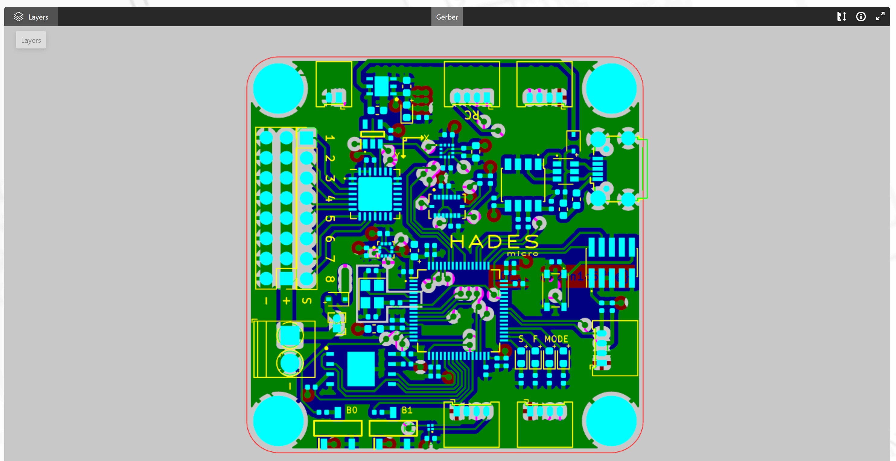
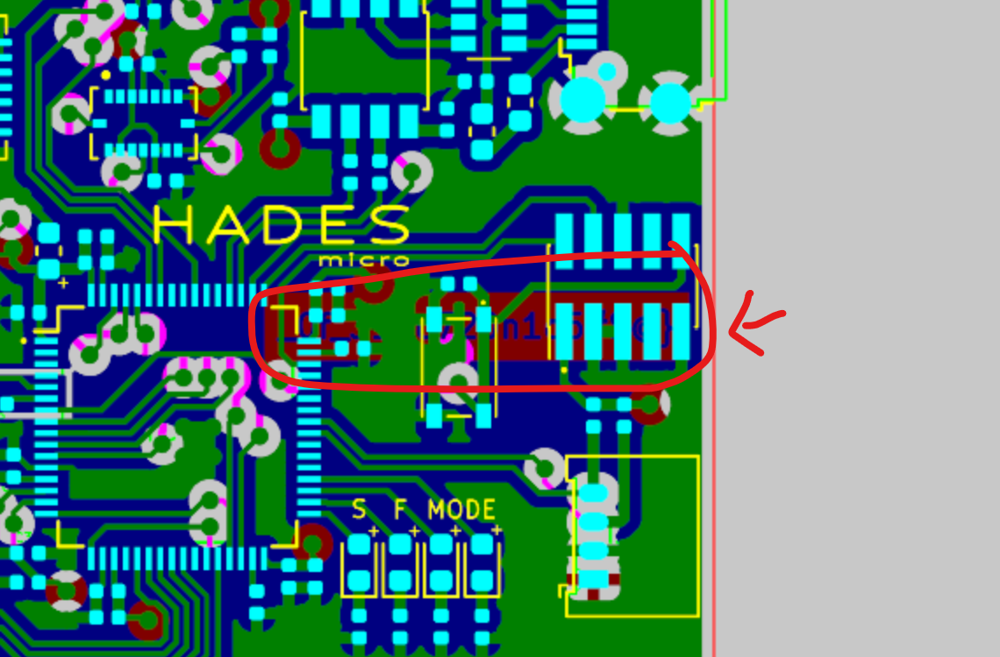
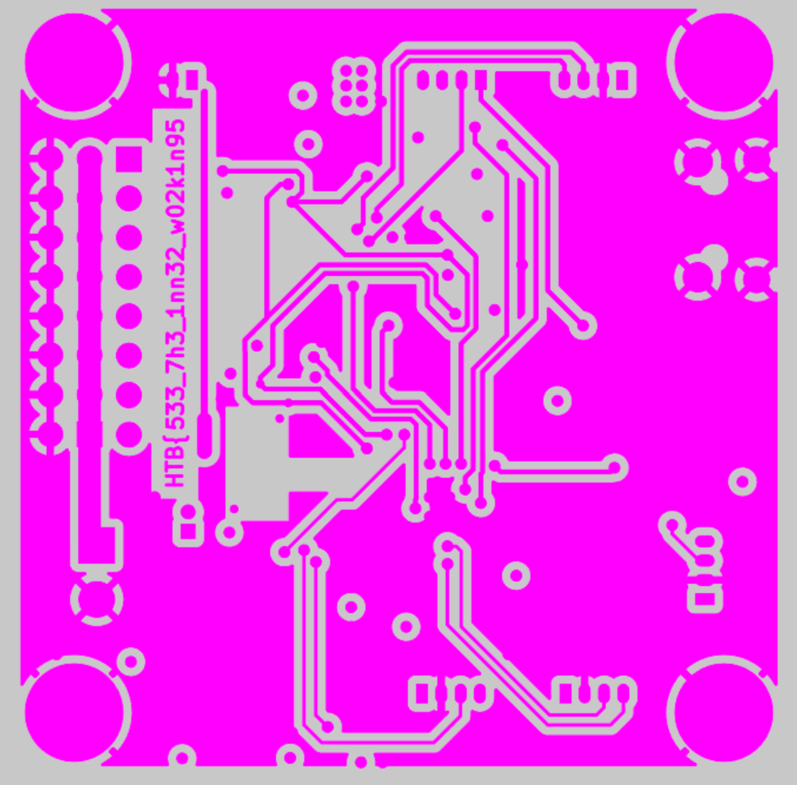
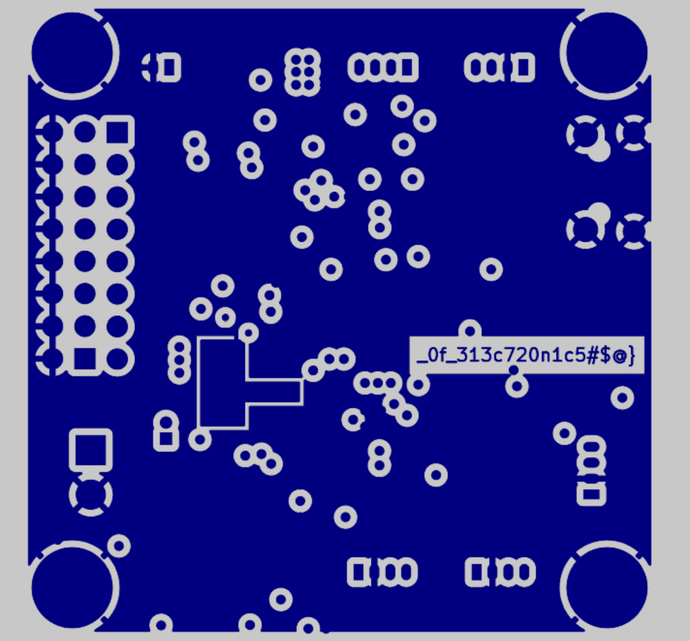

# [Cyber Apocalypse 2023](index.md) - Hardware - Critical Flight

> Your team has assigned you to a mission to investigate the production files of Printed Circuit Boards for irregularities. This is in response to the deployment of nonfunctional DIY drones that keep falling out of the sky. The team had used a slightly modified version of an open-source flight controller in order to save time, but it appears that someone had sabotaged the design before production. Can you help identify any suspicious alterations made to the boards?

We're given a zip file with `.gbr` files inside. Some quick Googling tells me that these are Gerber files containing the plans for a printed circuit board, with all of the layers designed.

There are several online viewers that can let us see these files - I used [Altium's](https://www.altium.com/viewer/) online Gerber viewer. There is also [PCBWay's viewer](https://www.pcbway.com/project/OnlineGerberViewer.html), but I found it to be a bit finnicky and often would not work for me. We can just drag and drop the whole zip file we get from the CTF and it will parse it and display all of the layers for us.



I can see something that stands out right away - there's obviously text underneath this area somewhere, and it looks like at least part of the flag. This wasn't as obvious using PCBWay's online viewer, for whatever reason (though their rendering of the board was definitely prettier).



We can toggle the individual layers too so we can view each layer one at a time with this site, which lets us find the two parts of the flag printed on the "Copper - Bottom" and "Copper - Mid 1" layers.




```
HTB{533_7h3_1nn32_w02k1n95_0f_313c720n1c5#$@}
```