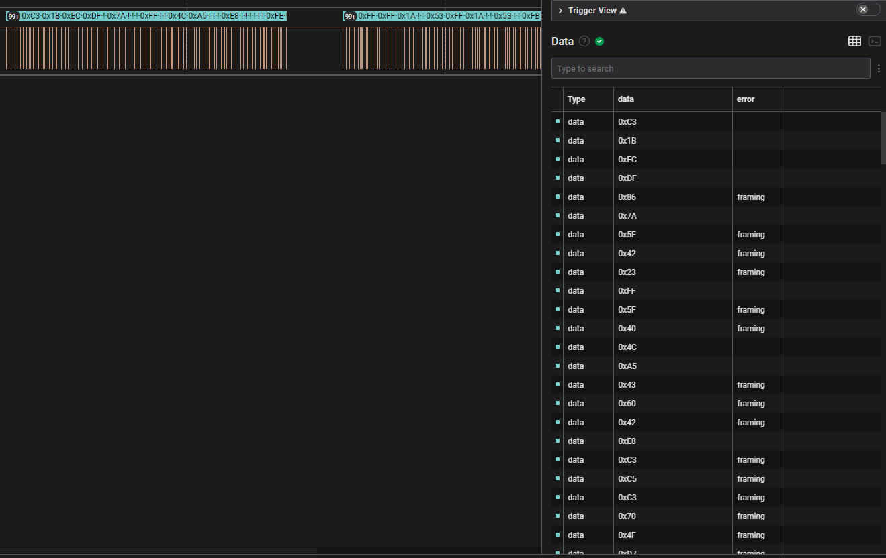
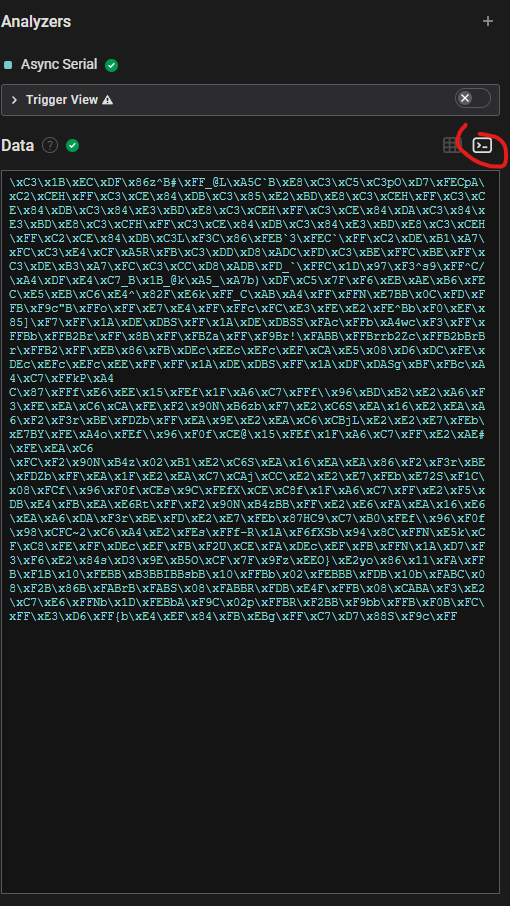
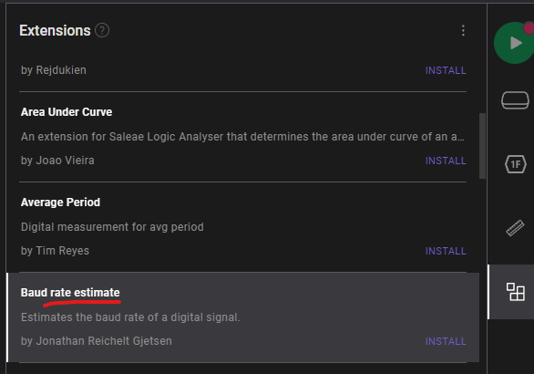
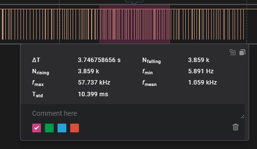
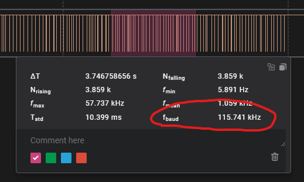
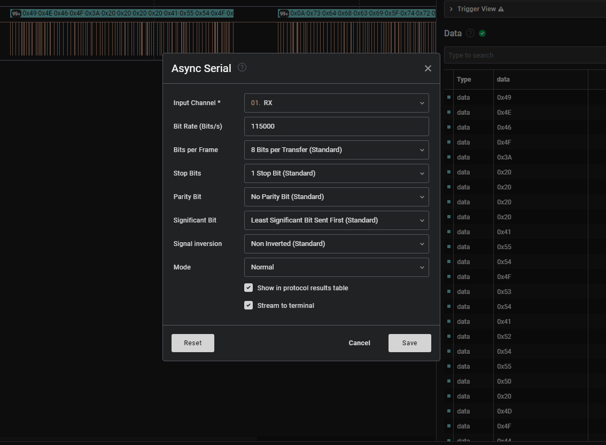
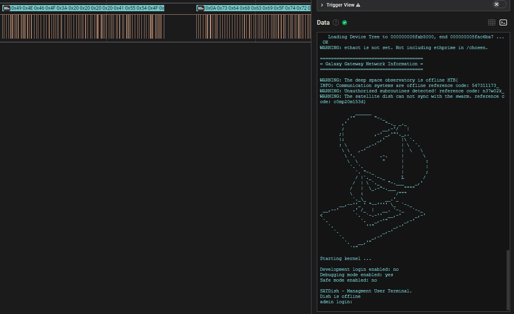

# [Cyber Apocalypse 2023](index.md) - Hardware - Critical Flight

> Your team has recovered a satellite dish that was used for transmitting the location of the relic, but it seems to be malfunctioning. There seems to be some interference affecting its connection to the satellite system, but there are no indications of what it could be. Perhaps the debugging interface could provide some insight, but they are unable to decode the serial signal captured during the device's booting sequence. Can you help to decode the signal and find the source of the interference?

We're provided with another `.sal` file that we can open in [Saleae Logic](https://www.saleae.com/downloads/).


Looks like it's some data that we'll need to decode.

I have _extremely little idea_ what I'm doing in this program - this CTF is my first time using it. After watching a few YouTube videos on how to use it, I'm more or less going to just try different analyzers until they work.

The __Async Serial__ analyzer reads a single channel - and that's all we have, so that seems like a good start.



This doesn't look right - there are quite a few rows listing errors on the right.



If we hit this "terminal" button we can see all the data together rather in tabular form. This might just be encoded, but I know that baud is an important factor when decoding signals like this, and I just accepted the default value for that without thinking about it - I suspect we're intended to see english characters here, so I'd like to understand how the baud rate works before trying to decode this mess.

I do some research and come accross this helpful page on the Saleae website: https://support.saleae.com/protocol-analyzers/analyzer-user-guides/using-async-serial

In the _Determining the Proper Bit Rate (Baud Rate)_ section, it mentions that there is a community plugin that can help estimate the proper baud rate, so lets try that out so we don't have to figure out the math ourselves.



Before installing this addon, we could add a "measurement range" by holding shift and dragging over an area.



It gives us some interesting information, but _when we install the Baud Rate Estimate_ extension, it also tells us the estimated baud rate in this box.



Neat. According to [this website I found on the topic of baud rates](http://www.ece.northwestern.edu/local-apps/matlabhelp/techdoc/matlab_external/baudrate.html), there are a set of standard rate values, and `115741` is very close to `115000` from this article.

So now lets configure an __Async Serial__ analyzer with a baud rate of 115000 and see what happens.





This looks like something we're supposed to be seeing, and it looks like our flag is split up into a few sections in the output.

```
HTB{547311173_n37w02k_c0mp20m153d}
```