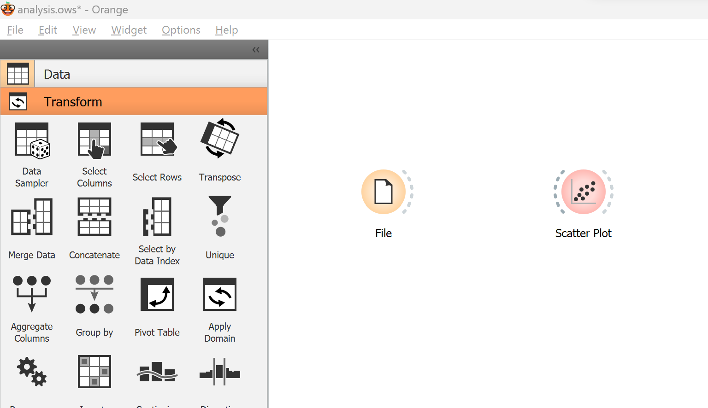
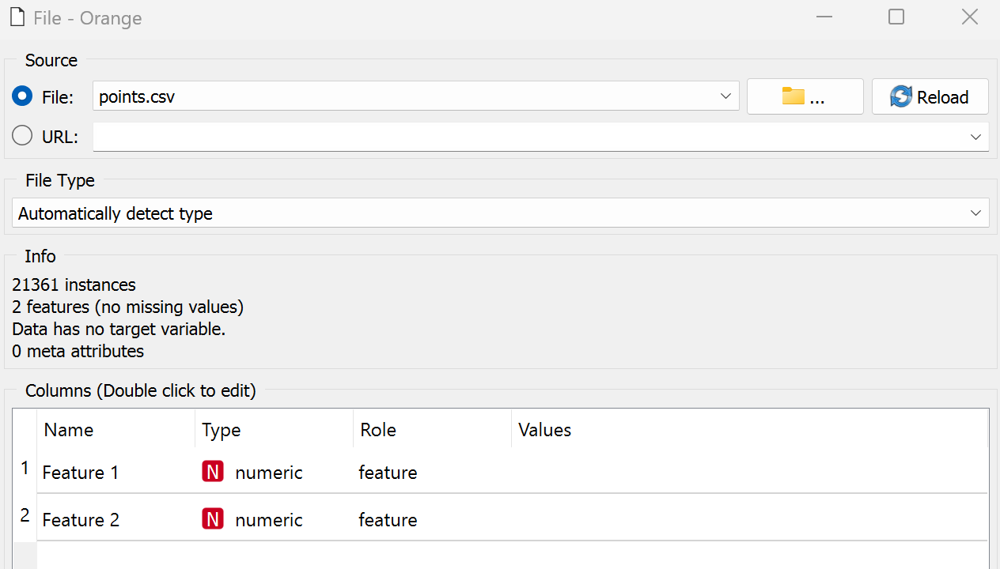
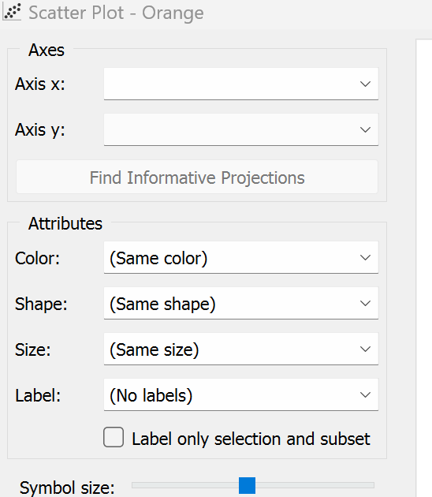
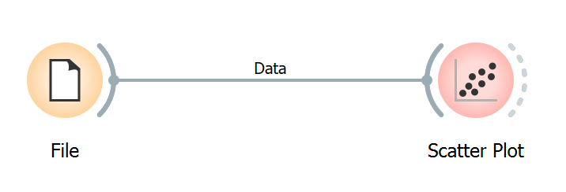
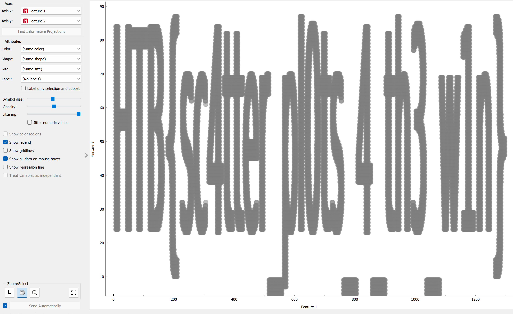

# [Cyber Apocalypse 2023](index.md) - Machine Learning - Reconfiguration

> As Pandora set out on her quest to find the ancient alien relic, she knew that the journey would be treacherous. The desert was vast and unforgiving, and the harsh conditions would put her cyborg body to the test. Pandora started by collecting data about the temperature and humidity levels in the desert. She used a scatter plot in an Orange Workspace file to visualize this data and identified the areas where the temperature was highest and the humidity was lowest. Using this information, she reconfigured her sensors to better withstand the extreme heat and conserve water. But, a second look at the data revealed something otherwordly, it seems that the relic's presence beneath the surface has scarred the land in a very peculiar way, can you see it?

We're given a zip file containing a `csv` file and an `ows` file. The `ows` file can be opened in Orange (https://orangedatamining.com/).

The CSV has two columns... but there's nothing for humans in this CSV.

I have _absolutely_ no idea how to use a program like this, so lets just open the file up and see what happens.



Opening the file... I have no idea what I'm looking at. Clicking items on the side menu seem to bring them into the workspace, which doesn't seem like something I want to do.

Double clicking the __File__ circle seems to describe two columns, which probably matches the CSV we have.



Double clicking the __Scatter Plot__ pops up some configuration options, but it seems empty, like it's not "hooked up" to the data from the CSV file.



Clicking the little semi-circle on the side of the __File__ circle seems to let me drag a line from it to the __Scatter Plot__ circle, which seems to link them up.



Now double clicking the __Scatter Plot__ shows me a chart. Moving and zooming in on this chart reveals that it spells out the flag (which we'll have to interpret and type in ourselves).



Interesting - perhaps I'll find some more uses for Orange, now that I've spent so much time getting it installed.

```
HTB{sc4tter_pl0ts_4_th3_w1n}
```