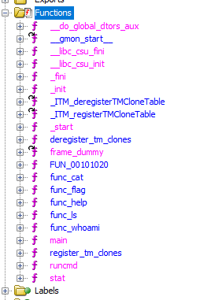

# [Cyber Apocalypse 2023](index.md) - Reversing - She Shells C Shells

> You've arrived in the Galactic Archive, sure that a critical clue is hidden here. You wait anxiously for a terminal to boot up, hiding in the shadows from the guards hunting for you. Unfortunately, it looks like you'll need a password to get what you need without setting off the alarms...

We're provided with a binary and that's it, as expected.

Running this, it appears to be a little shell with a couple commands that we can run.
One of the commands is `getflag`, and it asks for a password.

```
ctfsh-$ help
ls: ls [directory] - lists files in a directory
whoami: whoami - prints the current user's name
cat: cat [files...] - prints out a sequence of files
getflag: admin only
ctfsh-$
```

Time to open this in Ghidra and see what's inside.



There are functions for each command that we can run, including the `getflag` function.

```c
undefined8 func_flag(void)
{
  undefined8 uVar1;
  undefined8 local_118;
  undefined8 local_110;
  undefined8 local_108;
  undefined8 local_100;
  undefined8 local_f8;
  undefined8 local_f0;
  undefined8 local_e8;
  undefined8 local_e0;
  undefined8 local_d8;
  undefined8 local_d0;
  undefined8 local_c8;
  undefined8 local_c0;
  undefined8 local_b8;
  undefined8 local_b0;
  undefined8 local_a8;
  undefined8 local_a0;
  undefined8 local_98;
  undefined8 local_90;
  undefined8 local_88;
  undefined8 local_80;
  undefined8 local_78;
  undefined8 local_70;
  undefined8 local_68;
  undefined8 local_60;
  undefined8 local_58;
  undefined8 local_50;
  undefined8 local_48;
  undefined8 local_40;
  undefined8 local_38;
  undefined8 local_30;
  undefined8 local_28;
  undefined8 local_20;
  int local_14;
  uint local_10;
  uint local_c;

  printf("Password: ");
  local_118 = 0;
  local_110 = 0;
  local_108 = 0;
  local_100 = 0;
  local_f8 = 0;
  local_f0 = 0;
  local_e8 = 0;
  local_e0 = 0;
  local_d8 = 0;
  local_d0 = 0;
  local_c8 = 0;
  local_c0 = 0;
  local_b8 = 0;
  local_b0 = 0;
  local_a8 = 0;
  local_a0 = 0;
  local_98 = 0;
  local_90 = 0;
  local_88 = 0;
  local_80 = 0;
  local_78 = 0;
  local_70 = 0;
  local_68 = 0;
  local_60 = 0;
  local_58 = 0;
  local_50 = 0;
  local_48 = 0;
  local_40 = 0;
  local_38 = 0;
  local_30 = 0;
  local_28 = 0;
  local_20 = 0;
  fgets((char *)&local_118,0x100,stdin);
  for (local_c = 0; local_c < 0x4d; local_c = local_c + 1) {
    *(byte *)((long)&local_118 + (long)(int)local_c) =
         *(byte *)((long)&local_118 + (long)(int)local_c) ^ m1[(int)local_c];
  }
  local_14 = memcmp(&local_118,t,0x4d);
  if (local_14 == 0) {
    for (local_10 = 0; local_10 < 0x4d; local_10 = local_10 + 1) {
      *(byte *)((long)&local_118 + (long)(int)local_10) =
           *(byte *)((long)&local_118 + (long)(int)local_10) ^ m2[(int)local_10];
    }
    printf("Flag: %s\n",&local_118);
    uVar1 = 0;
  }
  else {
    uVar1 = 0xffffffff;
  }
  return uVar1;
}
```

At this point I'm not sure if Ghidra just likes to make a ton of seemigly unused variables, or if that's part of the challenge - I suspect the former.

We can spend some time cleaning this up a bit.

```c
  fgets((char *)&user_password_input,256,stdin);
  for (count_to_77_1 = 0; count_to_77_1 < 77; count_to_77_1 = count_to_77_1 + 1) {
    *(byte *)((long)&user_password_input + (long)(int)count_to_77_1) =
         *(byte *)((long)&user_password_input + (long)(int)count_to_77_1) ^ m1[(int)count_to_77_1];
  }
  is_password_ok = memcmp(&user_password_input,password_from_memory,77);
  if (is_password_ok == 0) {
    for (count_to_77_2 = 0; count_to_77_2 < 77; count_to_77_2 = count_to_77_2 + 1) {
      *(byte *)((long)&user_password_input + (long)(int)count_to_77_2) =
           *(byte *)((long)&user_password_input + (long)(int)count_to_77_2) ^ m2[(int)count_to_77_2]
      ;
    }
    printf("Flag: %s\n",&user_password_input);
    uVar1 = 0;
  }
```
`password_from_memory` was a constant, and double clicking it took us to it's place in memory.

But... there were no characters here, only bytes.

What took me 4 days, and solving [hw-hunting-license](hw-hunting-license) to understand, was that the weird for loop in there isn't doing what I thought it was doing.

In my research I came accross several videos explaining that to prevent buffer overflows, you can "flush" your buffer using a loop very similar to the one in the above code. This "spends" any extra characters the user might have typed in, possibly preventing buffer overflow attacks. I didn't notice the `^ m1[(int)count_to_77_1];` at the end was doing something very different.

In `c`, the `^` operator is the binary XOR operator. It's encrypting the user input and comparing it to the already-encrypted bytes stored in memory - that's why it wasn't just a series of characters that we could easily read.

What's interesting here is that there are _two_ XOR operations happening, with two separate XOR keys - `m1` and `m2`. They both run against the password that the user inputs. One loop happens before the check to see if it's valid, then it's validated, and if successful the user input is XOR'ed with a _second_ series of 77 characters - `m2`.

We can copy the bytes out of memory for the stored password as well as the `m1` and `m2`.

Stored password:
```
2c 4a b7 99 a3 e5 70 78 93 6e 97 d9 47 6d 38 bd ff bb 85 99 6f e1 4a ab 74 c3 7b a8 b2 9f d7 ec eb cd 63 b2 39 23 e1 84 92 96 09 c6 99 f2 58 fa cb 6f 6f 5e 1f be 2b 13 8e a5 a9 99 93 ab 8f 70 1c c0 c4 3e a6 fe 93 35 90 c3 c9 10 e9
```

XOR - m1:
```
6e 3f c3 b9 d7 8d 15 58 e5 0f fb ac 22 4d 57 db df cf ed fc 1c 84 6a d8 1c a6 17 c4 c1 bf a0 85 87 a1 43 d4 58 4f 8d a8 b2 f2 7c a3 b9 86 37 da bf 07 0a 7e 73 df 5c 60 ae ca cf b9 e0 de ff 00 70 b9 e4 5f c8 9a b3 51 f5 ae a8 7e 8d
```

XOR - m2:
```
64 1e f5 e2 c0 97 44 1b f8 5f f9 be 18 5d 48 8e 91 e4 f6 f1 5c 8d 26 9e 2b a1 02 f7 c6 f7 e4 b3 98 fe 57 ed 4a 4b d1 f6 a1 eb 09 c6 99 f2 58 fa cb 6f 6f 5e 1f be 2b 13 8e a5 a9 99 93 ab 8f 70 1c c0 c4 3e a6 fe 93 35 90 c3 c9 10 e9
```

Now we just need to figure out what to do with these.

At this point I'm a little confused about what I thought was an encryption key and what I thought was ciphertext. I guess with XOR there maybe isn't as big of a distinction as I expect, so it doesn't matter. I have a feeling that I've mislabelled `password_from_memory`, because it wasn't really comparing passwords, it was doing something else that I don't think I quite understand. I definitely need to do some more reading about XOR encryption.

The way to reverse XOR is to just XOR it again with the same key, so we should be able to take these three blobs of bytes and get something out of them.

I tried to do this with [CyberChef](https://gchq.github.io/CyberChef/), but I had some difficulty getting this to work - I think relating to converting to/from the hex. I wrote some C# code to handle it instead, because I now understood what has to happen to decrypt these.

My code was:
```cs
List<byte> stored_password = new List<byte>() { 0x2c, 0x4a, 0xb7, 0x99, 0xa3, 0xe5, 0x70, 0x78, 0x93, 0x6e, 0x97, 0xd9, 0x47, 0x6d, 0x38, 0xbd, 0xff, 0xbb, 0x85, 0x99, 0x6f, 0xe1, 0x4a, 0xab, 0x74, 0xc3, 0x7b, 0xa8, 0xb2, 0x9f, 0xd7, 0xec, 0xeb, 0xcd, 0x63, 0xb2, 0x39, 0x23, 0xe1, 0x84, 0x92, 0x96, 0x09, 0xc6, 0x99, 0xf2, 0x58, 0xfa, 0xcb, 0x6f, 0x6f, 0x5e, 0x1f, 0xbe, 0x2b, 0x13, 0x8e, 0xa5, 0xa9, 0x99, 0x93, 0xab, 0x8f, 0x70, 0x1c, 0xc0, 0xc4, 0x3e, 0xa6, 0xfe, 0x93, 0x35, 0x90, 0xc3, 0xc9, 0x10, 0xe9 };
List<byte> m1 = new List<byte>() { 0x6e, 0x3f, 0xc3, 0xb9, 0xd7, 0x8d, 0x15, 0x58, 0xe5, 0x0f, 0xfb, 0xac, 0x22, 0x4d, 0x57, 0xdb, 0xdf, 0xcf, 0xed, 0xfc, 0x1c, 0x84, 0x6a, 0xd8, 0x1c, 0xa6, 0x17, 0xc4, 0xc1, 0xbf, 0xa0, 0x85, 0x87, 0xa1, 0x43, 0xd4, 0x58, 0x4f, 0x8d, 0xa8, 0xb2, 0xf2, 0x7c, 0xa3, 0xb9, 0x86, 0x37, 0xda, 0xbf, 0x07, 0x0a, 0x7e, 0x73, 0xdf, 0x5c, 0x60, 0xae, 0xca, 0xcf, 0xb9, 0xe0, 0xde, 0xff, 0x00, 0x70, 0xb9, 0xe4, 0x5f, 0xc8, 0x9a, 0xb3, 0x51, 0xf5, 0xae, 0xa8, 0x7e, 0x8d };
List<byte> m2 = new List<byte>() { 0x64, 0x1e, 0xf5, 0xe2, 0xc0, 0x97, 0x44, 0x1b, 0xf8, 0x5f, 0xf9, 0xbe, 0x18, 0x5d, 0x48, 0x8e, 0x91, 0xe4, 0xf6, 0xf1, 0x5c, 0x8d, 0x26, 0x9e, 0x2b, 0xa1, 0x02, 0xf7, 0xc6, 0xf7, 0xe4, 0xb3, 0x98, 0xfe, 0x57, 0xed, 0x4a, 0x4b, 0xd1, 0xf6, 0xa1, 0xeb, 0x09, 0xc6, 0x99, 0xf2, 0x58, 0xfa, 0xcb, 0x6f, 0x6f, 0x5e, 0x1f, 0xbe, 0x2b, 0x13, 0x8e, 0xa5, 0xa9, 0x99, 0x93, 0xab, 0x8f, 0x70, 0x1c, 0xc0, 0xc4, 0x3e, 0xa6, 0xfe, 0x93, 0x35, 0x90, 0xc3, 0xc9, 0x10, 0xe9 };

for(int x = 0; x < 77; x++) {
    Console.Write((char)(m1[x] ^ stored_password[x]));
}
Console.WriteLine("");
for(int x = 0; x < 77; x++) {
    Console.Write((char)(m2[x] ^ stored_password[x]));
}
```
I used Ghidra's __Copy C Array__ under "Copy Special..." to copy the byte values, and it happened to be exactly the format I need to initialize these two collections, which saved quite a bit of time.


My code outputs the following:
```
> dotnet run
But the value of these shells will fall, due to the laws of supply and demand
HTB{cr4ck1ng_0p3n_sh3ll5_by_th3_s34_sh0r3}
```
We can see that we have a flag, and what is probably the password to the `getflag` command in the shell.

```
ctfsh-$ help
ls: ls [directory] - lists files in a directory
whoami: whoami - prints the current user's name
cat: cat [files...] - prints out a sequence of files
getflag: admin only
ctfsh-$ getflag
Password: But the value of these shells will fall, due to the laws of supply and demand
Flag: HTB{cr4ck1ng_0p3n_sh3ll5_by_th3_s34_sh0r3}
ctfsh-$
```
Yup.

```
HTB{cr4ck1ng_0p3n_sh3ll5_by_th3_s34_sh0r3}
```