# [Cyber Apocalypse 2023](index.md) - Reversing - Hunting License

> STOP! Adventurer, have you got an up to date relic hunting license? If you don't, you'll need to take the exam again before you'll be allowed passage into the spacelanes!

We're given a binary that we need to inspect, and a Docker container that we can spawn.

The docker container will ask us questions that we'll need to answer about the provided binary.

```
What is the file format of the executable?
>
```
Running `file license` on a linux system tells us:

```
license: ELF 64-bit LSB executable, x86-64, version 1 (SYSV), dynamically linked, interpreter /lib64/ld-linux-x86-64.so.2, BuildID[sha1]=5be88c3ed329c1570ab807b55c1875d429a581a7, for GNU/Linux 3.2.0, not stripped
```
So the answer they're looking for here is `ELF`.

```
What is the file format of the executable?
> ELF
[+] Correct!

What is the CPU architecture of the executable?
>
```
The output from `file` also tells us this - `64-bit`.

```
What is the CPU architecture of the executable?
> 64-bit
[+] Correct!

What library is used to read lines for user answers? (`ldd` may help)
>
```

The question helps us here by telling us we can use teh `ldd` command to find out.

```
ldd ./license
```
```
$ ldd license
        linux-vdso.so.1 (0x00007ffcd30ae000)
        libreadline.so.8 => /lib/x86_64-linux-gnu/libreadline.so.8 (0x00007fb1aba90000)
        libc.so.6 => /lib/x86_64-linux-gnu/libc.so.6 (0x00007fb1ab8bb000)
        libtinfo.so.6 => /lib/x86_64-linux-gnu/libtinfo.so.6 (0x00007fb1ab88c000)
        /lib64/ld-linux-x86-64.so.2 (0x00007fb1abafe000)
```

Probably they are lokoing for `libreadline.so.8`.

```
What library is used to read lines for user answers? (`ldd` may help)
> libreadline.so.8
[+] Correct!

What is the address of the `main` function?
>
```

Here's where it started to get tricky. I initially opened up the binary in `gdb` and ran `info functions` to get a list of all functions.

```
gef➤  info functions
All defined functions:

Non-debugging symbols:
0x0000000000401000  _init
0x0000000000401030  free@plt
0x0000000000401040  puts@plt
0x0000000000401050  readline@plt
0x0000000000401060  strcmp@plt
0x0000000000401070  getchar@plt
0x0000000000401080  exit@plt
0x0000000000401090  _start
0x00000000004010c0  _dl_relocate_static_pie
0x00000000004010d0  deregister_tm_clones
0x0000000000401100  register_tm_clones
0x0000000000401140  __do_global_dtors_aux
0x0000000000401170  frame_dummy
0x0000000000401172  main
0x00000000004011e1  reverse
0x0000000000401237  xor
0x000000000040128a  exam
0x00000000004013c0  __libc_csu_init
0x0000000000401420  __libc_csu_fini
0x0000000000401424  _fini
gef➤
```
But, it didn't like `0x0000000000401172` or `0000000000401172` as an answer.

I opened this in Ghidra and it told me that it was `00401172`, which was accepted. I don't know enough about why `gdb` pads that many zeros, but hey I still found the answer in the end.

```
What is the address of the `main` function?
> 00401172
[+] Correct!

How many calls to `puts` are there in `main`? (using a decompiler may help)
>
```

We'll need to actually look at the disassembled source code for this. I had it open in Ghidra and could just count, but I wanted to learn more about using `gdb`. The command to disassemble a function is `disassemble functionname`, but you can shorten it.

```
gef➤  disass main
Dump of assembler code for function main:
   0x0000000000401172 <+0>:     push   rbp
   0x0000000000401173 <+1>:     mov    rbp,rsp
   0x0000000000401176 <+4>:     sub    rsp,0x10
   0x000000000040117a <+8>:     mov    edi,0x402008
   0x000000000040117f <+13>:    call   0x401040 <puts@plt>
   0x0000000000401184 <+18>:    mov    edi,0x402030
   0x0000000000401189 <+23>:    call   0x401040 <puts@plt>
   0x000000000040118e <+28>:    mov    edi,0x402088
   0x0000000000401193 <+33>:    call   0x401040 <puts@plt>
   0x0000000000401198 <+38>:    call   0x401070 <getchar@plt>
   0x000000000040119d <+43>:    mov    BYTE PTR [rbp-0x1],al
   0x00000000004011a0 <+46>:    cmp    BYTE PTR [rbp-0x1],0x79
   0x00000000004011a4 <+50>:    je     0x4011c6 <main+84>
   0x00000000004011a6 <+52>:    cmp    BYTE PTR [rbp-0x1],0x59
   0x00000000004011aa <+56>:    je     0x4011c6 <main+84>
   0x00000000004011ac <+58>:    cmp    BYTE PTR [rbp-0x1],0xa
   0x00000000004011b0 <+62>:    je     0x4011c6 <main+84>
   0x00000000004011b2 <+64>:    mov    edi,0x4020dd
   0x00000000004011b7 <+69>:    call   0x401040 <puts@plt>
   0x00000000004011bc <+74>:    mov    edi,0xffffffff
   0x00000000004011c1 <+79>:    call   0x401080 <exit@plt>
   0x00000000004011c6 <+84>:    mov    eax,0x0
   0x00000000004011cb <+89>:    call   0x40128a <exam>
   0x00000000004011d0 <+94>:    mov    edi,0x4020f0
   0x00000000004011d5 <+99>:    call   0x401040 <puts@plt>
   0x00000000004011da <+104>:   mov    eax,0x0
   0x00000000004011df <+109>:   leave
   0x00000000004011e0 <+110>:   ret
End of assembler dump.
gef➤
```
I count 5.

```
How many calls to `puts` are there in `main`? (using a decompiler may help)
> 5
[+] Correct!

What is the first password?
>
```

The `main` function doesn't ask for a password directly, but it does call `exam()`.
This is where I switched to Ghidra, because it's a bit more friendly to navigate.

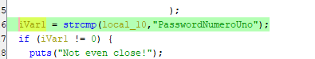

Looks like this one is just in plain text in the source.

```
What is the first password?
> PasswordNumeroUno
[+] Correct!

What is the reversed form of the second password?
>
```

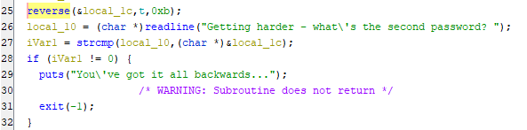

Further down in the `exam` method we see where it's asking for a second password, and it looks like it's been reversed using a function named `reverse`.

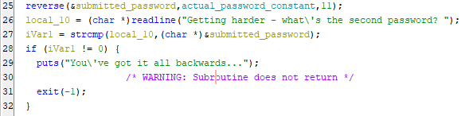

In Ghidra we can rename variables when we figure out what they are to make it easier to understand what's going on. We can also change the hex values to decimal so they are easier to understand. This function appears to reverse a string, and it indicates that the string is `11` characters long.
The `actual_password_constant` is a string constant that we should be able to find in memory. Double clicking it takes us to where it is stored.

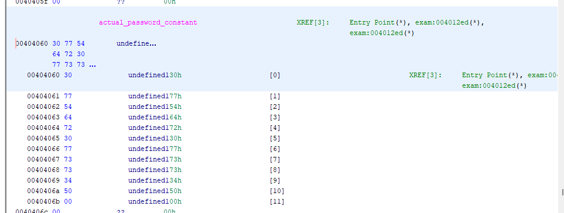

I learned some tricks to help understand things stored in memory like this.

First, we can change how Ghidra is displaying the values of stuff here. Right clicking the top/highlighted memory address, we can go __data__ -> __char__ to see characters instead of bytes.

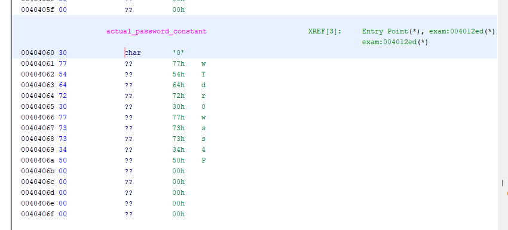

Next, we can specify that this is a constant, so it will just show up in the source code instead of looking like a variable. Right clicking the top memory address again (`00404060`) and going __data__ -> __settings__, finding __mutabliity__, and setting it to __constant__.

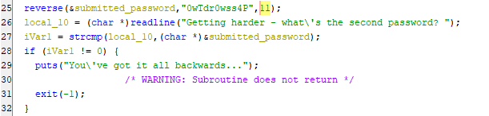

Now it's right in the source code and we can easily copy and paste it out.

```
What is the reversed form of the second password?
> 0wTdr0wss4P
[+] Correct!

What is the real second password?
>
```

Now it wants us to reverse it, as it would expect the user to type in. It looks like in this case, reversing it was an attempt to obfuscate it from the source code or from programs like `strings`... it didn't work very well.

I just used VSCode to reverse it to save time.

```
What is the real second password?
> P4ssw0rdTw0
[+] Correct!

What is the XOR key used to encode the third password?
>
```
Here is the section for the third password.

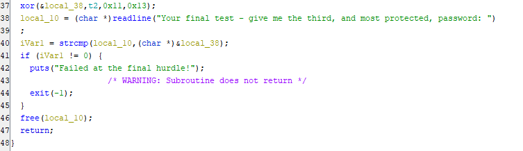

Here it is cleaned up a tiny bit so it's easier for a human to read.

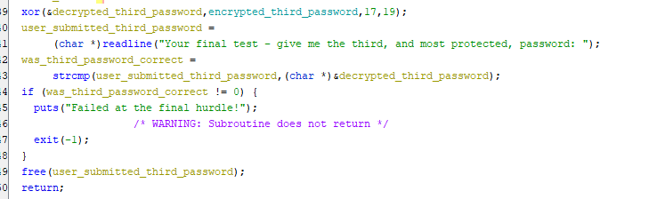

Looks like there's an `xor` function here for the second password, which probably decrypts the password in order to compare it to the plaintext the user would type in. Because I had figured out what the first and second variables were, I knew the key had to be either of the provided numbers, and the other number would likely be the length. I _could_ have spent some time figuring out the `xor` function, but instead I guessed and got it right on the second try - the answer they wanted was `19`.

```
What is the XOR key used to encode the third password?
> 19
[+] Correct!

What is the third password?
>
```


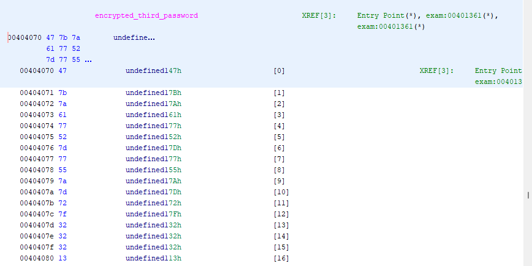

The third password is a constant in memory, like the second, but it's encrypted and stored as a series of bytes rather than characters - so we can't display it like we did the previous one. Since XOR'ing works on bytes, not on characters and strings, we'll need to get the bytes of this constant out in order to work with them. We can select all of the memory addresses in this section by clicking the top on (`00404070`) and SHIFT+Clicking the bottom one (`00404080`). Then we can right click the selected area and go __Copy Special...__ -> __Byte String__ _or_ __Byte String (No Spaces)__.

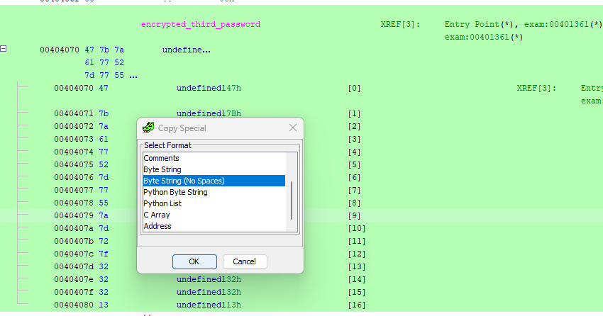

Now we can play with this byte string in [CyberChef](https://gchq.github.io/CyberChef/).

The values we got are in hexadecimal, so our first operation should be to convert them __From Hex__.
Then we can add the __XOR__ operation - or the __XOR Brute Force__ if we're lazy, though that will only work here because the key is so short - normally it would be much longer. We do know the key, so I'm going to choose just normal __XOR__.
Remembering to set the key to __Decimal__, to match how I set it to display in Ghidra.

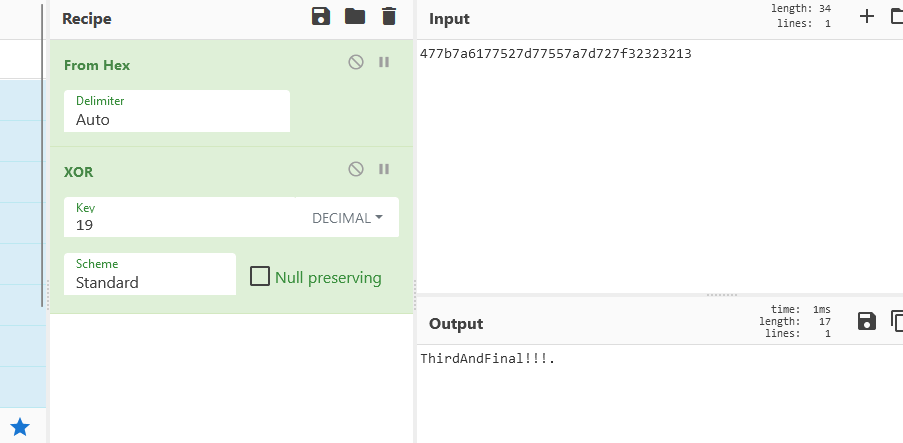

Cyberchef adds `.` characters when it doesn't know what a character is, or when it's null, so I like to add a __Remove null bytes__ at the end of any recipe, to clear these out.

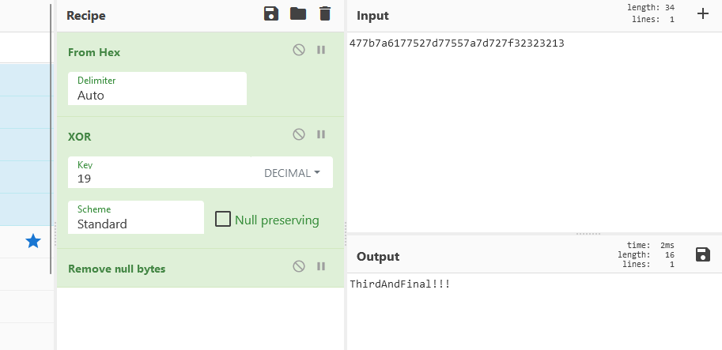

And we have our third password, and the flag.

```
What is the third password?
> ThirdAndFinal!!!
[+] Correct!

[+] Here is the flag: `HTB{l1c3ns3_4cquir3d-hunt1ng_t1m3!}`

```