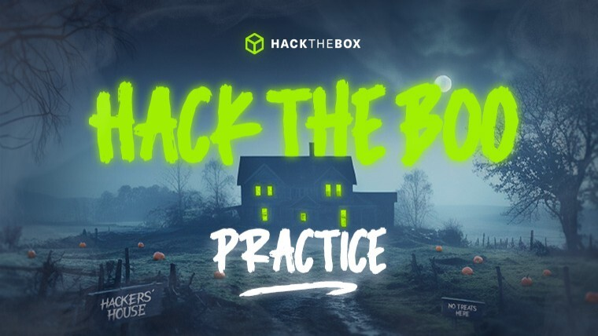

# [Home](../index.md) - HackTheBox Hack The Boo 2023 - Practice

# Event Details
This event was split into two events - a "practice" mode that was open 3 days earlier than the main competition, and the main "competition" event that lasted 48 hours. This is the write-up page for the __practice__ event. [See this page for the competition event](../htb-2023-hack-the-boo/)

**Location:** https://ctf.hackthebox.com

**Date:** October 23 2023 to October 28 2023

**Teams Allowed:** Team limit of 1 player (Solo)

# My progress
Since this was considered a "practice" CTF, there was no scoreboard.

# Challenges
## Reversing
- [CandyBowl](rev-candybowl.md)
- GhostInTheMachine
- Dynamic Secrets

## Crypto
- [Hexoding](crypt-hexoding)
- SPG
- yence

## Forensics
- [Spooky Phishing](for-spooky-phishing)
- [Vulnerable Season](for-vulnerable-season.md)
- [Bat Problems](for-bat-problems.md)

## Web
- [CandyVault](web-candyvault.md)
- PumpkinSpice
- SpookTastic
- Spellbound Servants

## Pwn
- Lesson
- Magic Trick
- Lemonade Stand v1
