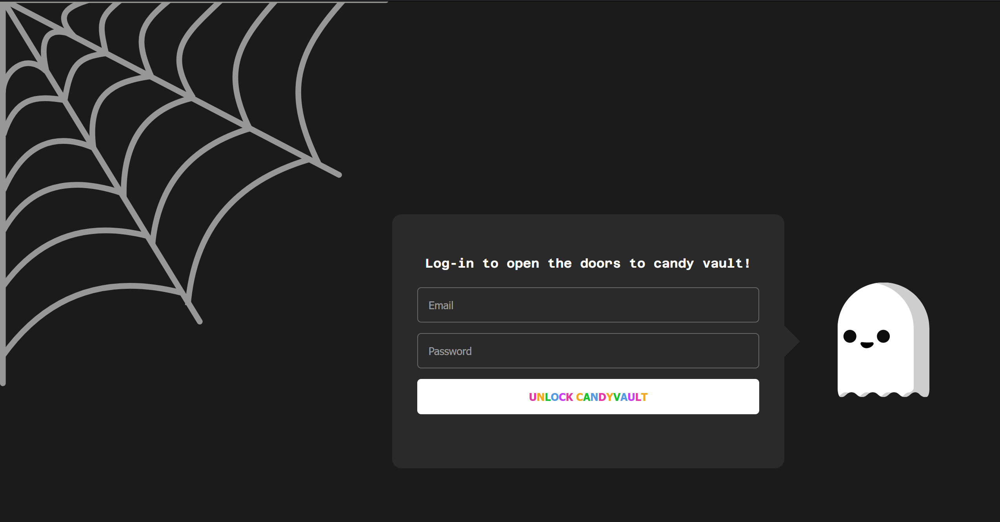
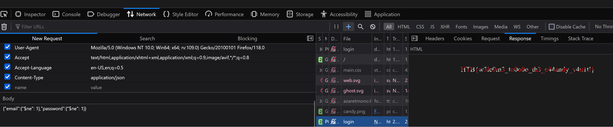

# [Hack The Boo 2023 - Practice](index.md) - Web - CandyVault

> The malevolent spirits have concealed all the Halloween treats within their secret vault, and it's imperative that you decipher its enigmatic seal to reclaim the candy before the spooky night arrives.

We're provided with the source code for a web application, and the ability to spawn the "live" website in a docker container.

The web app is a halloween themed login page.



The important part of the code is:

```python
@app.route("/login", methods=["POST"])
def login():
    content_type = request.headers.get("Content-Type")

    if content_type == "application/x-www-form-urlencoded":
        email = request.form.get("email")
        password = request.form.get("password")

    elif content_type == "application/json":
        data = request.get_json()
        email = data.get("email")
        password = data.get("password")
    
    else:
        return jsonify({"error": "Unsupported Content-Type"}), 400

    user = users_collection.find_one({"email": email, "password": password})

    if user:
        return render_template("candy.html", flag=open("flag.txt").read())
    else:
        return redirect("/")
```

We can see that it when we login using the website, it's going to do a `POST` to `/login`, and this will be a `application/x-www-form-urlencoded` so the first part of the `if` statement will handle that login.

We can see that it also supports a second method of login, via an `application/json` request, which is odd because the website doesn't use this. This will be important later.

Regardless of how the server gets the email and password, it takes the user's input without sanitizing it, and passes it right into a database query to the MongoDB database backing the server. This means we can likely inject something into it.

I didn't know much about injection in a No-SQL database, so I looked around for some guides and found this one: https://nullsweep.com/a-nosql-injection-primer-with-mongo/

So it sounds like we should be able to enter some logic into the username and/or password field and get it to resolve that instead of checking for a legit username and password - something like `{"$ne":1}` for "not equal to one". I have a feeling that if we just put this in the HTML form that it will not work due to it encoding the text literally - and I'm correct, when I try this it doesn't work. The `application/json` section does a `request.get_json()`, which looks like it probably deserializes the json body, and since a Mongo query resembles JSON (maybe it is JSON? I'm not sure), maybe we can sneak this in that way and avoid it htmlencoding our inject code.

I used FireFox's developer tools to capture a login attempt (with random garbage in the fields), and used it's "Edit and resend" functionality to craft a json based response. I changed "Content-Type" to "application/json", and then pasted this into the body:

```json
{"email":{"$ne": 1},"password":{"$ne": 1}}
```



And, it lets us in, and we see the flag

```
HTB{w3lc0m3_to0o0o_th3_c44andy_v4u1t!}
```

Today I learned that Mongo and other No-SQL databases can be injected just like SQL based ones. I guess this makes sense - I assumed they were more resilient to that sort of thing. A good lesson in why you should sanitize your inputs.

I also learned how useful Firefox can be at crafting arbitrary requests - now I dont need Postman or Insomnia.