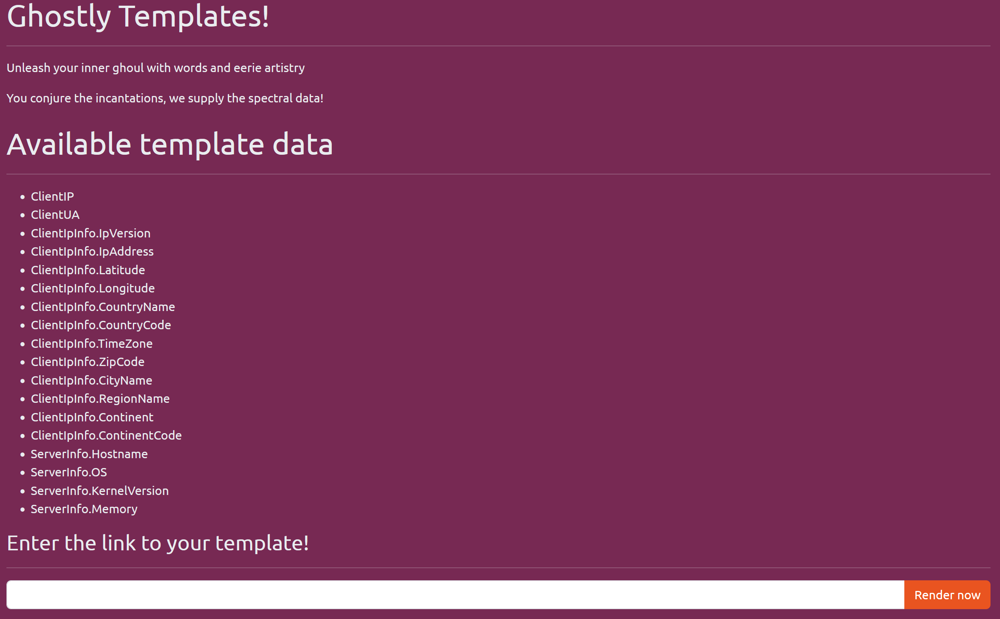
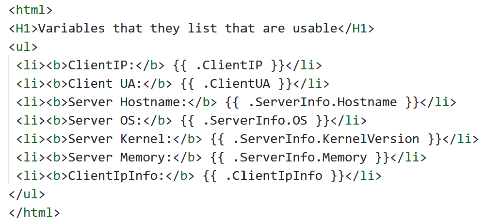
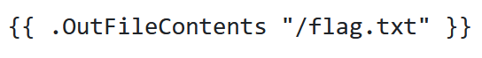

# [Hack The Boo 2023](index.md) - Web - Ghostly Templates

> In the dark corners of the internet, a mysterious website has been making waves among the cybersecurity community. This site, known for its Halloween-themed templates, has sparked rumors of an eerie secret lurking beneath the surface. Will you delve into this dark and spooky webapp to uncover the hidden truth?

Like most web challenges, we are provided with a zip file containing source code, and an IP/port to connect to the "live" challenge with.

The website seems fairly simple at first - no login or anything.


GitHub Gist URL: https://gist.githubusercontent.com/MarkStrendin/cd547d1bb1d20d54d8c07645864cc2b4/raw/e146300d6d1280844dfe19711d0b7576552b67ca/working-given-vars

I'm not familliar with whatever templating technology they're using, but I can tell that the name of the game here is some kind of template "injection" - making a template with something in it that the developers did not intend or defend against.

As an aside, as a developer, I can tell that this is _definitely not a good idea_ for a publicly accessible website... I don't need to know anything about how the templating works to know that this is dangerous and will almost certainly be abused.

Anyway - I don't recognize the syntax that the templating engine is using, so lets look at the source code.

The actual challenge code is pretty simple, there only really being two important files - `main.go` and `index.tpl`.

I'm not at all familliar with Go, or `.tpl` templates, so I spent some time doing some research.

It seems that there are numerous web-based templating systems that would use `.tpl`, and have similar syntax, but I figured the most likely one is the one mentioned in the Go documentation - [https://pkg.go.dev/text/template](https://pkg.go.dev/text/template)

I used [GitHub Gists](https://gist.github.com) to create a file for testing, so that I could give the web app the URL for it. 

The first one I made was this - a simple page that utilized all the variables that the challenge told us we could use:



Now that I had that working, I went looking for some ways to abuse this.

I tried to set my user-agent string to include some Javascript, but it did "sanitize" it when it displayed it on the page. This wouldn't have helped get the flag, but it was interesting to know.

I went looking through the code to find where we actually see the flag, and I didn't find any part of the code or template that loads or displays it. This tells me that we need to somehow convince it to read from the file system, or possibly get a reverse shell on the system to read it for ourselves.

I eventually found this website, which discusses Server-Site Template Injection techniques:
https://github.com/carlospolop/hacktricks/blob/master/pentesting-web/ssti-server-side-template-injection/README.md. This page has a section specifically about SSTI in Go: https://github.com/carlospolop/hacktricks/blob/master/pentesting-web/ssti-server-side-template-injection/README.md#ssti-in-go

It seems we should be able to reference any local or public object from the underlying code in our template, not just the ones they intended. We don't have a method called `System` like in the example, but lets see what we _do_ have...

The code that renders the template is as follows:

```go
func getTpl(w http.ResponseWriter, r *http.Request) {
	var page string = r.URL.Query().Get("page")
	var remote string = r.URL.Query().Get("remote")

	if page == "" {
		http.Error(w, "Missing required parameters", http.StatusBadRequest)
		return
	}

	reqData := &RequestData{}

	userIPCookie, err := r.Cookie("user_ip")
	clientIP := ""

	if err == nil {
		clientIP = userIPCookie.Value
	} else {
		clientIP = strings.Split(r.RemoteAddr, ":")[0]
	}

	userAgent := r.Header.Get("User-Agent")

	locationInfo, err := reqData.GetLocationInfo("https://freeipapi.com/api/json/" + clientIP)

	if err != nil {
		http.Error(w, "Could not fetch IP location info", http.StatusInternalServerError)
		return
	}

	reqData.ClientIP = clientIP
	reqData.ClientUA = userAgent
	reqData.ClientIpInfo = *locationInfo
	reqData.ServerInfo.Hostname = GetServerInfo("hostname")
	reqData.ServerInfo.OS = GetServerInfo("cat /etc/os-release | grep PRETTY_NAME | cut -d '\"' -f 2")
	reqData.ServerInfo.KernelVersion = GetServerInfo("uname -r")
	reqData.ServerInfo.Memory = GetServerInfo("free -h | awk '/^Mem/{print $2}'")

	var tmplFile string

	if remote == "true" {
		tmplFile, err = readRemoteFile(page)

		if err != nil {
			http.Error(w, "Internal Server Error", http.StatusInternalServerError)
			return
		}
	} else {
		if !reqData.IsSubdirectory("./", TEMPLATE_DIR+"/"+page) {
			http.Error(w, "Internal Server Error", http.StatusInternalServerError)
			return
		}

		tmplFile = reqData.OutFileContents(TEMPLATE_DIR + "/" + page)
	}

	tmpl, err := template.New("page").Parse(tmplFile)
	if err != nil {
		http.Error(w, "Internal Server Error", http.StatusInternalServerError)
		return
	}

	err = tmpl.Execute(w, reqData)
	if err != nil {
		http.Error(w, "Internal Server Error", http.StatusInternalServerError)
		return
	}
}
```

And in this file we can see the variables that it's told use that we can use:

```go
reqData.ClientIP = clientIP
reqData.ClientUA = userAgent
reqData.ClientIpInfo = *locationInfo
reqData.ServerInfo.Hostname = GetServerInfo("hostname")
reqData.ServerInfo.OS = GetServerInfo("cat /etc/os-release | grep PRETTY_NAME | cut -d '\"' -f 2")
reqData.ServerInfo.KernelVersion = GetServerInfo("uname -r")
reqData.ServerInfo.Memory = GetServerInfo("free -h | awk '/^Mem/{print $2}'")
```

These seem fairly dangerous on their own, since they are running arbitrary Linux commands, but I don't see an obvious way to inject anything into them.

It seems that the things that we can access are all "under" the `reqData` object/class - we're able to directly reference `reqData.ClientIP` by including `{{ .ClientIP }}` in our template. We can probably access _anything_ that lives in `reqData`. The code gives us some clues that we can refer to some functions as well:

```go
locationInfo, err := reqData.GetLocationInfo("https://freeipapi.com/api/json/" + clientIP)
...
tmplFile = reqData.OutFileContents(TEMPLATE_DIR + "/" + page)
```

The `OutFileContents` looks interesting - it's intended to be run after the template file is downloaded to a temporary directory, but it doesn't really have any security built into it. I would probably have written it in such a way that it could only ever access files from the temp directory.

```go
func (p RequestData) OutFileContents(filePath string) string {
	data, err := os.ReadFile(filePath)
	if err != nil {
		return err.Error()
	}
	return string(data)
}
```

With what we learned from the SSTI document, we should be able to do something like the code below to get it to read the contents of `flag.txt`. We know that `flag.txt` is located at `/flag.txt`, because we can see where the Dockerfile put it in the source code.


GitHub Gist URL: https://gist.githubusercontent.com/MarkStrendin/cd547d1bb1d20d54d8c07645864cc2b4/raw/cc64431ffd5786614350298ac5dfdb12e9376ad9/experiments

And sure enough, this gets us the flag.

```
HTB{t3mpl14t35_c4n_c4us3_p41n__4nd_f1l35_1nclud3d!}
```