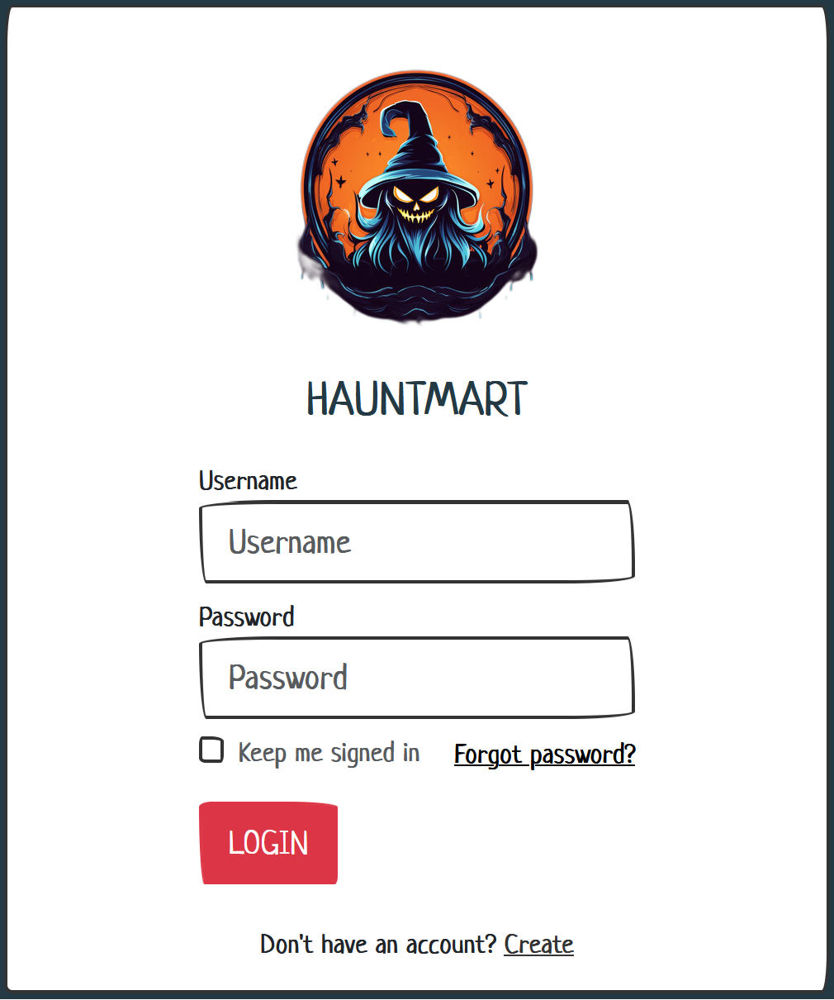
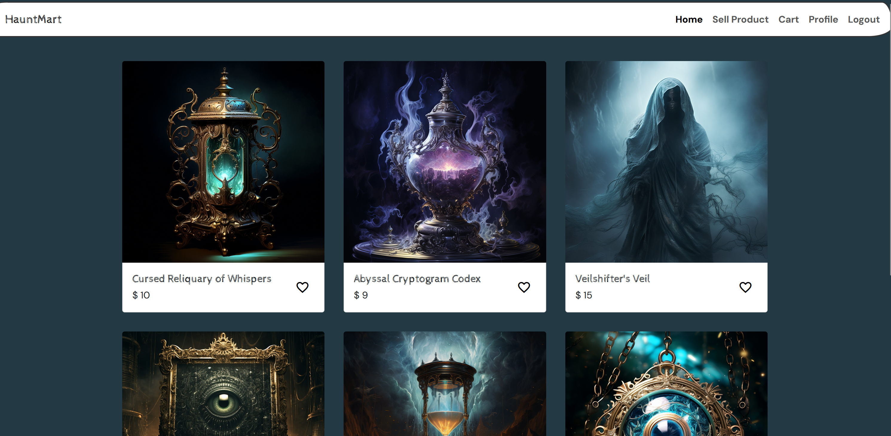
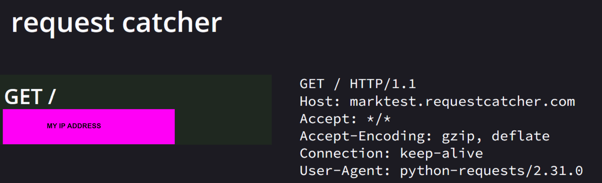
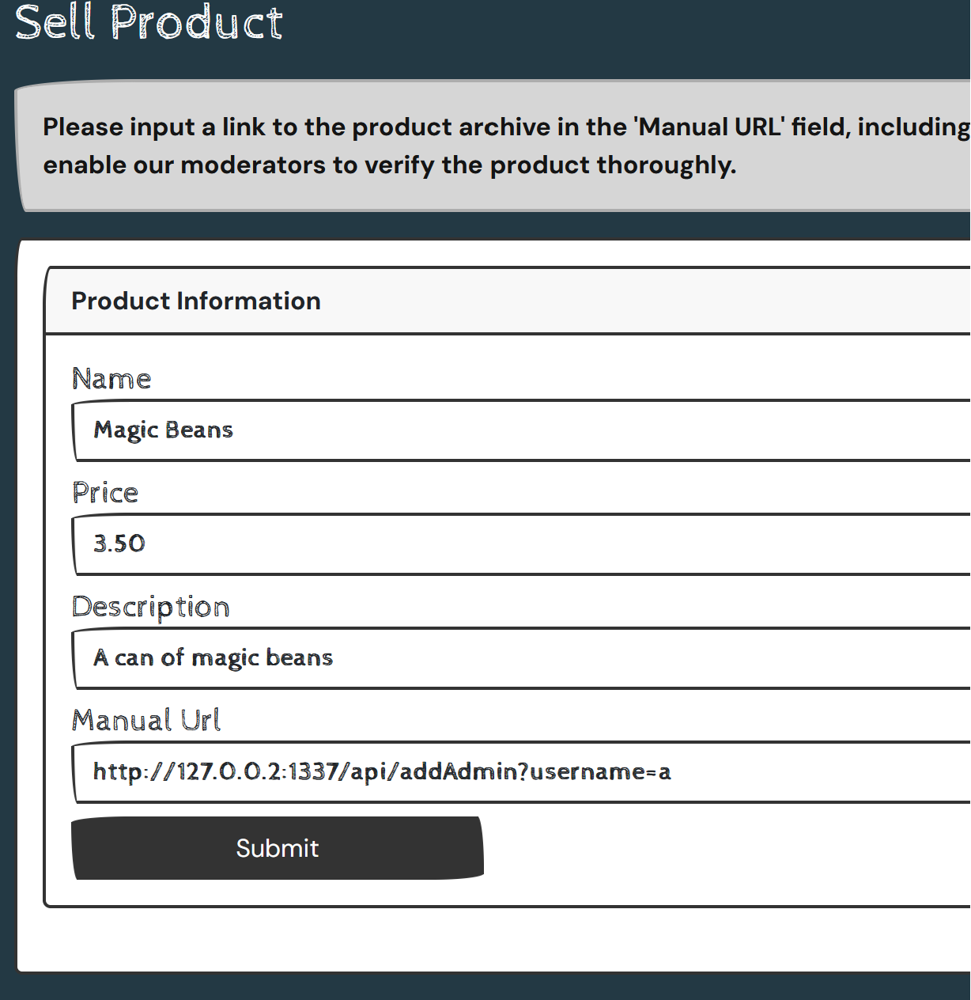
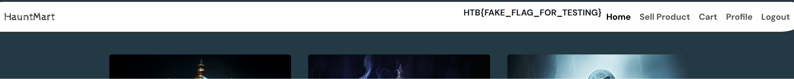
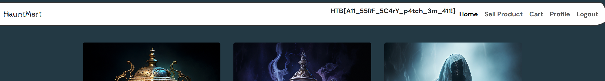

# [Hack The Boo 2023](index.md) - Web - HauntMart

> An eerie expedition into the world of online retail, where the most sinister and spine-tingling inventory reigns supreme. Can you take it down?

We're provided the source code, and an IP and port to connect to for the "live" challenge.



We can create an account and log in with it to see that the website is a sort of online store.



There's an interesting link in the top-right that lets us submit a product to sell - and it has an interesting field, asking for a "Manual URL" - so that we can include a link to a product manual from an arbitrary url... interesting.

Scanning the code, I don't see any initialization of any users in the database, so it looks like this _isn't_ a game of "impersonate the admin account". 

There's an interesting function in `database.py`. This file is a "repository" for the database - a set of functions in a single place that handle database interactions (so you only need to change them in one place). In this file we find this:

```python
def makeUserAdmin(username):
    check_user = query('SELECT username FROM users WHERE username = %s', (username,), one=True)
    
    if check_user:
        query('UPDATE users SET role="admin" WHERE username=%s', (username,))
        mysql.connection.commit()
        return True

    return False
```

In `routes.py` we can see an endpoint that calls this function:

```python
@api.route('/addAdmin', methods=['GET'])
@isFromLocalhost
def addAdmin():
    username = request.args.get('username')
    
    if not username:
        return response('Invalid username'), 400
    
    result = makeUserAdmin(username)

    if result:
        return response('User updated!')
    return response('Invalid username'), 400
```

In `index.html` we can see that if we are an "admin" user, it will simply show us the flag:

```html
<div class="collapse navbar-collapse" id="navbarColor03">
<ul class="navbar-nav ms-auto">
    
        {{flag}}
    
    <li class="nav-item">
        <a class="nav-link active" href="/home">Home
        </a>
</li>
```

So... it looks like the objective is to make our account an admin.
We can't talk to the `/addAdmin` endpoint directly, because it includes a check to ensure that it only responds to requests coming from localhost:

```python
@isFromLocalhost
```

This code is defined in `util.py` as follows:

```python
def isFromLocalhost(func):
    @wraps(func)
    def check_ip(*args, **kwargs):
        if request.remote_addr != "127.0.0.1":
            return abort(403)
        return func(*args, **kwargs)

    return check_ip
```

So, any request to this endpoint _must_ come from `127.0.0.1`.

Also in `util.py`, we find the function that downloads the manuals from the "Sell product" page:

```python
def downloadManual(url):
    safeUrl = isSafeUrl(url)
    if safeUrl:
        try:
            local_filename = url.split("/")[-1]
            r = requests.get(url)
            
            with open(f"/opt/manualFiles/{local_filename}", "wb") as f:
                for chunk in r.iter_content(chunk_size=1024):
                    if chunk:
                        f.write(chunk)
            return True
        except:
            return False
    
    return False
```

The first thing this code does is checks to see if the given url is "safe", and it does so using the `isSafeUrl` function:

```python
blocked_host = ["127.0.0.1", "localhost", "0.0.0.0"]

def isSafeUrl(url):
    for hosts in blocked_host:
        if hosts in url:
            return False
    
    return True
```

So, it determines if a URL is safe by making sure it _isn't_ on the list - `127.0.0.1`, `localhost`, or `0.0.0.0`.

Assuming the URL is "safe", the `downloadManual` function will proceed to the given URL and attempt to download it. This function does no further safety checks - it just calls `r = requests.get(url)`. 

I used [Request Catcher](https://requestcatcher.com/) to verify that the system would actually make a web request to the URL I gave it. The website said that the URL was invalid, but the web request did actually happen, which is all we need really. So now we just need to figure out how to get it to talk to the `/addAdmin` endpoint without tripping it's "security".



Something I happened to know, though I can't recall why, is that in Windows and Linux, is automatically creates loopback interfaces in the 127.0.0.0/8 range. Most people assume that the only loopback address that works is `127.0.0.1`, but `127.0.0.2`, or literally anything starting with `127.` is also a loopback in most operating systems (I understand that switches, notably Cisco switches, don't do this unless the configuration explicitly specifies it).

The other thing that I happened to know from decades of writing web applications, is that checking what IP address a request comes from is often not as straightforward as it seems. I'm fairly confident that any request _coming from_ localhost is going to resolve to `127.0.0.1`, because that's likely the first line of the server's `hosts` file (like it is on my freshly installed Linux system):

```
127.0.0.1       localhost
```

In order to test everything I said in the above paragraphs, I took advantage of the fact that we were provided with everything we need to build and host a docker container exactly like the "live" challenge.

```
docker build -t htb:hauntmart .
docker run -p 8080:1337 htb:hauntmart
```

I took the opportunity to add some extra code in my version, to get a better understanding of what exactly was happening - I wanted to find out why my requests to Request Catcher were failing.

```python
import sys

def isSafeUrl(url):
    for hosts in blocked_host:
        if hosts in url:
            print("URL is NOT safe!", file=sys.stderr)
            return False
    print("URL is SAFE")
    return True

def downloadManual(url):
    safeUrl = isSafeUrl(url)
    print("URL is safe enough to continue", file=sys.stderr)
    if safeUrl:
        try:
            print("Starting to add product", file=sys.stderr);
            local_filename = url.split("/")[-1]
            print("Extracted local filename", file=sys.stderr)
            r = requests.get(url)
            print("URL retrieved", file=sys.stderr)

            with open(f"/opt/manualFiles/{local_filename}", "wb") as f:
                for chunk in r.iter_content(chunk_size=1024):
                    if chunk:
                        f.write(chunk)
            print("Manual downloaded", file=sys.stderr)
            return True
        except Exception as e:
            print("Exception occurred: ", file=sys.stderr)
            print(e, file=sys.stderr)
            return False

    return False
```

So now if I repeat my Request Catcher experiment, I can see what's happening on the server console:

```
URL is safe enough to continue
Starting to add product
Extracted local filename
URL retrieved
Exception occurred:
[Errno 21] Is a directory: '/opt/manualFiles/'
10.0.0.82 - - [01/Nov/2023 01:17:44] "POST /api/product HTTP/1.1" 400 -
```

I see - The request went through, and did reach the Request Catcher URL, but Request Catcher didn't return anything, so there was nothing to download, and it didn't like that. The request going through is what's important though, so we can still proceed.

So we need to craft a URL that will go to `localhost`, without appearing to come from `127.0.0.1`.
So lets try `127.0.0.2`:

```
http://127.0.0.2:8080/addAdmin?username=a
```

The user I registered had the username `a`.

This didn't work though, on my system or on the live CTF system, and it took a while for me to figure out why. When the web app is in a container, it thinks it's running on a specific port. The CTF platform gives users a random port due to the volume of players who need their own instance, and on my personal copy of the container I ran it on port `8080` by port-forwarding it using Docker:

```
docker run -p 8080:1337 htb:hauntmart
```

Since the request goes to to the localhost, it never leaves the system, so we need to use the port that the web app is using _inside the container_, which is `1337`, as per `run.py`:

```python
from application.main import app

app.run(host='0.0.0.0', port=1337, debug=True)
```

```
http://127.0.0.2:1337/addAdmin?username=a
```

This didn't work, and it took me a while to figure out why (because I don't know Python very well). On my instance of the challenge, I could see the server logs, and it was giving me an error 404.

I eventually noticed that `/addAdmin` is an __API__ endpoint, not a __Web__ endpoint, and therefore had a slightly different route than I was expecting. I used Firefox's developer tools to see where exactly the form data got sent to, and noticed that for API endpoints you need `/api` between the hostname/ip and the endpoint.

```python
@web.route('/home', methods=['GET'])
...
@api.route('/addAdmin', methods=['GET'])
```

So, lets add the `/api` in there and try again...
```
http://127.0.0.2:1337/api/addAdmin?username=a
```

```
10.0.0.82 - - [01/Nov/2023 01:31:06] "POST /api/product HTTP/1.1" 200 -
```

On my instance I got an HTTP status code `200`, not the `404`, so it looks like this was the answer.




The form accepted the URL, and presumably has updated the database to flag us as an admin.

We can't see the flag right away if we go back to the home page, but logging out and back in with our account makes the system check to see if we are "admin", and we see the flag.






```
HTB{A11_55RF_5C4rY_p4tch_3m_411!}
```